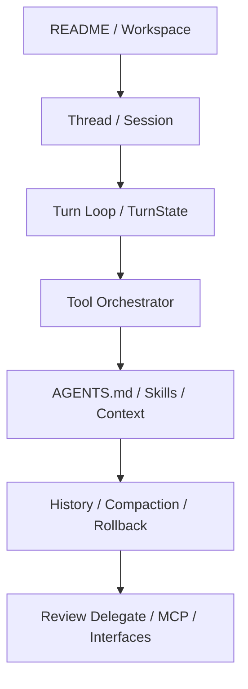

# 부록 A: 주요 파일 인덱스 — 무엇을 어디서 찾을 것인가

이 부록은 저장소를 처음 여는 독자가 "어떤 질문을 품었을 때 어느 파일부터 봐야 하는가"를 빠르게 찾게 하기 위한 참조 보드입니다. 장별 설명을 따라가다가 직접 코드를 확인하고 싶을 때 이 인덱스를 시작점으로 쓰면 됩니다.

## 1. 시작과 런타임 골격

| 질문 | 먼저 볼 파일 | 이유 |
| --- | --- | --- |
| 저장소 전체 구조는 어떤가 | `README.md`, `codex-rs/README.md`, `Cargo.toml` | 워크스페이스와 주요 실행 표면을 가장 빠르게 잡을 수 있다 |
| 스레드/세션은 어디서 시작되나 | `codex-rs/core/src/thread_manager.rs`, `codex-rs/core/src/session/mod.rs` | thread spawn과 session handle이 만나는 지점이다 |
| 턴 루프는 어디서 도나 | `codex-rs/core/src/tasks/mod.rs`, `codex-rs/core/src/tasks/regular.rs` | regular/review/compact task가 나뉘는 시작점이다 |

## 2. 도구와 정책

| 질문 | 먼저 볼 파일 | 이유 |
| --- | --- | --- |
| 도구 표면은 어디서 조립되나 | `codex-rs/core/src/tools/registry.rs`, `codex-rs/core/src/tools/router.rs` | 도구 등록과 라우팅의 중심이다 |
| 승인과 샌드박스는 어디서 계산되나 | `codex-rs/core/src/tools/orchestrator.rs` | approval, sandbox, escalation이 한곳에서 만난다 |
| 병렬 실행은 어디서 통제되나 | `codex-rs/core/src/tools/parallel.rs` | read/write lock 기반 병렬성 정책이 보인다 |

## 3. 이벤트와 표면

| 질문 | 먼저 볼 파일 | 이유 |
| --- | --- | --- |
| app-server 계약은 어디 있나 | `codex-rs/app-server/README.md`, `codex-rs/app-server-protocol/**` | 외부 표면이 어떤 RPC/event 계약을 갖는지 보인다 |
| TUI와 CLI는 어디서 코어를 호출하나 | `codex-rs/tui/**`, `codex-rs/cli/**` | 같은 코어가 서로 다른 UX로 드러나는 방식이 보인다 |
| 이벤트 타입은 어디서 정의되나 | `codex-rs/protocol/**`, `codex-rs/app-server-protocol/**` | 클라이언트가 보는 event vocabulary를 찾을 수 있다 |

## 4. 지침과 컨텍스트

| 질문 | 먼저 볼 파일 | 이유 |
| --- | --- | --- |
| AGENTS.md는 어떻게 읽히나 | `codex-rs/core/src/agents_md.rs` | 지침 수집과 병합의 핵심이다 |
| skills는 어디서 로드되나 | `codex-rs/core-skills/src/loader.rs`, `codex-rs/core-skills/src/injection.rs`, `codex-rs/core/src/session/mod.rs` | discovery/dedupe, 명시적 본문 injection, 초기 developer section 렌더링이 나뉘어 보인다 |
| 모델 가시 컨텍스트는 어디서 조립되나 | `codex-rs/core/src/session/mod.rs`, `codex-rs/core/src/context/*.rs`, `codex-rs/core/src/context_manager/updates.rs` | developer/user section 조립과 update item 생성이 보인다 |

## 5. 상태와 히스토리

| 질문 | 먼저 볼 파일 | 이유 |
| --- | --- | --- |
| SessionState와 TurnState는 어디 있나 | `codex-rs/core/src/state/session.rs`, `codex-rs/core/src/state/turn.rs` | 상태 책임이 어떻게 분리되는지 직접 보인다 |
| 히스토리 관리자는 어디 있나 | `codex-rs/core/src/context_manager/history.rs`, `codex-rs/core/src/context_manager/normalize.rs` | 메시지 누적, prompt 정규화, call/output 짝 보존, 토큰 추정의 중심이다 |
| compaction과 rollback은 어디 있나 | `codex-rs/core/src/compact.rs`, `codex-rs/core/src/tasks/compact.rs`, `codex-rs/core/src/context_manager/history.rs`, `codex-rs/core/src/thread_manager.rs` | compaction task, replacement history, rollback trimming, fork snapshot 경계가 보인다 |

## 6. 확장과 고급 서브시스템

| 질문 | 먼저 볼 파일 | 이유 |
| --- | --- | --- |
| 리뷰 서브에이전트는 어디서 시작되나 | `codex-rs/core/src/tasks/review.rs`, `codex-rs/core/src/codex_delegate.rs` | child thread와 parent mediation이 만난다 |
| 모델 카탈로그는 어디서 갱신되나 | `codex-rs/models-manager/**`, provider 관련 crate | 새로고침과 모델 메타데이터 공급원을 찾을 수 있다 |
| MCP 연결 관리는 어디 있나 | `codex-rs/codex-mcp/src/mcp_connection_manager.rs` | 외부 도구/앱 확장의 중심 제어점이다 |

## 7. 읽는 순서 제안

직접 코드를 따라갈 때는 아래 순서를 추천합니다.

1. `README.md`와 `codex-rs/README.md`
2. `thread_manager.rs`와 `session/mod.rs`
3. `tasks/regular.rs`와 `state/turn.rs`
4. `tools/orchestrator.rs`
5. `agents_md.rs`, `skills` 관련 모듈
6. `history`, `compact`, `rollback`
7. `review.rs`, `codex_delegate.rs`, `mcp_connection_manager.rs`

## 8. 장별 최소 근거 세트

책을 빠르게 검증하려면 모든 파일을 열 필요는 없습니다. 아래 최소 세트만 따라가도 핵심 하니스 구조는 확인할 수 있습니다.

| 장 | 최소 근거 세트 |
| --- | --- |
| 1-3장 | `session/session.rs`, `thread_manager.rs`, `tasks/mod.rs`, `tasks/regular.rs`, `state/turn.rs` |
| 4-6장 | `tools/router.rs`, `tools/orchestrator.rs`, `tools/parallel.rs`, `app-server/README.md`, `app-server-protocol/src/protocol/common.rs` |
| 7-9장 | `agents_md.rs`, `core-skills/src/loader.rs`, `core-skills/src/injection.rs`, `session/mod.rs`, `context/*.rs` |
| 10-12장 | `state/session.rs`, `state/turn.rs`, `context_manager/history.rs`, `context_manager/normalize.rs`, `compact.rs` |
| 13-15장 | `tools/orchestrator.rs`, `hooks/src/registry.rs`, `hooks/src/events/*.rs`, `codex-mcp/src/mcp_connection_manager.rs` |
| 16-18장 | `session/review.rs`, `tasks/review.rs`, `codex_delegate.rs`, `models-manager/src/manager.rs`, `tui/src/cli.rs`, `app-server/README.md` |

이 표는 "무엇을 어디서 찾는가"보다 한 단계 더 나아가, 장별 주장을 검증하는 최소 파일 묶음을 제공합니다. 새 장을 추가한다면 같은 방식으로 최소 근거 세트를 먼저 정해 두는 편이 좋습니다.

## Builder Takeaway

좋은 파일 인덱스는 단순한 목록이 아니라 "질문 -> 경로" 맵이어야 합니다. 자신의 에이전트 프로젝트에도 같은 방식의 인덱스를 만들어 두면, 새 팀원이 저장소를 훨씬 빨리 이해할 수 있습니다.
