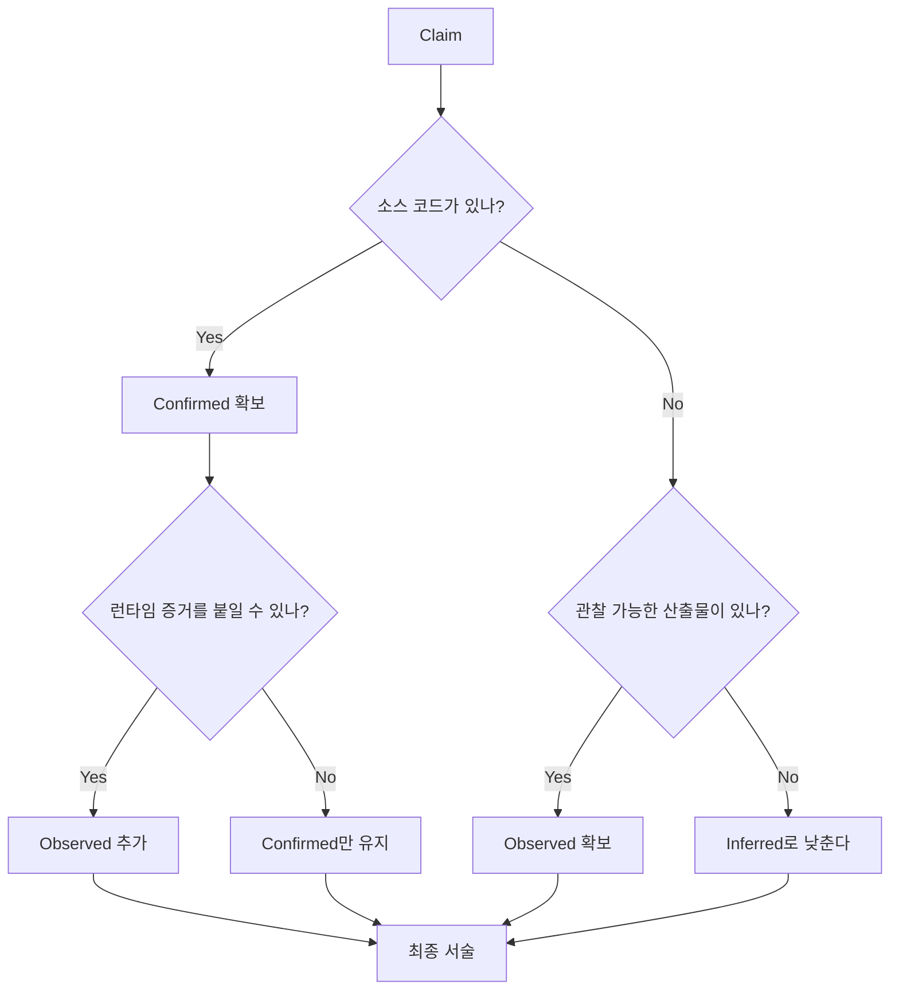

# 부록 B: 근거 사용 규칙 — 무엇을 확인이라 부르고 무엇을 추론이라 부를 것인가

이 책은 가능한 한 직접 근거를 사용합니다. 하지만 공개 저장소를 읽는 책에서 모든 문장이 같은 강도의 증거를 가지는 것은 아닙니다. 그래서 이 부록은 "무엇을 확인이라 부를 수 있고, 무엇을 추론으로 남겨야 하는가"를 명확히 정의합니다.

## 세 가지 근거 수준

| Level | 의미 | 허용 근거 | 예시 |
| --- | --- | --- | --- |
| Confirmed | 코드나 설정으로 직접 확인 | 소스 코드, 타입 정의, 설정 파일, 테스트 | 특정 enum variant, approval policy 설정 |
| Observed | 런타임 산출물로 관찰 | 로그, 이벤트, JSON schema, CLI 출력 | `TurnStarted` 이벤트, protocol schema artifact |
| Inferred | 앞선 근거를 바탕으로 한 구조적 해석 | 다이어그램, 비교 설명, 설계 원칙 | "이 계층이 제어 평면 역할을 한다" |

## 기본 규칙

1. `Confirmed`를 먼저 보여 준다.
2. 가능하면 `Observed`를 최소 1개 붙인다.
3. `Inferred`만으로 장의 핵심 결론을 닫지 않는다.
4. 근거가 약할수록 표현을 약하게 쓴다.

## 소스 발췌 규칙

본문의 `소스 발췌`는 파일 경로를 대신하는 장식이 아닙니다. 독자가 책만 보고도 핵심 타입과 분기를 볼 수 있도록 실제 저장소의 짧은 코드 구간을 붙입니다.

1. 가능하면 실제 파일의 연속 구간을 그대로 붙인다.
2. 코드 블록이 struct나 함수 전체가 아니라 앞부분 발췌라면, 본문에서 "앞부분 연속 발췌"처럼 범위를 설명한다.
3. 설명을 위해 필드를 임의로 재배열하거나 서로 떨어진 줄을 하나의 코드 블록처럼 합치지 않는다.
4. 장황한 함수 전체보다 Claim을 증명하는 최소 구간을 고른다.
5. 발췌 아래에는 그 코드에서 무엇을 확인해야 하는지 한두 문장으로 적는다.

## 추천 문장 패턴

가장 권장하는 형식은 아래다.

- `Claim -> file path -> observable event/check`

예:

- review task는 일반 턴과 별도 workflow다 -> `codex-rs/core/src/tasks/review.rs` -> `TaskKind::Review`를 반환한다
- 모델 카탈로그는 갱신 가능한 서브시스템이다 -> `codex-rs/models-manager/**` -> refresh 관련 함수와 provider별 load path가 분리돼 있다

보강된 장에서는 이 형식을 한 번만 쓰고 끝내지 않습니다. 같은 Claim을 적어도 두 방향에서 확인할 수 있으면 더 좋습니다. 예를 들어 "review는 constrained sub-agent다"라는 주장은 `tasks/review.rs`의 feature/approval 제한과 `codex_delegate.rs`의 parent-mediated approval relay를 함께 봅니다.

## 피해야 할 것

### 1. 파일 경로 없이 큰 주장하기

나쁜 예:

- "Codex는 항상 이렇게 동작한다"

좋은 예:

- "현재 공개 Rust 구현에서는 이 경로가 이렇게 동작한다 -> `codex-rs/...` -> 특정 함수/이벤트"

### 2. UI나 README만 보고 내부 계약을 단정하기

README는 의도를 설명하지만, 계약 자체는 타입과 함수가 보증하는 경우가 많습니다. 가능하면 README와 코드 둘 다 보강 근거로 붙입니다.

### 3. 런타임 관찰 없이 "실제로는 이럴 것"이라 적기

Observed 증거가 없으면 "실제로"라는 표현을 줄이고 "구조상 이렇게 해석할 수 있다" 수준으로 낮춥니다.

## 어떤 증거를 우선하나

우선순위는 아래와 같습니다.

1. 소스 코드
2. 타입/스키마 산출물
3. 테스트와 테스트 이름
4. 런타임 출력이나 이벤트 로그
5. README/주석
6. 구조적 추론

## 근거를 장면으로 바꾸는 법

파일 경로만 붙였다고 충분히 grounded한 것은 아닙니다. 독자가 코드를 열었을 때 무엇을 봐야 하는지까지 적어야 합니다.

나쁜 예:

- "Codex는 상태를 잘 나눈다 -> `state/session.rs`, `state/turn.rs`"

좋은 예:

- "장수명 상태와 턴 지역 상태가 분리된다 -> `codex-rs/core/src/state/session.rs`, `codex-rs/core/src/state/turn.rs` -> `SessionState`는 history/rate limits/previous turn settings를 갖고, `TurnState`는 pending approvals/user input/elicitations/dynamic tools를 갖는다"

이 차이는 큽니다. 첫 문장은 파일을 열어도 무엇을 확인해야 하는지 모호하고, 두 번째 문장은 바로 필드 목록으로 검증할 수 있습니다.

## 코드와 문서를 같이 쓸 때

README나 app-server 문서는 외부 계약의 vocabulary를 설명하는 데 강합니다. 하지만 내부 동작을 증명할 때는 코드와 짝을 지어야 합니다.

- 외부 API 이름을 말할 때 -> `codex-rs/app-server/README.md`와 `codex-rs/app-server-protocol/src/protocol/common.rs`를 같이 본다
- 내부 이벤트 순서를 말할 때 -> `codex-rs/core/src/session/session.rs`와 `codex-rs/core/src/thread_manager.rs`를 같이 본다
- 정책 경계를 말할 때 -> `codex-rs/core/src/tools/orchestrator.rs`와 app-server approval 문서를 같이 본다
- 지식 주입을 말할 때 -> `codex-rs/core/src/agents_md.rs`, `codex-rs/core-skills/src/*`, `codex-rs/core/src/session/mod.rs`를 같이 본다

문서는 "사용자가 보는 계약"을, 코드는 "런타임이 지키는 계약"을 보여 줍니다. 둘이 같은 결론을 가리킬 때 주장이 강해집니다.

## 장별 최소 검증 기준

각 장의 핵심 결론은 적어도 아래 기준을 만족해야 합니다.

| 장 유형 | 최소 기준 |
| --- | --- |
| 런타임 loop 장 | 시작 이벤트, 상태 carry-over, 반복 게이트, 종료 조건 중 3개 이상을 코드로 확인한다 |
| 정책/안전 장 | 정책 선언 위치와 실행 시점 계산 위치를 둘 다 확인한다 |
| 지식/컨텍스트 장 | discovery, selection, rendering 중 2개 이상을 확인한다 |
| 메모리/compaction 장 | raw history와 prompt history의 차이, replacement/rollback 경계 중 하나 이상을 확인한다 |
| sub-agent 장 | child config 제한, parent relay, shutdown 조건을 모두 확인한다 |
| surface/API 장 | README vocabulary와 protocol type/method mapping을 같이 확인한다 |

이 기준을 통과하지 못한 장은 설명이 그럴듯해도 아직 grounded하지 않은 것으로 봅니다.

## Codex 책에서 특히 조심할 영역

아래 영역은 추론이 끼기 쉬우므로 더 엄격하게 적습니다.

- 비공개 서버 정책
- 외부 서비스 내부 동작
- 원격 모델 라우팅의 숨겨진 규칙
- UI가 암시하지만 코드로 직접 드러나지 않는 제품 정책

이 경우에는 다음 식으로 씁니다.

- "공개 저장소 기준으로는 여기까지 확인된다"
- "이후 동작은 외부 서비스에 숨겨져 있어 단정하지 않는다"
- "코드 구조상 이런 의도로 해석할 수 있다"

## Builder Takeaway

좋은 기술 책은 지식을 많이 담는 것보다, 독자에게 "이 문장이 얼마나 믿을 만한가"를 계속 알려 주는 편이 더 강합니다. 자신의 설계 문서에도 같은 규칙을 적용하면, 팀 내 논의가 의견 싸움보다 증거 싸움이 됩니다.
