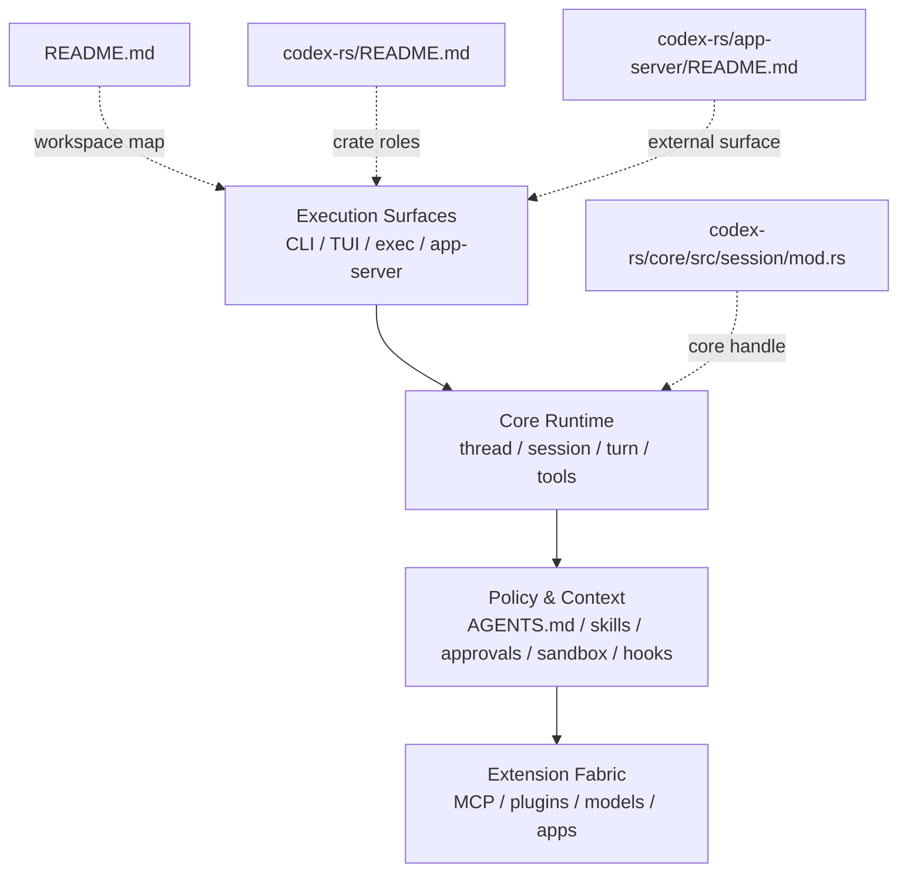

# 1장: 저장소 지형도 — Codex를 어떤 층으로 읽어야 하는가

> **이 장의 질문**: `openai/codex`는 어떤 실행 표면과 공용 런타임 층으로 나뉘며, 무엇을 중심 축으로 읽어야 하는가?

## 왜 중요한가

Codex를 처음 볼 때 가장 흔한 오해는 `codex`라는 바이너리 하나를 중심으로 저장소를 읽는 것입니다. 그렇게 보면 TUI, CLI, app-server, 모델 관리, MCP, hooks, skills가 모두 병렬적인 부속 기능처럼 보입니다. 하지만 실제 저장소는 그렇게 조직되지 않습니다. 이 워크스페이스는 여러 실행 표면이 하나의 코어 런타임 위에 얹히는 방식으로 설계되어 있고, 그 위에 다시 정책 계층과 확장 계층이 올라갑니다.

이 구조를 먼저 고정하지 않으면 이후 장에서 도구 라우팅, 승인 정책, 컨텍스트 조립, review delegate 같은 하위 시스템이 서로 다른 제품처럼 보입니다. 반대로 저장소 지형도를 먼저 잡으면, 이후의 모든 장이 "이 기능이 어느 층에서 책임지는가"라는 질문으로 정리됩니다.

## System Map

Codex 저장소를 읽는 가장 좋은 방법은 아래 4층 모델로 시작하는 것입니다.



핵심은 표면보다 코어를 먼저 읽는 것입니다. CLI나 TUI는 사용자 경험의 차이일 뿐이고, 세션 생성, 턴 처리, 도구 실행, 정책 계산 같은 에이전트 의미론은 `core`가 쥐고 있습니다.

## Code Anchor

이 장의 핵심 파일은 네 개입니다.

| 파일 | 왜 먼저 보나 |
| --- | --- |
| `README.md` | 저장소 전체 범위와 제품 표면을 가장 넓게 보여 준다 |
| `codex-rs/README.md` | Rust 워크스페이스의 crate 역할을 빠르게 구분하게 해 준다 |
| `codex-rs/core/src/session/mod.rs` | 코어 런타임 핸들이 어떤 채널과 상태를 묶는지 보여 준다 |
| `codex-rs/app-server/README.md` | "외부 클라이언트가 보는 Codex"가 무엇인지 정의한다 |

이 네 파일을 순서대로 읽으면 "표면 -> 워크스페이스 -> 코어 핸들 -> 외부 표면"의 흐름이 한 번에 잡힙니다.

## Runtime Proof

이 장의 주장은 비교적 직접적입니다.

- Rust 구현이 현재 유지되는 기본 CLI이다 -> `codex-rs/README.md` -> 문서가 Rust 구현을 maintained CLI로 설명한다
- 런타임 핵심 인터페이스는 제출 채널과 이벤트 채널의 결합이다 -> `codex-rs/core/src/session/mod.rs` -> `Codex` 타입이 submission/event/state 핸들을 묶는다
- rich interface는 `app-server` 경계를 통해 코어와 연결된다 -> `codex-rs/app-server/README.md` -> 외부 클라이언트를 위한 protocol surface를 정의한다

이 세 문장만으로도 저장소 읽기 순서가 바뀝니다. "화면"이 아니라 "코어 핸들"을 중심으로 읽게 되기 때문입니다.

## 소스 발췌

`codex-rs/core/src/session/mod.rs`의 공개 핸들은 제출 채널과 이벤트 채널을 함께 들고 있습니다.

```rust
/// The high-level interface to the Codex system.
/// It operates as a queue pair where you send submissions and receive events.
pub struct Codex {
    pub(crate) tx_sub: Sender<Submission>,
    pub(crate) rx_event: Receiver<Event>,
    // Last known status of the agent.
    pub(crate) agent_status: watch::Receiver<AgentStatus>,
    pub(crate) session: Arc<Session>,
    // Shared future for the background submission loop completion so multiple
    // callers can wait for shutdown.
    pub(crate) session_loop_termination: SessionLoopTermination,
}
```

`codex-rs/core/src/session/session.rs`의 세션은 코어 런타임 상태를 훨씬 더 많이 소유합니다.

```rust
/// Context for an initialized model agent
///
/// A session has at most 1 running task at a time, and can be interrupted by user input.
pub(crate) struct Session {
    pub(crate) conversation_id: ThreadId,
    pub(super) tx_event: Sender<Event>,
    pub(super) agent_status: watch::Sender<AgentStatus>,
    pub(super) out_of_band_elicitation_paused: watch::Sender<bool>,
    pub(super) state: Mutex<SessionState>,
    /// Serializes rebuild/apply cycles for the running proxy; each cycle
    /// rebuilds from the current SessionState while holding this lock.
    pub(super) managed_network_proxy_refresh_lock: Semaphore,
    /// The set of enabled features should be invariant for the lifetime of the
    /// session.
    pub(super) features: ManagedFeatures,
    pub(super) pending_mcp_server_refresh_config: Mutex<Option<McpServerRefreshConfig>>,
    pub(crate) conversation: Arc<RealtimeConversationManager>,
    pub(crate) active_turn: Mutex<Option<ActiveTurn>>,
    pub(super) mailbox: Mailbox,
    pub(super) mailbox_rx: Mutex<MailboxReceiver>,
    pub(super) idle_pending_input: Mutex<Vec<ResponseInputItem>>, // TODO (jif) merge with mailbox!
    pub(crate) guardian_review_session: GuardianReviewSessionManager,
    pub(crate) services: SessionServices,
    pub(super) js_repl: Arc<JsReplHandle>,
    pub(super) next_internal_sub_id: AtomicU64,
}
```

이 발췌만 봐도 표면 계층은 "보내고 받는 핸들"이고, 실제 장수명 상태와 서비스 묶음은 `Session`에 모인다는 점을 확인할 수 있습니다.

## 무엇을 먼저 읽고 무엇을 나중에 읽을까

초독자에게는 아래 순서를 권합니다.

1. `README.md`
2. `codex-rs/README.md`
3. `codex-rs/core/src/session/mod.rs`
4. `codex-rs/app-server/README.md`
5. 그 다음부터는 질문에 따라 각 장의 anchor 파일로 이동

이 순서를 따르면 저장소가 "폴더가 많은 프로젝트"가 아니라 "코어 런타임과 여러 표면"으로 보이기 시작합니다.

## 더 깊게 읽기: 표면이 아니라 소유권을 본다

저장소 지형도를 잡을 때 단순히 "어느 바이너리가 있나"를 세는 것은 충분하지 않습니다. 더 중요한 질문은 "어느 계층이 상태를 소유하고, 어느 계층이 그 상태를 포장해서 노출하는가"입니다. `codex-rs/core/src/session/session.rs`의 `Session`은 이벤트 송신자, 세션 상태, active turn, mailbox, 서비스 핸들을 한곳에 묶습니다. 반면 `codex-rs/tui/src/cli.rs`는 approval policy, web search, alt-screen 같은 UX 옵션을 파싱하는 표면입니다.

이 차이를 기준으로 읽으면 `core`가 "공통 의미론", TUI/CLI/app-server가 "입출력 어댑터"라는 말이 추상 구호가 아니라 코드 소유권으로 보입니다.

- 세션은 이벤트와 상태의 공통 손잡이다 -> `codex-rs/core/src/session/session.rs` -> `Session`이 `tx_event`, `state`, `active_turn`, `mailbox`, `services`를 함께 가진다
- TUI는 실행 의미론보다 사용자 옵션을 노출한다 -> `codex-rs/tui/src/cli.rs` -> `approval_policy`, `web_search`, `no_alt_screen` 같은 CLI 필드가 중심이다
- 외부 클라이언트 표면은 별도 프로토콜로 고정된다 -> `codex-rs/app-server/README.md` -> stdio/websocket transport와 `thread/start`, `turn/start` vocabulary를 설명한다

따라서 이 책의 각 장을 읽을 때도 "기능 이름"보다 "그 기능의 상태와 계약을 누가 소유하는가"를 먼저 물어야 합니다. 예를 들어 모델 카탈로그는 UI 드롭다운의 일부처럼 보이지만 실제로는 `models-manager`가 cache, etag, auth mode를 소유합니다. MCP도 도구 몇 개가 아니라 `codex-mcp`의 connection manager가 tool map과 client lifecycle을 소유합니다.

## 직접 확인 체크포인트

이 장을 읽은 뒤 저장소에서 다음 세 가지를 직접 확인해 보세요.

1. `codex-rs/core/src/session/session.rs`에서 `Session` 필드를 훑고, 장수명 런타임 핸들이 무엇을 품는지 표시한다.
2. `codex-rs/app-server/README.md`의 Core Primitives를 읽고, 내부 `Session` vocabulary가 외부에서는 `thread`, `turn`, `item`으로 바뀌는 지점을 찾는다.
3. `codex-rs/README.md`와 `codex-rs/tui/src/cli.rs`를 나란히 보고, 문서상 제품 표면과 실제 CLI 옵션 표면이 어떻게 연결되는지 확인한다.

## Builder Takeaway

좋은 에이전트 저장소는 기능 목록보다 계층 경계가 먼저 보여야 합니다. 직접 시스템을 설계한다면 `표면`, `코어 런타임`, `정책/컨텍스트`, `확장 버스`를 분리해 두는 편이 장기적으로 훨씬 강합니다. UI를 바꾸거나 표면을 늘려도 코어 의미론을 흔들지 않기 때문입니다.

이제 저장소의 층이 보였으니, 다음 장에서는 이 코어 런타임이 실제로 `스레드`와 `세션`이라는 단위로 어디서 시작되는지 봅니다.
