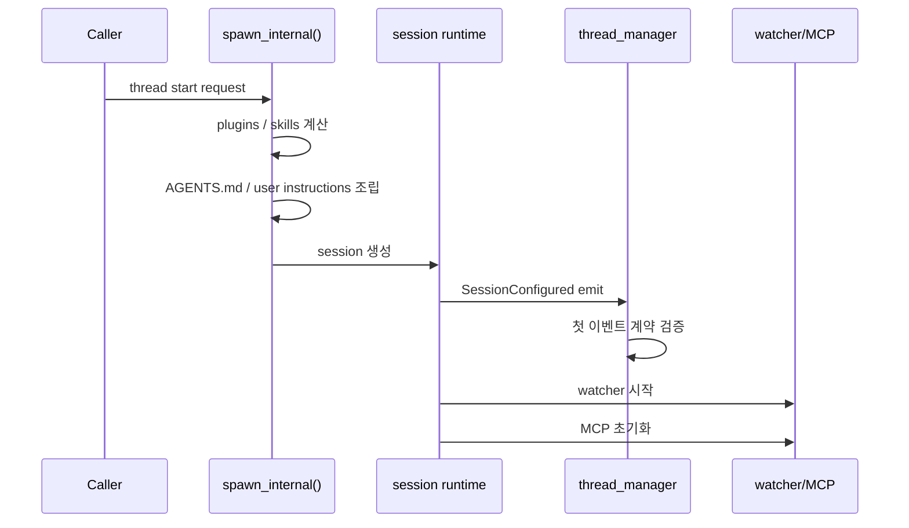

# 2장: 스레드와 세션 — 런타임은 어디서 시작되는가

> **이 장의 질문**: Codex에서 한 개의 "대화"는 어떤 초기화 순서를 거쳐 스레드와 세션으로 살아나며, 첫 계약은 어디서 고정되는가?

## 왜 중요한가

에이전트 시스템에서 시작 순서는 사소하지 않습니다. skills를 먼저 로드할지, 사용자 지침을 먼저 읽을지, 첫 이벤트를 언제 보낼지, MCP나 watcher를 언제 붙일지는 전부 "초기 계약"을 결정합니다. 시작 순서가 흔들리면 상위 UI와 외부 클라이언트는 어느 시점부터 시스템을 신뢰할 수 있는지 모르게 됩니다.

Codex는 이 문제를 느슨한 초기화가 아니라, 스레드 스폰과 세션 설정을 별도의 단계로 나눠 해결합니다. 그리고 그 사이에서 `SessionConfigured`를 사실상의 첫 계약으로 강제합니다.

## System Map



이 순서가 중요한 이유는 간단합니다. 상위 계층은 `SessionConfigured`를 받은 시점부터만 "이제 이 스레드는 살아 있다"고 간주할 수 있기 때문입니다.

## Code Anchor

| 파일 | 역할 |
| --- | --- |
| `codex-rs/core/src/session/mod.rs` | 세션 스폰 전 준비와 초기 컨텍스트 조립 |
| `codex-rs/core/src/session/session.rs` | 실제 세션 초기화와 첫 이벤트 송신 |
| `codex-rs/core/src/thread_manager.rs` | 첫 이벤트 계약을 검증하고 스레드 생명주기를 관리 |

특히 `spawn_internal()`과 `finalize_thread_spawn()`을 함께 보면 "준비 단계"와 "계약 검증 단계"가 분리된 이유가 선명해집니다.

## Runtime Proof

- 스레드 스폰 시 skills와 plugins는 세션 시작 전에 로드된다 -> `codex-rs/core/src/session/mod.rs` -> `spawn_internal()`이 plugin outcome과 loaded skills를 먼저 계산한다
- AGENTS.md 기반 사용자 지침은 세션 초기화 직전에 조립된다 -> `codex-rs/core/src/session/mod.rs` -> `AgentsMdManager::new(&config).user_instructions(...)`를 호출한다
- 첫 이벤트는 반드시 `SessionConfigured`여야 한다 -> `codex-rs/core/src/thread_manager.rs` -> `finalize_thread_spawn()`이 다른 첫 이벤트를 `SessionConfiguredNotFirstEvent`로 거부한다
- watcher와 MCP는 첫 이벤트 뒤에 붙는다 -> `codex-rs/core/src/session/session.rs` -> `SessionConfiguredEvent` 송신 이후 관련 초기화를 이어서 실행한다

이것은 단순 구현 우연이 아닙니다. "클라이언트가 신뢰할 수 있는 첫 순간"을 명시적으로 만드는 설계입니다.

## 소스 발췌

`codex-rs/core/src/thread_manager.rs`는 새 thread 결과에 첫 이벤트인 `SessionConfigured`를 함께 담는다고 타입 주석으로 못박습니다.

```rust
/// Represents a newly created Codex thread (formerly called a conversation), including the first event
/// (which is [`EventMsg::SessionConfigured`]).
pub struct NewThread {
    pub thread_id: ThreadId,
    pub thread: Arc<CodexThread>,
    pub session_configured: SessionConfiguredEvent,
}
```

같은 파일의 `finalize_thread_spawn`은 실제로 첫 이벤트를 읽고, 그것이 아니면 에러로 처리합니다.

```rust
let event = codex.next_event().await?;
let session_configured = match event {
    Event {
        id,
        msg: EventMsg::SessionConfigured(session_configured),
    } if id == INITIAL_SUBMIT_ID => session_configured,
    _ => {
        return Err(CodexErr::SessionConfiguredNotFirstEvent);
    }
};
```

따라서 "세션 시작 이벤트가 먼저 온다"는 말은 문서 관습이 아니라 thread manager가 직접 검사하는 계약입니다.

## 시작 순서가 말해 주는 것

Codex는 시작 시점부터 세 가지를 먼저 고정합니다.

1. **지식층**: skills, plugins, 사용자 지침
2. **세션 계약**: `SessionConfigured`
3. **부가 서브시스템**: watcher, MCP

즉 "행동 이전에 컨텍스트를 만들고, 확장 이전에 계약을 내보낸다"가 이 시스템의 시작 철학입니다.

## 더 깊게 읽기: 스폰은 준비와 보증으로 나뉜다

`spawn_internal()`을 보면 세션 생성은 곧바로 모델 호출로 이어지지 않습니다. 먼저 plugin outcome을 계산하고, plugin이 제공한 skill root까지 포함해 skills를 로드합니다. 그 다음 AGENTS.md 기반 사용자 지침을 읽고, 모델 카탈로그를 새로고침할지 결정하고, base instructions와 dynamic tools를 세션 설정에 넣습니다. 이 준비가 끝난 뒤에야 `Session::new()`가 호출됩니다.

여기서 핵심은 "스폰 함수가 너무 많은 일을 한다"가 아니라 "세션이 생기기 전 확정해야 하는 것"과 "세션이 생긴 뒤 이벤트로 보증해야 하는 것"을 분리한다는 점입니다. `Session::new()` 안에서는 MCP manager를 처음에는 uninitialized로 세팅한 뒤, `SessionConfigured`를 먼저 보냅니다. 그 다음 skills watcher를 시작하고 MCP connection manager를 실제 manager로 교체합니다.

- plugin과 skill discovery는 세션 생성 전에 끝난다 -> `codex-rs/core/src/session/mod.rs` -> `plugins_for_config`, `effective_skill_roots`, `skills_for_config`가 `Session::new()`보다 먼저 호출된다
- 사용자 지침도 세션 설정에 들어가기 전에 조립된다 -> `codex-rs/core/src/session/mod.rs` -> `AgentsMdManager::new(&config).user_instructions(...)` 결과가 `SessionConfiguration.user_instructions`로 들어간다
- 첫 보증 이벤트는 정책과 cwd까지 포함한다 -> `codex-rs/core/src/session/session.rs` -> `SessionConfiguredEvent`가 model, approval policy, sandbox policy, cwd, rollout path를 담는다
- MCP 관련 이벤트는 첫 계약 뒤로 밀린다 -> `codex-rs/core/src/session/session.rs` -> 주석이 `SessionConfigured` 이전 MCP 이벤트 방지를 설명하고, 이후 `McpConnectionManager::new(...)`를 호출한다

이 순서 덕분에 클라이언트는 "세션이 살아 있다"는 의미를 단순한 스레드 ID 발급이 아니라 정책, 모델, cwd, rollout 정보를 동반한 이벤트로 이해할 수 있습니다.

## 실패 모드로 읽기

시작 순서를 검토할 때는 성공 경로보다 실패 경로를 같이 봐야 합니다. skills 로드 오류는 로깅되고, hooks startup warning은 `SessionConfigured` 뒤에 warning 이벤트로 전달되며, required MCP server 실패는 초기화 후 별도 검사에서 에러가 됩니다. 즉 Codex는 모든 초기화 실패를 같은 방식으로 취급하지 않습니다.

이 구분은 제품 설계에도 중요합니다. 지식층 일부가 빠지는 것은 경고로 계속 진행할 수 있지만, required MCP server처럼 런타임 계약의 일부로 선언된 외부 연결이 실패하면 세션 자체를 실패시킬 수 있습니다.

## Builder Takeaway

자신의 에이전트 시스템을 설계한다면 첫 이벤트를 명확한 계약으로 만들 필요가 있습니다. 세션이 준비되었는지, 아직 준비 중인지, 또는 부분적으로만 초기화되었는지를 흐리게 두면 상위 UI와 외부 SDK가 불안정해집니다. `SessionConfigured` 같은 명시적 경계는 런타임 신뢰성을 크게 올립니다.

이제 세션이 시작되는 순간을 봤으니, 다음 장에서는 이 세션 안에서 실제 작업이 어떤 `턴 루프`와 `태스크 모델`로 반복되는지 봅니다.
