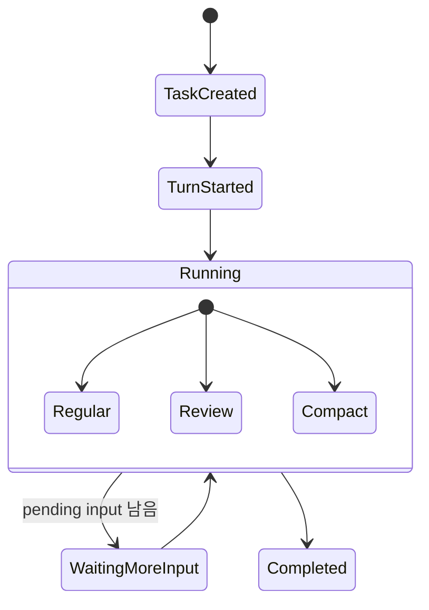

# 3장: 턴 루프 — Codex 하니스는 어떻게 한 턴을 계속 이어 가는가

> **이 장의 질문**: Codex의 한 번의 "턴"은 왜 단순 REPL이 아니라, 하니스의 코어를 이루는 태스크/상태/추가 입력 루프인가?

## 왜 중요한가

이 장은 책 전체의 닻(anchor)이자 하니스 코어입니다. 이후에 보게 될 승인, 샌드박스, skills, context assembly, review delegate, compaction은 결국 모두 턴 루프 안에서 오케스트레이션됩니다. 턴 루프를 모르면 나머지 장은 기능별 메모로 쪼개져 보이고, 턴 루프를 이해하면 그 기능들이 언제 끼어들고 어떤 상태를 바꾸는지가 하나의 하니스 지도처럼 보입니다.

Codex의 턴은 "입력 한 번 받고 응답 한 번 보내는" 구조가 아닙니다. regular turn, review turn, compact turn이 모두 태스크라는 공통 추상화 위에 올라가고, 한 턴 안에서도 추가 입력이 남아 있으면 같은 태스크가 다시 반복됩니다.

## System Map



이 다이어그램의 핵심은 "한 턴 = 한 함수 호출"이 아니라는 점입니다. Codex는 턴을 `TaskKind`와 `TurnState`의 결합으로 모델링합니다.

## Code Anchor

| 파일 | 역할 |
| --- | --- |
| `codex-rs/core/src/tasks/mod.rs` | `SessionTask` 추상화와 task kind 정의 |
| `codex-rs/core/src/tasks/regular.rs` | 일반 사용자 턴의 실제 실행 경로 |
| `codex-rs/core/src/state/turn.rs` | 현재 턴에서 유지해야 하는 상태와 pending map |

특히 `regular.rs`와 `turn.rs`를 같이 봐야 합니다. 하나는 루프를 돌리고, 다른 하나는 루프가 다시 돌 수 있게 만드는 상태를 보관합니다.

## Runtime Proof

- 턴 워크플로는 `SessionTask` 추상화로 나뉜다 -> `codex-rs/core/src/tasks/mod.rs` -> trait이 `kind`, `run`, `abort`를 통해 공통 태스크 계약을 제공한다
- regular turn은 시작 이벤트를 보낸 뒤 실제 실행기로 내려간다 -> `codex-rs/core/src/tasks/regular.rs` -> `TurnStartedEvent`를 emit한 뒤 turn runner로 진입한다
- 같은 턴 안에서도 추가 입력이 남아 있으면 태스크가 반복된다 -> `codex-rs/core/src/tasks/regular.rs` -> `has_pending_input()`가 true면 loop를 다시 돈다
- 현재 실행 중인 턴은 `ActiveTurn { tasks, turn_state }`로 표현된다 -> `codex-rs/core/src/state/turn.rs` -> 여러 running task와 공용 `TurnState`를 함께 보관한다

## 소스 발췌

`codex-rs/core/src/tasks/mod.rs`의 공통 태스크 trait은 턴 workflow를 `kind`, `span_name`, `run`, `abort`로 좁힙니다.

```rust
pub(crate) trait SessionTask: Send + Sync + 'static {
    /// Describes the type of work the task performs so the session can
    /// surface it in telemetry and UI.
    fn kind(&self) -> TaskKind;

    /// Returns the tracing name for a spawned task span.
    fn span_name(&self) -> &'static str;

    /// Executes the task until completion or cancellation.
    ///
    /// Implementations typically stream protocol events using `session` and
    /// `ctx`, returning an optional final agent message when finished. The
    /// provided `cancellation_token` is cancelled when the session requests an
    /// abort; implementers should watch for it and terminate quickly once it
    /// fires. Returning [`Some`] yields a final message that
    /// [`Session::on_task_finished`] will emit to the client.
    fn run(
        self: Arc<Self>,
        session: Arc<SessionTaskContext>,
        ctx: Arc<TurnContext>,
        input: Vec<UserInput>,
        cancellation_token: CancellationToken,
    ) -> impl std::future::Future<Output = Option<String>> + Send;
}
```

`codex-rs/core/src/tasks/regular.rs`의 regular turn은 모델 호출 뒤 pending input이 남아 있으면 같은 task 안에서 다시 돕니다.

```rust
let mut next_input = input;
let mut prewarmed_client_session = prewarmed_client_session;
loop {
    let last_agent_message = run_turn(
        Arc::clone(&sess),
        Arc::clone(&ctx),
        next_input,
        prewarmed_client_session.take(),
        cancellation_token.child_token(),
    )
    .instrument(run_turn_span.clone())
    .await;
    if !sess.has_pending_input().await {
        return last_agent_message;
    }
    next_input = Vec::new();
}
```

## TurnState는 왜 따로 필요한가

`TurnState`는 단순 pending user input 버퍼가 아닙니다. 여기에는 승인 대기, request permissions, tool-driven user input, MCP elicitation, dynamic tool response, mailbox delivery phase처럼 "한 번의 턴 안에서 생기는 비동기 왕복"이 접혀 있습니다.

즉 세션은 장수명 상태를 들고, 턴은 현재 왕복의 중간 결과를 들며, 태스크는 그 상태를 소비하면서 전진합니다. 이 세 층이 분리되어 있기 때문에 review와 compact 같은 별도 workflow도 같은 세션 틀 안에 자연스럽게 들어옵니다.

## 루프를 읽는 관점

Codex의 루프를 읽을 때는 아래 세 질문으로 보는 편이 좋습니다.

1. 이 루프는 어떤 `TaskKind`인가
2. 현재 턴 안에 어떤 pending state가 남아 있는가
3. 이번 반복이 끝났을 때 종료하는가, 아니면 다시 도는가

이 세 질문만 유지해도 이후 장에서 approval, dynamic tool, rollback, mailbox delivery가 왜 갑자기 등장하는지 이해하기 쉬워집니다.

## 더 깊게 읽기: 턴은 완료 뒤에도 다시 깨어날 수 있다

`RegularTask`의 루프는 이 장에서 가장 중요한 코드입니다. regular turn은 `TurnStarted`를 보낸 뒤 `run_turn(...)`을 실행합니다. 여기서 끝이 아닙니다. 실행이 끝난 뒤 `sess.has_pending_input().await`가 true이면 같은 task가 `next_input = Vec::new()` 상태로 다시 `run_turn(...)`에 들어갑니다. 즉 한 번의 사용자 입력이 모델 응답 한 번으로 끝난다는 가정은 코드와 맞지 않습니다.

pending input이 어디서 오느냐도 중요합니다. `Session::start_task()`는 queued response item과 mailbox item을 `TurnState.pending_input`에 밀어 넣고, task 완료 시 `on_task_finished()`가 다시 `take_pending_input()`으로 꺼내 hook inspection을 거쳐 기록합니다. 이 구조 때문에 mailbox, request user input, dynamic tool response 같은 비동기 입력이 같은 턴의 후속 모델 요청으로 이어질 수 있습니다.

- regular turn은 시작 이벤트 후 루프에 들어간다 -> `codex-rs/core/src/tasks/regular.rs` -> `TurnStartedEvent` 송신 뒤 `loop { run_turn(...) }`를 실행한다
- pending input은 같은 task 반복의 게이트다 -> `codex-rs/core/src/tasks/regular.rs` -> `!sess.has_pending_input()`일 때만 마지막 agent message를 반환한다
- task 시작 시 queued input과 mailbox input이 턴 상태로 들어간다 -> `codex-rs/core/src/tasks/mod.rs` -> `take_queued_response_items_for_next_turn()`와 `get_pending_input()` 결과를 `turn_state.push_pending_input(...)`으로 넣는다
- task 종료 시 pending input은 hook inspection을 거쳐 다시 기록된다 -> `codex-rs/core/src/tasks/mod.rs` -> `on_task_finished()`가 `inspect_pending_input`과 `record_pending_input`을 호출한다

이 설계는 긴 실행 중 사용자 개입이나 하위 에이전트 메시지를 "다음 대화"로만 밀어내지 않고, 현재 턴의 의미론 안으로 접어 넣을 수 있게 합니다.

## 루프를 검증하는 최소 추적

직접 코드를 따라갈 때는 아래 순서로 추적하면 됩니다.

1. `Session::spawn_task()`가 이전 task를 abort하고 `start_task()`로 들어가는지 본다.
2. `ActiveTurn`에 `RunningTask`가 추가되는 순간을 찾는다.
3. `RegularTask::run()`에서 `run_turn(...)` 뒤 pending input 여부를 확인한다.
4. `on_task_finished()`가 active turn을 비우는지, pending input을 다시 기록하는지 본다.

이 네 지점이 연결되면 "Codex의 턴 루프"는 추상 다이어그램이 아니라 실제 상태 전이로 보입니다.

## Builder Takeaway

에이전트 하니스를 설계할 때 "while 한 번"으로 모든 것을 설명하려고 하면 곧 무너집니다. 사용자 입력, 도구 왕복, 승인 대기, 중간 삽입 입력을 다루려면 태스크 추상화와 턴 상태를 분리해 두는 편이 훨씬 낫습니다. Codex는 그 분리를 공개 코드 수준에서 보여 주며, 이후 서브에이전트 장도 같은 코어를 축소 복제하는 방식으로 읽게 만듭니다.

이제 하니스의 심장을 봤으니, 다음 장에서는 모델이 보게 되는 도구 표면이 어떻게 구성되고 실제 호출이 어디로 라우팅되는지 봅니다.
