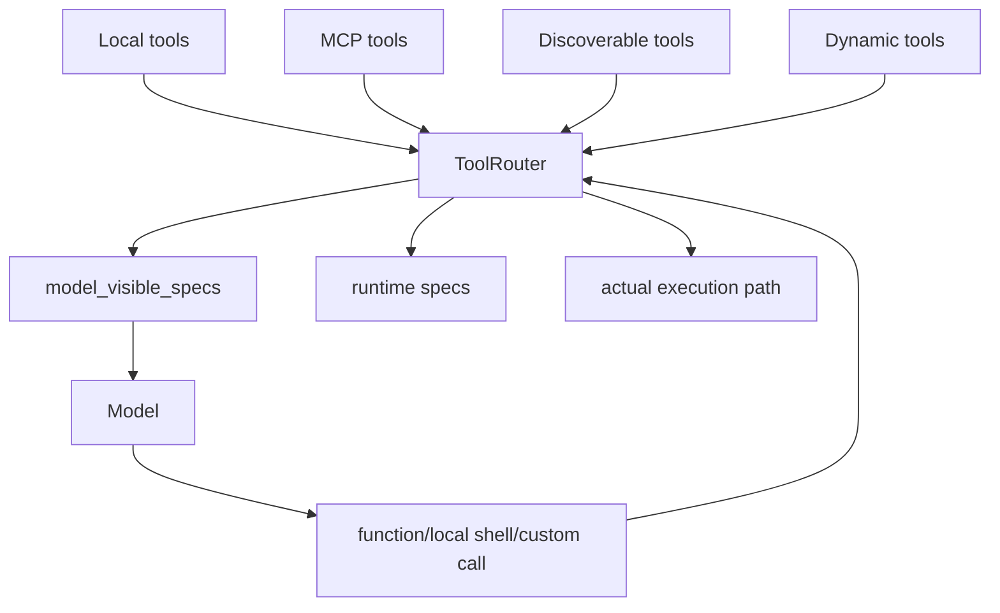

# 4장: 도구 표면과 라우팅 — 모델의 손은 어떻게 조직되는가

> **이 장의 질문**: 모델이 보는 도구 목록은 어떻게 구성되며, 호출은 왜 별도의 라우팅 계층을 거쳐야 하는가?

## 왜 중요한가

도구가 많은 에이전트일수록 "도구를 많이 붙이는 것"과 "모델이 보게 되는 도구 표면을 설계하는 것"은 전혀 다른 문제입니다. Codex는 이 둘을 명확히 분리합니다. 로컬 도구, MCP 도구, discoverable tools, dynamic tools는 런타임 출처가 다르지만, 모델에게는 하나의 도구 표면으로 보이게 해야 합니다. 반대로 모델이 호출을 내렸을 때는 다시 적절한 실행 경로로 되돌려 보내야 합니다.

이 문제를 해결하는 것이 `ToolRouter`입니다. 이 라우터가 없으면 모델이 본 스키마와 실제 실행기 사이의 간격을 관리할 수 없습니다.

## System Map



이 그림에서 중요한 점은 `specs`와 `model_visible_specs`가 따로 있다는 것입니다. Codex는 "보이는 표면"과 "실제 실행 경로"를 같은 자료구조로 다루지 않습니다.

## Code Anchor

| 파일 | 역할 |
| --- | --- |
| `codex-rs/core/src/tools/router.rs` | 여러 출처의 도구를 model-visible 표면과 runtime path로 연결 |
| `codex-rs/core/src/tools/spec.rs` | 도구 스펙과 호출 파라미터를 정규화하는 기반 타입 |

이 장의 핵심은 도구 종류 자체보다, 그 다양한 종류를 같은 표면으로 보이게 만드는 어댑터 계층입니다.

## Runtime Proof

- 도구 목록은 로컬/MCP/discoverable/dynamic 입력을 합쳐 구성된다 -> `codex-rs/core/src/tools/router.rs` -> `ToolRouterParams`가 서로 다른 도구 출처를 함께 받는다
- model-visible 도구 목록은 runtime registry와 분리된다 -> `codex-rs/core/src/tools/router.rs` -> `specs`와 `model_visible_specs`를 따로 보관한다
- 함수 호출은 MCP, 일반 function, local shell, custom, tool search 등으로 다시 분기된다 -> `codex-rs/core/src/tools/router.rs` -> `build_tool_call()`이 응답 아이템별 payload를 정규화한다
- local shell call도 별도 예외가 아니라 표준 tool payload로 재정규화된다 -> `codex-rs/core/src/tools/router.rs` -> `LocalShellAction::Exec`를 shell params로 감싼다

## 소스 발췌

`codex-rs/core/src/tools/router.rs`의 `ToolRouter`는 실행용 spec과 모델 가시 spec을 별도로 보관합니다.

```rust
pub struct ToolRouter {
    registry: ToolRegistry,
    specs: Vec<ConfiguredToolSpec>,
    model_visible_specs: Vec<ToolSpec>,
    parallel_mcp_server_names: HashSet<String>,
}
```

같은 파일의 생성 경로는 config와 MCP, discoverable, dynamic tools를 합쳐 registry를 만들고, 별도의 `model_visible_specs`를 계산합니다.

```rust
let builder = build_specs_with_discoverable_tools(
    config,
    mcp_tools,
    deferred_mcp_tools,
    unavailable_called_tools,
    discoverable_tools,
    dynamic_tools,
);
let (specs, registry) = builder.build();
let model_visible_specs = if config.code_mode_only_enabled {
    specs
        .iter()
        .filter_map(|configured_tool| {
            if !codex_code_mode::is_code_mode_nested_tool(configured_tool.name()) {
                Some(configured_tool.spec.clone())
            } else {
                None
            }
        })
        .collect()
} else {
    specs
        .iter()
        .map(|configured_tool| configured_tool.spec.clone())
        .collect()
};
```

## 왜 라우터가 필요한가

Codex의 도구 라우팅이 중요한 이유는 두 가지입니다.

1. **모델에게는 단순한 표면을 보인다**
   모델은 출처별 구현 차이를 몰라도 된다.
2. **런타임은 출처별 차이를 유지한다**
   실제 실행기, 권한 계산, 프로토콜, 네임스페이스는 각기 다를 수 있다.

즉 라우터는 모델을 단순화하고 런타임은 복잡성을 유지하는 계층입니다.

## 더 깊게 읽기: 보이는 스펙과 실행 스펙을 분리한다

`ToolRouter`에서 가장 먼저 봐야 할 필드는 `specs`와 `model_visible_specs`입니다. 둘 다 도구 목록처럼 보이지만 역할이 다릅니다. `specs`는 런타임이 dispatch와 lookup에 쓰는 설정된 도구 목록이고, `model_visible_specs`는 모델에 실제로 보여 줄 도구 목록입니다. code mode only 같은 설정에서는 nested tool을 모델 가시 목록에서 숨기지만, 런타임 registry는 별도로 유지됩니다.

호출을 받는 쪽도 같은 원칙을 따릅니다. 모델 응답의 `ResponseItem`은 그대로 실행되지 않고 `ToolCall`로 재정규화됩니다. MCP tool이면 server와 raw tool name을 payload에 담고, 일반 function이면 function payload로 남기고, local shell call이면 `ShellToolCallParams`로 감쌉니다.

- model-visible surface는 runtime registry와 별도다 -> `codex-rs/core/src/tools/router.rs` -> `ToolRouter { registry, specs, model_visible_specs, ... }`가 분리돼 있다
- code mode only에서는 일부 nested tool을 모델 표면에서 숨긴다 -> `codex-rs/core/src/tools/router.rs` -> `code_mode_only_enabled` 분기에서 `is_code_mode_nested_tool`을 필터링한다
- MCP 호출은 canonical tool name으로 재작성된다 -> `codex-rs/core/src/tools/router.rs` -> `resolve_mcp_tool_info(...)` 성공 시 `ToolPayload::Mcp { server, tool, raw_arguments }`를 만든다
- local shell은 특별 케이스로 실행되지 않고 표준 payload가 된다 -> `codex-rs/core/src/tools/router.rs` -> `LocalShellAction::Exec`가 `ShellToolCallParams`로 변환된다

이 분리 덕분에 "모델에게 보여 주는 단순성"과 "실제 실행 경로의 정확성"을 동시에 유지할 수 있습니다. 모델은 도구 이름과 스키마만 보면 되지만, 런타임은 namespace, MCP server, custom call, shell permission 같은 정보를 잃지 않습니다.

## 라우터를 읽는 순서

도구 라우팅을 처음 볼 때는 등록 파일부터 파고들기보다 아래 흐름을 권합니다.

1. `ToolRouterParams`에서 도구 출처가 무엇인지 확인한다.
2. `from_config()`에서 `specs`와 `model_visible_specs`가 어떻게 달라지는지 본다.
3. `build_tool_call()`에서 `ResponseItem`이 어떤 payload로 바뀌는지 따라간다.
4. `dispatch_tool_call_with_code_mode_result()`가 registry로 넘기는 마지막 지점을 확인한다.

이 순서대로 보면 MCP, dynamic tools, tool search가 제각각 추가된 예외가 아니라 같은 라우팅 계층에 들어온 출처로 보입니다.

## Builder Takeaway

도구 수가 늘어날수록 "등록"보다 "노출"과 "역정규화"가 더 중요해집니다. 자신의 에이전트에서도 `모델이 보는 스키마`와 `실제 실행기 레지스트리`를 분리해 두면, MCP나 앱 연결 같은 새 출처를 추가해도 코어 호출 경로를 덜 흔들 수 있습니다.

이제 모델의 손이 어떻게 조직되는지 봤으니, 다음 장에서는 그 손이 실제로 움직일 때 승인, 샌드박스, 병렬성이 어디서 계산되는지 봅니다.
