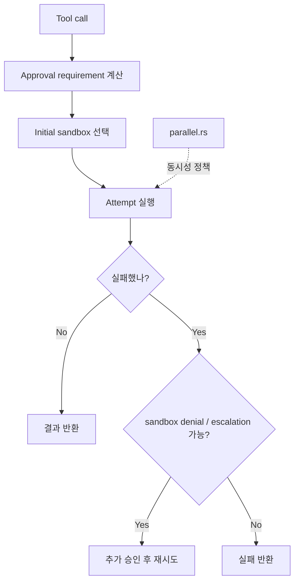

# 5장: 승인·샌드박스·병렬 실행 — 실행은 어디서 통제되는가

> **이 장의 질문**: Codex는 도구 실행 전에 무엇을 계산하며, 승인·샌드박스·병렬성은 왜 중앙 오케스트레이터에서 처리되는가?

## 왜 중요한가

대부분의 에이전트 데모는 도구 호출이 성공하는 장면만 보여 줍니다. 하지만 실제 제품 런타임에서 더 중요한 것은 호출이 실패하거나, 금지되거나, 제한된 권한으로만 허용되는 순간입니다. Codex는 이 문제를 "각 도구가 알아서 하라"가 아니라 `ToolOrchestrator`라는 중앙 정책 계층으로 끌어올려 해결합니다.

여기서 핵심은 도구가 호출되기 전에 이미 많은 것이 결정된다는 점입니다. 승인 없이 가능한지, 어떤 샌드박스를 쓸지, 네트워크 승인이 필요한지, 실패했을 때 escalation을 허용할지, 그리고 동시에 실행해도 되는지가 모두 이 계층에서 계산됩니다.

## System Map



이 그림이 보여 주는 건 단순합니다. 실행은 언제나 "호출 -> 정책 계산 -> 시도"의 순서를 따릅니다.

## Code Anchor

| 파일 | 역할 |
| --- | --- |
| `codex-rs/core/src/tools/orchestrator.rs` | approval, sandbox, attempt, escalation의 중심 |
| `codex-rs/core/src/tools/parallel.rs` | 도구별 병렬 가능 여부와 lock 정책 |

오케스트레이터는 실행 전 정책을 계산하고, 병렬 모듈은 동일 시점에 함께 돌 수 있는 호출을 제한합니다. 두 파일을 함께 읽어야 "실행 가능성"과 "동시 실행 가능성"을 같이 이해할 수 있습니다.

## Runtime Proof

- 오케스트레이터의 기본 순서는 approval -> sandbox selection -> attempt -> escalation이다 -> `codex-rs/core/src/tools/orchestrator.rs` -> 모듈 헤더와 `run()` 경로가 이 순서를 유지한다
- 첫 실행 샌드박스는 파일시스템, 네트워크, 플랫폼 지원 수준을 함께 고려해 선택된다 -> `codex-rs/core/src/tools/orchestrator.rs` -> `select_initial(...)`이 관련 정책을 모두 받는다
- 네트워크 승인도 실행 수명주기에 결합된다 -> `codex-rs/core/src/tools/orchestrator.rs` -> `begin_network_approval`, `finish_*_network_approval` 경로가 존재한다
- 병렬 실행은 도구 capability에 따라 read/write lock으로 제어된다 -> `codex-rs/core/src/tools/parallel.rs` -> 병렬 가능 호출은 read lock, 불가능 호출은 write lock을 잡는다

## 소스 발췌

`codex-rs/core/src/tools/orchestrator.rs`의 실행 진입부는 먼저 approval requirement를 계산하고, 그 결과에 따라 거절하거나 승인 흐름으로 들어갑니다.

```rust
let requirement = tool.exec_approval_requirement(req).unwrap_or_else(|| {
    default_exec_approval_requirement(approval_policy, &turn_ctx.file_system_sandbox_policy)
});
match requirement {
    ExecApprovalRequirement::Skip { .. } => {
        otel.tool_decision(
            otel_tn,
            otel_ci,
            &ReviewDecision::Approved,
            ToolDecisionSource::Config,
        );
    }
    ExecApprovalRequirement::Forbidden { reason } => {
        return Err(ToolError::Rejected(reason));
    }
    ExecApprovalRequirement::NeedsApproval { reason, .. } => {
        let guardian_review_id = use_guardian.then(new_guardian_review_id);
        let approval_ctx = ApprovalCtx {
            session: &tool_ctx.session,
            turn: &tool_ctx.turn,
            call_id: &tool_ctx.call_id,
            guardian_review_id: guardian_review_id.clone(),
            retry_reason: reason,
            network_approval_context: None,
        };
```

parallel 실행 여부는 `codex-rs/core/src/tools/parallel.rs`에서 lock 선택으로 강제됩니다.

```rust
let _guard = if supports_parallel {
    Either::Left(lock.read().await)
} else {
    Either::Right(lock.write().await)
};
```

## 중앙 정책 계층의 의미

왜 이 계층이 중요한가? 이유는 세 가지입니다.

1. 도구 구현이 정책을 몰라도 된다.
2. 승인/샌드박스/재시도 규칙을 한곳에서 바꿀 수 있다.
3. 새 도구가 추가돼도 정책 일관성을 유지할 수 있다.

즉 Codex는 도구를 "함수"가 아니라 "정책이 먼저 계산되는 작업"으로 봅니다.

## 더 깊게 읽기: 실행 성공보다 실행 전 결정을 읽는다

`ToolOrchestrator::run()`은 도구 실행의 본체처럼 보이지만, 실제로 먼저 하는 일은 실행이 아니라 decision입니다. tool이 자체 approval requirement를 제공하지 않으면 `default_exec_approval_requirement(...)`로 현재 approval policy와 filesystem sandbox policy를 합쳐 requirement를 계산합니다. 그 결과는 skip, forbidden, needs approval 중 하나입니다.

그 다음에야 initial sandbox를 고릅니다. tool이 첫 시도에서 sandbox를 우회하겠다고 선언하면 `SandboxType::None`이지만, 기본 경로에서는 `SandboxManager::select_initial(...)`이 filesystem policy, network policy, tool preference, Windows sandbox level, managed network 상태를 함께 받습니다. 즉 샌드박스 선택은 단일 enum switch가 아니라 실행 환경 전체를 반영하는 결정입니다.

- approval requirement는 attempt보다 먼저 계산된다 -> `codex-rs/core/src/tools/orchestrator.rs` -> `requirement` match가 `run_attempt(...)`보다 앞에 있다
- forbidden은 실행 없이 즉시 rejected가 된다 -> `codex-rs/core/src/tools/orchestrator.rs` -> `ExecApprovalRequirement::Forbidden`이 `ToolError::Rejected`를 반환한다
- initial sandbox는 파일/네트워크/플랫폼 상태를 함께 본다 -> `codex-rs/core/src/tools/orchestrator.rs` -> `select_initial(...)` 호출에 filesystem, network, preference, windows level, managed network 인자가 모인다
- sandbox denial 후 재시도는 조건부다 -> `codex-rs/core/src/tools/orchestrator.rs` -> `escalate_on_failure`, `wants_no_sandbox_approval`, network approval context를 검사한다

병렬성도 같은 철학입니다. `ToolCallRuntime`은 tool call마다 `tool_supports_parallel(...)`을 물어보고, 가능한 call은 read lock, 불가능한 call은 write lock을 잡습니다. 병렬 실행은 Tokio task를 많이 띄우는 문제가 아니라, 어떤 호출이 환경을 동시에 건드려도 되는지의 정책 문제입니다.

- 병렬 가능 tool은 read lock으로 함께 실행될 수 있다 -> `codex-rs/core/src/tools/parallel.rs` -> `supports_parallel`이면 `lock.read().await`를 사용한다
- 병렬 불가능 tool은 write lock으로 직렬화된다 -> `codex-rs/core/src/tools/parallel.rs` -> `supports_parallel`이 false이면 `lock.write().await`를 사용한다

## 읽을 때 조심할 점

도구 handler 안에서 보이는 실제 command 실행만 보면 Codex의 안전성을 놓칩니다. 권한 요청, hook, sandbox, network approval, retry는 handler 바깥의 orchestration layer에 있습니다. 따라서 "이 도구가 안전한가"를 평가하려면 handler 파일과 함께 `orchestrator.rs`, `sandboxing.rs`, `parallel.rs`, hook runtime을 같이 읽어야 합니다.

## Builder Takeaway

프로덕션급 에이전트에서 도구 실행은 반드시 중앙 정책 계층을 거쳐야 합니다. 각 도구에 권한 검사와 재시도 정책을 흩뿌리면, 시간이 갈수록 예외 규칙이 폭발합니다. `orchestrator -> executor` 구조를 분리해 두면 안전성과 확장성이 동시에 좋아집니다.

이제 실행이 어디서 통제되는지 봤으니, 다음 장에서는 이 모든 런타임 사건이 내부 이벤트와 외부 app-server 프로토콜로 어떻게 드러나는지 봅니다.
