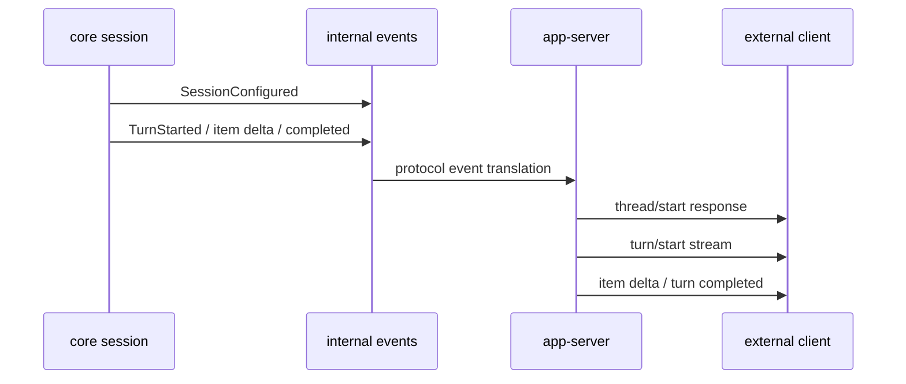

# 6장: 이벤트 스트리밍과 app-server — 런타임 계약은 어떤 이벤트로 드러나는가

> **이 장의 질문**: Codex 내부의 이벤트 기반 런타임은 외부 클라이언트에게 어떤 프로토콜 계약으로 노출되는가?

## 왜 중요한가

Codex를 단지 로컬 CLI로 보면 내부 이벤트 설계가 과하게 느껴질 수 있습니다. 하지만 이 저장소는 처음부터 TUI, CLI, app-server, 그리고 그 위에 올라갈 외부 클라이언트를 모두 염두에 둔 구조입니다. 이때 중요한 것은 "코어가 어떤 사건을 알고 있는가"와 "외부 표면이 어떤 프리미티브를 이해하는가"를 맞추는 일입니다.

Codex는 내부적으로 이벤트 기반 런타임이고, app-server는 그 사건들을 thread/turn/item 중심의 외부 계약으로 번역하는 계층입니다. 이 번역이 안정적이어야 VS Code 같은 rich interface도 코어와 같은 의미론을 공유할 수 있습니다.

## System Map



이 구조 덕분에 외부 클라이언트는 코어의 세부 구현을 몰라도 `thread`, `turn`, `item`이라는 안정된 단위로 Codex를 제어할 수 있습니다.

## Code Anchor

| 파일 | 역할 |
| --- | --- |
| `codex-rs/core/src/session/session.rs` | 내부 이벤트가 처음 방출되는 지점 |
| `codex-rs/app-server/README.md` | 외부 프로토콜의 개념과 lifecycle 설명 |

특히 `app-server` 문서는 구현 파일이 아니라도 중요합니다. 왜냐하면 외부 계약이 어떤 vocabulary를 기준으로 설계되었는지를 가장 명시적으로 설명하기 때문입니다.

## Runtime Proof

- 세션 시작 시 `SessionConfigured`가 먼저 나간다 -> `codex-rs/core/src/session/session.rs` -> watcher와 MCP 초기화보다 먼저 이벤트를 송신한다
- app-server는 JSON-RPC 스타일의 양방향 프로토콜을 사용한다 -> `codex-rs/app-server/README.md` -> stdio/websocket transport와 initialization 규칙을 설명한다
- 외부 API의 핵심 개념은 thread, turn, item이다 -> `codex-rs/app-server/README.md` -> Core Primitives 섹션이 세 단위를 정의한다
- `turn/start` 이후에는 item delta와 turn completion 스트림을 읽어야 한다 -> `codex-rs/app-server/README.md` -> lifecycle overview가 그 흐름을 서술한다

## 소스 발췌

`codex-rs/app-server-protocol/src/protocol/common.rs`의 request macro 사용부는 wire method 이름을 Rust variant에 직접 붙입니다.

```rust
client_request_definitions! {
    Initialize {
        params: v1::InitializeParams,
        response: v1::InitializeResponse,
    },

    /// NEW APIs
    // Thread lifecycle
    // Uses `inspect_params` because only some fields are experimental.
    ThreadStart => "thread/start" {
        params: v2::ThreadStartParams,
        inspect_params: true,
        response: v2::ThreadStartResponse,
    },
```

turn lifecycle도 같은 파일에서 별도 request와 notification 이름으로 드러납니다.

```rust
TurnStart => "turn/start" {
    params: v2::TurnStartParams,
    inspect_params: true,
    response: v2::TurnStartResponse,
},
```

```rust
ThreadStarted => "thread/started" (v2::ThreadStartedNotification),
ThreadStatusChanged => "thread/status/changed" (v2::ThreadStatusChangedNotification),
ThreadArchived => "thread/archived" (v2::ThreadArchivedNotification),
ThreadUnarchived => "thread/unarchived" (v2::ThreadUnarchivedNotification),
ThreadClosed => "thread/closed" (v2::ThreadClosedNotification),
SkillsChanged => "skills/changed" (v2::SkillsChangedNotification),
ThreadNameUpdated => "thread/name/updated" (v2::ThreadNameUpdatedNotification),
ThreadTokenUsageUpdated => "thread/tokenUsage/updated" (v2::ThreadTokenUsageUpdatedNotification),
TurnStarted => "turn/started" (v2::TurnStartedNotification),
HookStarted => "hook/started" (v2::HookStartedNotification),
TurnCompleted => "turn/completed" (v2::TurnCompletedNotification),
```

## 내부 사건과 외부 계약의 대응

이 장에서 중요한 해석은 하나입니다. Codex는 내부 이벤트를 그대로 바깥에 쏟아내지 않고, 외부가 이해하기 쉬운 단위로 재구성합니다.

- 내부는 세션/태스크/이벤트 중심
- 외부는 thread/turn/item 중심

이 분리는 아주 중요합니다. 코어 구현이 바뀌어도 외부 계약을 덜 흔들 수 있기 때문입니다.

## 더 깊게 읽기: 이벤트는 내부 로그가 아니라 외부 상태 기계다

app-server 문서가 긴 이유는 단순 API 목록이 많아서가 아닙니다. 외부 클라이언트가 Codex를 안정적으로 붙잡으려면 "언제 thread가 시작됐는가", "turn이 실제로 running이 됐는가", "item이 시작/완료됐는가", "approval request에 어떻게 응답해야 하는가"를 알아야 합니다. 그래서 app-server는 내부 이벤트를 그대로 내보내는 대신 JSON-RPC method와 notification vocabulary로 다시 정리합니다.

예를 들어 내부 regular turn은 `TurnStartedEvent`를 보내고 task 완료 시 `TurnComplete`로 닫힙니다. app-server 문서에서는 이것이 `turn/start` 응답, `turn/started`, `item/*`, `turn/completed` notification 흐름으로 설명됩니다. 같은 사건을 내부 구현자는 `EventMsg`로, 외부 클라이언트는 JSON-RPC notification으로 이해하는 셈입니다.

- 외부 thread lifecycle은 method와 notification이 쌍을 이룬다 -> `codex-rs/app-server/README.md` -> `thread/start`가 thread object를 반환하고 `thread/started`를 emit한다고 설명한다
- turn lifecycle은 start response와 stream notification으로 나뉜다 -> `codex-rs/app-server/README.md` -> `turn/start` 뒤 `turn/started`, `item/*`, `turn/completed`를 읽으라고 설명한다
- protocol crate도 같은 method vocabulary를 타입으로 고정한다 -> `codex-rs/app-server-protocol/src/protocol/common.rs` -> `ThreadStart`, `TurnStart`, `ReviewStart`, `ThreadRollback`, `ThreadCompactStart` method 매핑이 있다
- v2 타입은 camelCase wire format과 TypeScript export를 함께 갖는다 -> `codex-rs/app-server-protocol/src/protocol/v2.rs` -> 다수 payload가 `#[serde(rename_all = "camelCase")]`, `#[ts(export_to = "v2/")]`를 사용한다

이 구조는 외부 클라이언트가 Rust 내부 모듈명을 몰라도 되게 합니다. 클라이언트는 thread/turn/item이라는 안정된 단위를 보고, core는 task/session/event라는 내부 구조를 유지합니다.

## 프로토콜을 읽는 법

이 장을 코드와 함께 읽으려면 README만 보지 말고 세 층을 같이 봐야 합니다.

1. `codex-rs/core/src/session/session.rs`에서 어떤 `EventMsg`가 core에서 만들어지는지 확인한다.
2. `codex-rs/app-server/README.md`에서 그 사건이 어떤 user-facing lifecycle로 설명되는지 본다.
3. `codex-rs/app-server-protocol/src/protocol/common.rs`와 `v2.rs`에서 method 이름과 payload 타입이 어떻게 고정되는지 확인한다.

이 세 층이 맞아야 "문서상 API"와 "실제 런타임 사건"이 어긋나지 않습니다.

## Builder Takeaway

코어 런타임을 외부 표면에 그대로 노출하지 말고, 외부가 오래 붙잡을 수 있는 프로토콜 단위를 다시 정의해야 합니다. Codex에서는 그 단위가 `thread`, `turn`, `item`입니다. 자신의 시스템도 같은 식으로 "내부 사건 vocabulary"와 "외부 계약 vocabulary"를 분리해 두는 편이 좋습니다.

이제 실행 표면과 이벤트 계약이 보였으니, 다음 장부터는 이 런타임을 실제로 제어하는 `AGENTS.md`, `skills`, 초기 컨텍스트 조립 계층으로 들어갑니다.
