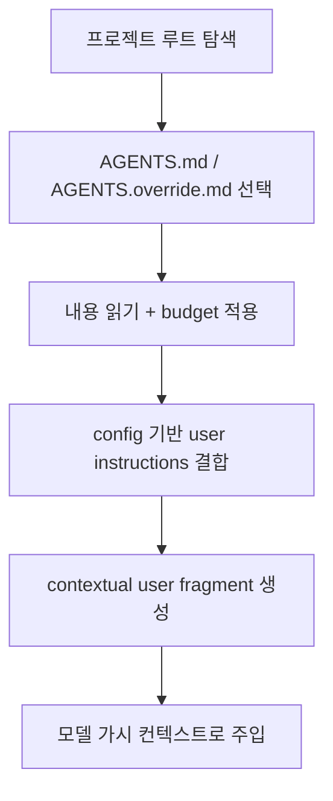

# 7장: AGENTS.md — 사용자 지침은 어떻게 우선권을 얻는가

> **이 장의 질문**: Codex는 파일 시스템에 흩어진 AGENTS.md 계열 지침을 어떤 우선순위와 포맷으로 모델에게 주입하는가?

## 왜 중요한가

에이전트 시스템에서 사용자 지침은 "옵션 몇 개"가 아니라 모델 행동을 바꾸는 제어 평면입니다. Codex가 흥미로운 이유는 AGENTS.md를 그냥 읽어서 붙이지 않는다는 점입니다. 프로젝트 루트 탐색, override 우선순위, byte budget, config 기반 사용자 지침 결합, model-visible 포맷팅까지 모두 별도 파이프라인으로 다룹니다.

즉 이 장은 파일 읽기 기능이 아니라, "사용자 명령이 어디서 우선권을 얻는가"를 해부하는 장입니다.

## System Map



이 구조에서 핵심은 `탐색`, `우선순위`, `표현`이 한 함수에 뭉쳐 있지 않다는 점입니다.

## Code Anchor

| 파일 | 역할 |
| --- | --- |
| `codex-rs/core/src/agents_md.rs` | 파일 탐색, override 우선순위, 결합 로직 |
| `codex-rs/core/src/context/user_instructions.rs` | 모델이 실제로 보게 되는 포맷 생성 |

## Runtime Proof

- AGENTS.md 탐색은 프로젝트 루트에서 현재 디렉터리까지 내려오며 루트를 넘지 않는다 -> `codex-rs/core/src/agents_md.rs` -> 모듈 주석과 `agents_md_paths()`가 탐색 규칙을 구현한다
- `AGENTS.override.md`가 `AGENTS.md`보다 우선된다 -> `codex-rs/core/src/agents_md.rs` -> `LOCAL_AGENTS_MD_FILENAME`를 우선 후보로 둔다
- AGENTS 내용은 config의 사용자 지침과 결합될 수 있다 -> `codex-rs/core/src/agents_md.rs` -> `user_instructions_with_fs()`가 separator를 넣어 합친다
- 모델에 보이는 형식은 contextual user fragment다 -> `codex-rs/core/src/context/user_instructions.rs` -> `# AGENTS.md instructions for ...` 마커와 body formatter가 존재한다

## 소스 발췌

`codex-rs/core/src/agents_md.rs`는 파일 상단 주석에서 탐색 규칙을 직접 설명합니다.

```rust
//! Project-level documentation is primarily stored in files named `AGENTS.md`.
//! Additional fallback filenames can be configured via `project_doc_fallback_filenames`.
//! We include the concatenation of all files found along the path from the
//! project root to the current working directory as follows:
//!
//! 1.  Determine the project root by walking upwards from the current working
//!     directory until a configured `project_root_markers` entry is found.
//!     When `project_root_markers` is unset, the default marker list is used
//!     (`.git`). If no marker is found, only the current working directory is
//!     considered. An empty marker list disables parent traversal.
//! 2.  Collect every `AGENTS.md` found from the project root down to the
//!     current working directory (inclusive) and concatenate their contents in
//!     that order.
//! 3.  We do **not** walk past the project root.
```

후보 파일 우선순위도 같은 파일에서 확인할 수 있습니다.

```rust
fn candidate_filenames(&self) -> Vec<&str> {
    let mut names: Vec<&str> =
        Vec::with_capacity(2 + self.config.project_doc_fallback_filenames.len());
    names.push(LOCAL_AGENTS_MD_FILENAME);
    names.push(DEFAULT_AGENTS_MD_FILENAME);
    for candidate in &self.config.project_doc_fallback_filenames {
        let candidate = candidate.as_str();
        if candidate.is_empty() {
            continue;
        }
        if !names.contains(&candidate) {
            names.push(candidate);
        }
    }
    names
}
```

모델에 보이는 최종 포맷은 `codex-rs/core/src/context/user_instructions.rs`에서 contextual user fragment로 만들어집니다.

```rust
impl ContextualUserFragment for UserInstructions {
    const ROLE: &'static str = "user";
    const START_MARKER: &'static str = "# AGENTS.md instructions for ";
    const END_MARKER: &'static str = "</INSTRUCTIONS>";

    fn body(&self) -> String {
        format!("{}\n\n<INSTRUCTIONS>\n{}\n", self.directory, self.text)
    }
}
```

## 해석

Codex는 AGENTS.md를 "파일"이 아니라 "우선순위를 가진 지침 계층"으로 취급합니다. 이 계층화 덕분에 로컬 override, 루트 지침, config 기반 지침을 한데 넣어도 행동의 우선순위를 비교적 예측 가능하게 유지할 수 있습니다.

## 더 깊게 읽기: 발견, 예산, 표현을 나눠 본다

`agents_md.rs`의 주석은 이 장의 가장 좋은 출발점입니다. Codex는 현재 디렉터리에서 위로 올라가 project root marker를 찾고, 그 root부터 현재 cwd까지 내려오며 AGENTS.md를 수집합니다. 이때 project root를 넘지 않는다는 규칙이 명시돼 있습니다. 이 규칙은 "상위 홈 디렉터리에 우연히 있는 파일이 프로젝트 지침으로 들어오는" 문제를 막습니다.

파일 우선순위도 별도입니다. global instruction load에서는 `AGENTS.override.md`를 `AGENTS.md`보다 먼저 봅니다. 프로젝트 문서는 `project_doc_max_bytes` 예산 안에서 읽고, 남은 예산을 넘는 파일은 truncate합니다. 마지막으로 config의 user instructions와 AGENTS.md 문서를 separator로 합치고, model-visible user fragment는 `UserInstructions`가 렌더링합니다.

- 탐색은 root부터 cwd까지 내려오는 계층이다 -> `codex-rs/core/src/agents_md.rs` -> 모듈 주석과 `agents_md_paths()`가 root marker와 search dir 순서를 설명한다
- budget 0이면 프로젝트 문서를 아예 넣지 않는다 -> `codex-rs/core/src/agents_md.rs` -> `read_agents_md()`와 `agents_md_paths()`가 `project_doc_max_bytes == 0`에서 조기 반환한다
- config instruction과 project doc은 separator로 합쳐진다 -> `codex-rs/core/src/agents_md.rs` -> `AGENTS_MD_SEPARATOR`와 `user_instructions_with_fs()`가 결합 순서를 보여 준다
- 모델에 보이는 user fragment는 고정 marker를 가진다 -> `codex-rs/core/src/context/user_instructions.rs` -> `START_MARKER`가 `# AGENTS.md instructions for `로 정의된다

이렇게 보면 AGENTS.md는 단순 파일 include가 아니라 "발견 규칙, 우선순위, 예산, 렌더링 marker"를 모두 가진 지침 pipeline입니다.

## 설계상 중요한 경계

AGENTS.md의 내용은 강력하지만 무한하지 않습니다. Codex는 예산을 둬서 너무 큰 프로젝트 문서가 전체 초기 컨텍스트를 잠식하지 못하게 하고, 프로젝트 root 밖으로 탐색하지 않아서 지침의 적용 범위를 제한합니다. 이 두 경계가 없다면 AGENTS.md는 유용한 제어 평면이 아니라 예측하기 어려운 전역 side effect가 됩니다.

자신의 시스템에서도 "지침 파일을 읽는다"에서 멈추면 부족합니다. 반드시 어느 디렉터리까지 읽는지, 어떤 파일이 override인지, 얼마나 읽는지, 모델에게 어떤 marker로 보여 주는지를 같이 설계해야 합니다.

## Builder Takeaway

지침 주입을 설계할 때 파일 발견과 모델 노출 포맷을 분리해 두는 편이 좋습니다. 그래야 나중에 override 파일, 관리자 지침, 사용자별 설정을 추가해도 시스템이 무너지지 않습니다.

이제 사용자 지침 계층이 보였으니, 다음 장에서는 Codex가 `skills`를 어떻게 런타임 지식층으로 로드하고 주입하는지 봅니다.
