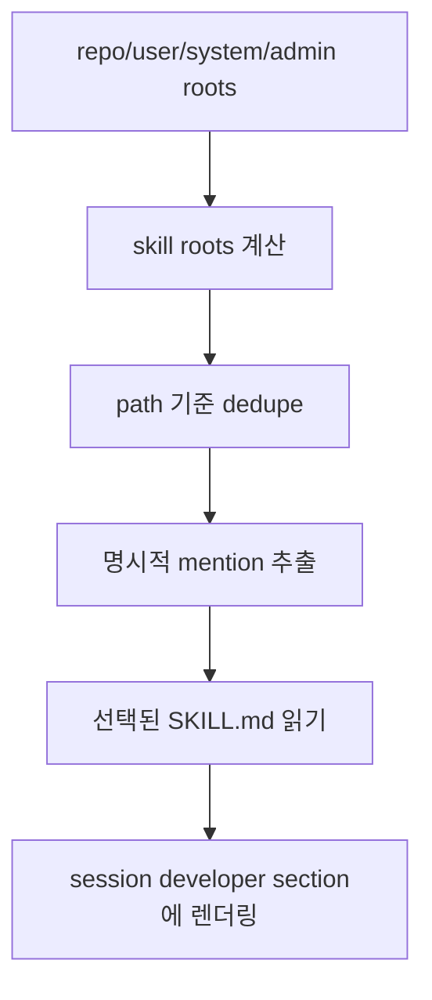

# 8장: Skills — 런타임 지식층은 어떻게 주입되는가

> **이 장의 질문**: Codex의 skills 시스템은 파일 나열이 아니라 어떤 로딩·선택·주입 파이프라인으로 작동하는가?

## 왜 중요한가

skills는 흔히 "프롬프트 조각 모음" 정도로 오해되지만, Codex에서는 scope 우선순위, 파일 시스템 탐색, 명시적 언급 추출, 예산 제한, session 시작 시 개발자 섹션 렌더링까지 포함하는 독립된 지식 주입 계층입니다. 즉 이 장은 메모장 기능이 아니라 "런타임이 지식을 어떤 방식으로 모델에 보이게 하는가"를 설명합니다.

## System Map



## Code Anchor

| 파일 | 역할 |
| --- | --- |
| `codex-rs/core-skills/src/loader.rs` | scope, root, dedupe 로직 |
| `codex-rs/core-skills/src/injection.rs` | 언급된 skill만 실제 injection item으로 변환 |
| `codex-rs/core/src/session/mod.rs` | 세션 시작 시 skill 목록과 경고를 모델 가시 섹션으로 렌더링 |

## Runtime Proof

- skill loader는 repo/user/system/admin scope를 고려해 여러 root를 합친다 -> `codex-rs/core-skills/src/loader.rs` -> `SkillRoot`, `skill_roots(...)`, `scope_rank(...)`가 존재한다
- 스캔 결과는 path 기준으로 dedupe된다 -> `codex-rs/core-skills/src/loader.rs` -> `seen.insert(skill.path_to_skills_md.clone())`로 중복을 제거한다
- 명시적으로 언급된 skill만 본문까지 읽어 실제 injection item이 된다 -> `codex-rs/core-skills/src/injection.rs` -> `build_skill_injections()`가 `mentioned_skills`만 읽는다
- 세션 시작 시 implicit invocation 가능한 skill 목록은 예산 안에서 developer section으로 렌더링된다 -> `codex-rs/core/src/session/mod.rs` -> `build_available_skills(...)`와 trim warning 경로가 존재한다

## 소스 발췌

`codex-rs/core-skills/src/loader.rs`의 root 단위 loader는 skill을 읽은 뒤 path 기준으로 중복을 제거하고 scope/name/path 순서로 정렬합니다.

```rust
pub async fn load_skills_from_roots<I>(roots: I) -> SkillLoadOutcome
where
    I: IntoIterator<Item = SkillRoot>,
{
    let mut outcome = SkillLoadOutcome::default();
    let mut file_systems_by_skill_path: HashMap<AbsolutePathBuf, Arc<dyn ExecutorFileSystem>> =
        HashMap::new();
    for root in roots {
        let fs = root.file_system;
        let skills_before_root = outcome.skills.len();
        discover_skills_under_root(fs.as_ref(), &root.path, root.scope, &mut outcome).await;
        for skill in &outcome.skills[skills_before_root..] {
            file_systems_by_skill_path
                .entry(skill.path_to_skills_md.clone())
                .or_insert_with(|| Arc::clone(&fs));
        }
    }

    let mut seen: HashSet<AbsolutePathBuf> = HashSet::new();
    outcome
        .skills
        .retain(|skill| seen.insert(skill.path_to_skills_md.clone()));
```

`codex-rs/core-skills/src/injection.rs`는 명시적으로 선택된 skill만 본문 파일을 읽어 injection item으로 만듭니다.

```rust
for skill in mentioned_skills {
    let fs = loaded_skills
        .and_then(|outcome| outcome.file_system_for_skill(skill))
        .unwrap_or_else(|| Arc::clone(&LOCAL_FS));
    match fs
        .read_file_text(&skill.path_to_skills_md, /*sandbox*/ None)
        .await
    {
        Ok(contents) => {
            emit_skill_injected_metric(otel, skill, "ok");
            invocations.push(SkillInvocation {
                skill_name: skill.name.clone(),
                skill_scope: skill.scope,
                skill_path: skill.path_to_skills_md.to_path_buf(),
                invocation_type: InvocationType::Explicit,
            });
            result.items.push(SkillInjection {
                name: skill.name.clone(),
                path: skill.path_to_skills_md.to_string_lossy().into_owned(),
                contents,
            });
        }
```

## 해석

Codex는 모든 skill 파일을 무차별적으로 넣지 않습니다. 먼저 "어떤 skill이 존재하는가"를 만들고, 그 다음 "어떤 skill이 언급되었는가"를 보고, 마지막에 "무엇을 모델에게 보여 줄 것인가"를 결정합니다. 이 세 단계가 분리되어 있기 때문에 규모가 커져도 지식 주입이 덜 혼란스러워집니다.

## 더 깊게 읽기: skill은 두 번 선택된다

skills 시스템은 한 번의 선택으로 끝나지 않습니다. 첫 번째 선택은 discovery입니다. `loader.rs`는 repo, user, system, admin scope의 root를 모으고, root path를 dedupe한 뒤, 발견된 skill을 scope rank와 이름, path 기준으로 정렬합니다. 이 단계의 결과는 "사용 가능한 skill 목록"입니다.

두 번째 선택은 invocation입니다. `injection.rs`는 structured `UserInput::Skill`과 텍스트 `$skill-name` mention을 따로 보고, disabled path와 중복 path를 제외합니다. 그리고 실제 `SKILL.md` 본문은 명시적으로 mention된 skill에 대해서만 읽습니다. 즉 available list가 모델에게 "어떤 skill이 있는지"를 알려 줄 수는 있지만, 모든 skill body가 항상 prompt에 들어가는 것은 아닙니다.

- skill root는 scope별로 모인다 -> `codex-rs/core-skills/src/loader.rs` -> `SkillRoot`, `skill_roots_with_home_dir(...)`, `repo_agents_skill_roots(...)`가 root 계산을 담당한다
- scope rank는 repo를 가장 높은 우선순위로 둔다 -> `codex-rs/core-skills/src/loader.rs` -> `scope_rank()`가 Repo, User, System, Admin 순서를 반환한다
- discovery 결과는 path 기준으로 dedupe된다 -> `codex-rs/core-skills/src/loader.rs` -> `seen.insert(skill.path_to_skills_md.clone())`로 중복 skill을 제거한다
- 본문 injection은 mention된 skill만 대상으로 한다 -> `codex-rs/core-skills/src/injection.rs` -> `build_skill_injections()`가 `mentioned_skills`를 순회하며 파일을 읽는다
- mention parser는 structured input과 text input을 모두 본다 -> `codex-rs/core-skills/src/injection.rs` -> `collect_explicit_skill_mentions()`가 `UserInput::Skill`과 `$...` text mention을 따로 처리한다

이 두 단계 분리 덕분에 Codex는 "skill catalog"와 "skill invocation"을 서로 다른 예산과 타이밍으로 다룰 수 있습니다.

## budget 관점에서 보는 skills

세션 시작 시 implicit invocation 가능한 skill 목록은 `build_initial_context()`에서 developer section으로 렌더링됩니다. 그런데 이 목록도 무제한이 아닙니다. `default_skill_metadata_budget(...)`을 적용하고, trim이 발생하면 warning 이벤트를 보냅니다. 이것은 skills가 강력한 지식층이지만 컨텍스트 예산을 공유하는 자원이라는 뜻입니다.

- available skills는 초기 developer section에 들어간다 -> `codex-rs/core/src/session/mod.rs` -> `build_initial_context()`가 `AvailableSkillsInstructions`를 push한다
- 예산 초과는 조용히 묻히지 않는다 -> `codex-rs/core/src/session/mod.rs` -> `emit_warning`이면 `THREAD_START_SKILLS_TRIMMED_WARNING_MESSAGE`를 warning event로 보낸다

이 지점에서 skills는 "편한 프롬프트 조각"이 아니라 런타임이 관리해야 하는 지식 자원으로 바뀝니다.

## Builder Takeaway

지식층을 설계할 때는 `발견(discovery)`과 `주입(injection)`을 분리해야 합니다. 모든 지식을 항상 모델에게 던지기보다, 먼저 목록을 만들고, 언급이나 규칙으로 좁히고, 마지막에 budget 안에서 렌더링하는 구조가 훨씬 강합니다.

이제 skills가 보였으니, 다음 장에서는 AGENTS.md와 skills, apps, plugins, personality 같은 요소들이 실제 초기 컨텍스트로 어떻게 조립되는지 봅니다.
