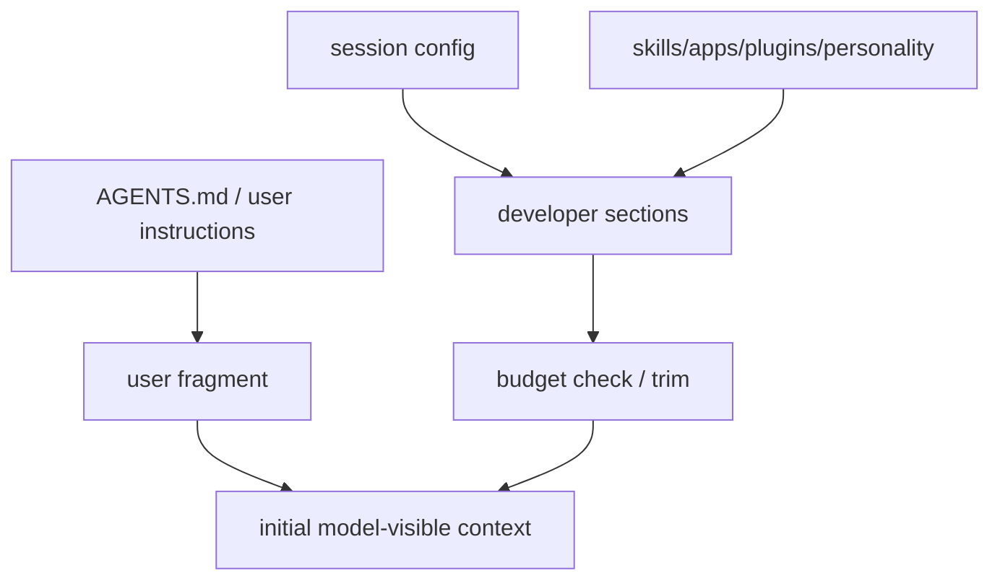

# 9장: 초기 컨텍스트 — 모델은 무엇을 먼저 보게 되는가

> **이 장의 질문**: Codex는 세션 시작 시 어떤 developer/user section을 어떤 순서와 예산으로 조립해 모델에게 보여 주는가?

## 왜 중요한가

많은 에이전트 구현은 거대한 system prompt 문자열 하나만 보고 설명을 끝냅니다. 하지만 실제 제품 런타임에서는 personality, collaboration mode, realtime update, apps, skills, plugins, 사용자 지침 같은 조각이 동적으로 바뀝니다. Codex는 이 조각들을 section 단위로 조립하며, 예산을 넘기면 일부를 잘라내고 경고를 남깁니다.

즉 이 장은 "프롬프트를 어떻게 쓰는가"가 아니라 "모델이 처음 보게 되는 세계를 어떻게 구성하는가"를 다룹니다.

## System Map



## Code Anchor

| 파일 | 역할 |
| --- | --- |
| `codex-rs/core/src/session/mod.rs` | 초기 developer sections 조립과 trim warning |
| `codex-rs/core/src/state/session.rs` | 이전 턴 설정과 세션 전역 설정 보관 |

## Runtime Proof

- 초기 developer sections에는 collaboration mode, realtime update, personality, apps, skills, plugins가 단계적으로 추가된다 -> `codex-rs/core/src/session/mod.rs` -> 관련 섹션 push 경로가 연속적으로 존재한다
- skills 목록이 예산을 넘기면 warning을 내고 일부만 모델에 노출한다 -> `codex-rs/core/src/session/mod.rs` -> trimmed warning message와 emit 경로가 있다
- session state는 이전 regular turn 설정을 따로 보관해 후속 턴 재주입에 쓴다 -> `codex-rs/core/src/state/session.rs` -> `previous_turn_settings` 필드와 접근자가 존재한다

## 소스 발췌

`codex-rs/core/src/session/mod.rs`의 `build_initial_context`는 문자열 하나를 만드는 대신 developer/user 섹션 배열을 따로 조립합니다.

```rust
pub(crate) async fn build_initial_context(
    &self,
    turn_context: &TurnContext,
) -> Vec<ResponseItem> {
    let mut developer_sections = Vec::<String>::with_capacity(8);
    let mut contextual_user_sections = Vec::<String>::with_capacity(2);
    let shell = self.user_shell();
```

권한 안내, collaboration mode, apps, skills, plugins는 순서대로 developer section에 추가됩니다.

```rust
if turn_context.config.include_permissions_instructions {
    developer_sections.push(
        PermissionsInstructions::from_policy(
            turn_context.sandbox_policy.get(),
            turn_context.approval_policy.value(),
            turn_context.config.approvals_reviewer,
            self.services.exec_policy.current().as_ref(),
            &turn_context.cwd,
            turn_context
                .features
                .enabled(Feature::ExecPermissionApprovals),
            turn_context
                .features
                .enabled(Feature::RequestPermissionsTool),
        )
        .render(),
    );
}
```

AGENTS.md와 환경 정보는 contextual user section으로 들어갑니다.

```rust
if let Some(user_instructions) = turn_context.user_instructions.as_deref() {
    contextual_user_sections.push(
        UserInstructions {
            text: user_instructions.to_string(),
            directory: turn_context.cwd.to_string_lossy().into_owned(),
        }
        .render(),
    );
}
```

## 해석

Codex의 초기 컨텍스트는 "문자열 하나"가 아니라 조립식 보드입니다. 이 조립식 구조는 두 가지 장점을 만듭니다.

1. 어떤 섹션이 행동을 바꿨는지 추적하기 쉬워집니다.
2. 예산 초과 시 어느 부분을 잘랐는지 설명하고 경고할 수 있습니다.

이것이 바로 Codex가 제어 평면을 운영 가능한 상태로 만드는 방식입니다.

## 더 깊게 읽기: 초기 컨텍스트는 섹션 배열로 만들어진다

`build_initial_context()`는 거대한 문자열을 바로 만들지 않습니다. 먼저 `developer_sections`와 `contextual_user_sections`라는 두 배열을 만듭니다. developer 쪽에는 permissions, developer instructions, memory, collaboration mode, realtime update, personality, apps, skills, plugins, commit attribution 같은 조각이 차례로 들어갑니다. user 쪽에는 AGENTS.md 지침과 environment context가 들어갑니다.

이 구조가 중요한 이유는 각 섹션의 출처와 lifecycle이 다르기 때문입니다. permissions는 현재 sandbox/approval policy에 의존하고, apps는 MCP connection manager에서 접근 가능한 connector를 읽고, skills는 `TurnSkillsContext`의 outcome과 budget에 의존합니다. 같은 "초기 프롬프트"라도 출처별로 계산 시점과 실패 방식이 다릅니다.

- 초기 컨텍스트는 developer/user section 배열에서 출발한다 -> `codex-rs/core/src/session/mod.rs` -> `build_initial_context()`가 `developer_sections`, `contextual_user_sections`를 만든다
- permissions section은 현재 policy에서 렌더링된다 -> `codex-rs/core/src/session/mod.rs` -> `PermissionsInstructions::from_policy(...)`가 sandbox, approval, approvals reviewer, exec policy를 받는다
- apps section은 MCP manager에서 connector 상태를 읽는다 -> `codex-rs/core/src/session/mod.rs` -> `list_accessible_and_enabled_connectors_from_manager(...)` 결과로 `AppsInstructions`를 만든다
- user instructions는 contextual user fragment로 따로 들어간다 -> `codex-rs/core/src/session/mod.rs` -> `UserInstructions { text, directory }.render()` 결과가 user section에 추가된다
- 최종 item은 update builder를 거쳐 만들어진다 -> `codex-rs/core/src/session/mod.rs` -> `build_developer_update_item(...)`, `build_contextual_user_message(...)`가 section 배열을 `ResponseItem`으로 바꾼다

이 방식은 "초기 컨텍스트"를 한 번 만든 뒤 잊는 것이 아니라, 후속 턴에서 이전 context item과 비교해 diff 또는 reinjection을 만들 수 있는 기반이 됩니다.

## section 순서가 주는 의미

섹션 순서는 단순 정렬이 아닙니다. permissions는 모델에게 현재 실행 경계를 먼저 알려야 하므로 앞쪽에 있고, collaboration/personality/apps/skills/plugins는 모델 행동과 가용 도구를 설명합니다. AGENTS.md는 user fragment로 분리되어 "프로젝트/사용자 지침"의 성격을 유지합니다.

이 구분이 없으면 나중에 "왜 모델이 이 지침을 봤는가"를 설명하기 어렵습니다. Codex는 section 기반 조립으로 이 설명 가능성을 남깁니다.

## Builder Takeaway

자신의 시스템에서도 system prompt를 하나의 거대한 상수로 두기보다, 출처별 section으로 나눠 두는 편이 좋습니다. 그래야 기능을 추가해도 전체 프롬프트를 다시 쓰지 않고, 어느 section이 행동을 바꿨는지 설명 가능성을 유지할 수 있습니다.

이제 제어 평면이 보였으니, 다음 장부터는 이 평면이 어떤 상태와 메모리 구조 위에서 움직이는지 봅니다.
