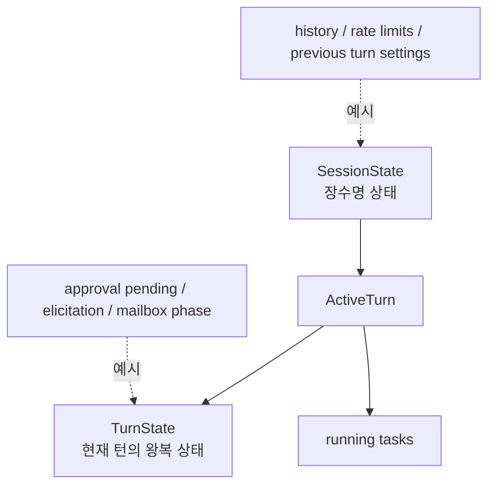

# 10장: SessionState와 TurnState — 상태는 왜 둘로 나뉘는가

> **이 장의 질문**: Codex는 왜 세션 전역 상태와 턴 지역 상태를 분리하며, 그 분리가 어떤 복잡성을 감당하게 해 주는가?

## 왜 중요한가

에이전트 런타임은 상태가 빠르게 엉킵니다. 히스토리, rate limits, connector 선택, 이전 턴 설정처럼 오래 살아야 하는 정보와, 승인 대기, elicitation, pending input처럼 지금 턴에서만 유효한 정보가 뒤섞이면 곧 유지보수가 어려워집니다. Codex는 이 문제를 `SessionState`와 `TurnState`의 분리로 해결합니다.

이 장은 그 분리가 단순 코드 취향이 아니라, resume/rollback/approval/dynamic tool 같은 기능을 지탱하는 구조적 결정임을 보여 줍니다.

## System Map



## Code Anchor

| 파일 | 역할 |
| --- | --- |
| `codex-rs/core/src/state/session.rs` | 세션 전역 상태 구조 |
| `codex-rs/core/src/state/turn.rs` | 턴 지역 상태와 active turn 구조 |

## Runtime Proof

- 세션 전역 상태는 히스토리, rate limits, 이전 턴 설정, prewarm, connector selection 등을 가진다 -> `codex-rs/core/src/state/session.rs` -> `SessionState` 필드 목록이 그 범위를 보여 준다
- 턴 상태는 승인 대기, user input, elicitation, dynamic tool, pending input 같은 현재 턴의 왕복을 저장한다 -> `codex-rs/core/src/state/turn.rs` -> 여러 pending map과 phase 필드가 존재한다
- Active turn은 여러 running task를 한 번에 가질 수 있다 -> `codex-rs/core/src/state/turn.rs` -> `ActiveTurn { tasks, turn_state }`와 `IndexMap` 기반 관리가 있다
- mailbox delivery는 현재 턴과 다음 턴 사이를 잇는 별도 phase를 가진다 -> `codex-rs/core/src/state/turn.rs` -> `MailboxDeliveryPhase`가 상태 전이를 설명한다

## 소스 발췌

`codex-rs/core/src/state/session.rs`의 `SessionState`는 세션 전역으로 오래 살아야 하는 값들을 담습니다.

```rust
/// Persistent, session-scoped state previously stored directly on `Session`.
pub(crate) struct SessionState {
    pub(crate) session_configuration: SessionConfiguration,
    pub(crate) history: ContextManager,
    pub(crate) latest_rate_limits: Option<RateLimitSnapshot>,
    pub(crate) server_reasoning_included: bool,
    pub(crate) dependency_env: HashMap<String, String>,
    pub(crate) mcp_dependency_prompted: HashSet<String>,
    /// Settings used by the latest regular user turn, used for turn-to-turn
    /// model/realtime handling on subsequent regular turns (including full-context
    /// reinjection after resume or `/compact`).
    previous_turn_settings: Option<PreviousTurnSettings>,
    /// Startup prewarmed session prepared during session initialization.
    pub(crate) startup_prewarm: Option<SessionStartupPrewarmHandle>,
    pub(crate) active_connector_selection: HashSet<String>,
    pub(crate) pending_session_start_source: Option<codex_hooks::SessionStartSource>,
    granted_permissions: Option<PermissionProfile>,
    next_turn_is_first: bool,
}
```

반대로 `codex-rs/core/src/state/turn.rs`의 `TurnState`는 현재 턴에서만 의미 있는 pending 왕복을 보관합니다.

```rust
/// Mutable state for a single turn.
#[derive(Default)]
pub(crate) struct TurnState {
    pending_approvals: HashMap<String, oneshot::Sender<ReviewDecision>>,
    pending_request_permissions: HashMap<String, PendingRequestPermissions>,
    pending_user_input: HashMap<String, oneshot::Sender<RequestUserInputResponse>>,
    pending_elicitations: HashMap<(String, RequestId), oneshot::Sender<ElicitationResponse>>,
    pending_dynamic_tools: HashMap<String, oneshot::Sender<DynamicToolResponse>>,
    pending_input: Vec<ResponseInputItem>,
    mailbox_delivery_phase: MailboxDeliveryPhase,
    granted_permissions: Option<PermissionProfile>,
    pub(crate) tool_calls: u64,
    pub(crate) has_memory_citation: bool,
    pub(crate) token_usage_at_turn_start: TokenUsage,
}
```

## 해석

Codex는 "대화 전체의 기억"과 "현재 왕복의 중간 상태"를 의식적으로 분리합니다. 이 분리가 있기 때문에 턴이 중단되거나, 추가 입력이 끼어들거나, review/compact 같은 다른 태스크가 같은 세션 안에서 돌더라도 상태 책임이 비교적 명확하게 유지됩니다.

## 더 깊게 읽기: 오래 사는 것과 잠깐 기다리는 것

`SessionState`와 `TurnState`를 나란히 보면 분리 이유가 선명합니다. `SessionState`에는 session configuration, history, rate limits, dependency env, active connector selection, previous turn settings, startup prewarm처럼 여러 턴을 가로질러 유지돼야 하는 값이 있습니다. 반면 `TurnState`에는 approval 응답 channel, request permissions 응답 channel, user input 응답 channel, MCP elicitation 응답 channel, dynamic tool 응답 channel처럼 현재 턴에서 기다리는 one-shot 왕복이 모여 있습니다.

즉 SessionState는 "이 대화가 어떤 상태인가"를 말하고, TurnState는 "지금 이 턴이 무엇을 기다리는가"를 말합니다.

- history와 token/rate 상태는 session scope다 -> `codex-rs/core/src/state/session.rs` -> `SessionState`가 `history`, `latest_rate_limits`, `previous_turn_settings`, `startup_prewarm`을 가진다
- connector selection도 session scope다 -> `codex-rs/core/src/state/session.rs` -> `merge_connector_selection`, `get_connector_selection`, `clear_connector_selection`이 session state에 있다
- approval과 elicitation은 turn scope다 -> `codex-rs/core/src/state/turn.rs` -> `TurnState`가 `pending_approvals`, `pending_elicitations`, `pending_dynamic_tools`를 가진다
- granted permissions는 session과 turn 양쪽에 존재할 수 있다 -> `codex-rs/core/src/state/session.rs`, `codex-rs/core/src/state/turn.rs` -> 각각 `record_granted_permissions(...)`가 있어 scope별 sticky permission을 표현한다

마지막 bullet이 특히 중요합니다. 같은 "승인된 권한"이라도 이번 턴에만 붙는 권한과 세션 전체에 남는 권한은 다르게 다뤄져야 합니다. Codex는 이 차이를 상태 구조에 반영합니다.

## ActiveTurn이 필요한 이유

`ActiveTurn`은 단순히 현재 task 하나를 저장하는 wrapper가 아닙니다. `tasks: IndexMap<String, RunningTask>`와 `turn_state`를 함께 갖습니다. 지금 구현 주석은 세션에 한 번에 최대 하나의 running task가 있다는 방향을 말하지만, 구조 자체는 sub_id별 running task 관리와 공용 turn state를 함께 둡니다. 이 덕분에 abort, clear pending, task finished 같은 경로가 active turn 단위로 작동합니다.

- running task는 sub_id로 관리된다 -> `codex-rs/core/src/state/turn.rs` -> `ActiveTurn.tasks`가 `IndexMap<String, RunningTask>`다
- task가 모두 제거되면 active turn이 비워진다 -> `codex-rs/core/src/tasks/mod.rs` -> `on_task_finished()`가 `remove_task(...)` 결과로 active turn을 `None`으로 만든다
- abort는 task를 drain하고 pending을 정리한다 -> `codex-rs/core/src/tasks/mod.rs` -> `abort_all_tasks()`가 `drain_tasks()` 후 `clear_pending()`을 호출한다

## Builder Takeaway

자신의 에이전트 런타임도 `session scope`와 `turn scope`를 분리하는 편이 좋습니다. 특히 승인 대기나 도구 왕복처럼 비동기 삽입이 많은 시스템일수록, 장수명 상태와 단기 상태를 같은 구조체에 밀어 넣으면 곧 파편화됩니다.

이제 상태의 큰 분리가 보였으니, 다음 장에서는 히스토리 관리자와 토큰 추정이 이 상태 위에서 어떻게 기억을 관리하는지 봅니다.
