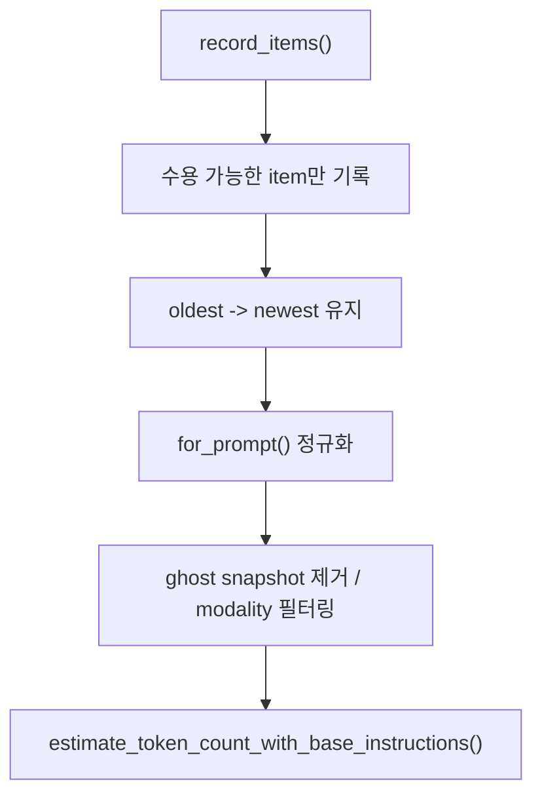

# 11장: 히스토리 관리자와 토큰 추정 — 기억은 어떻게 계산되는가

> **이 장의 질문**: Codex는 메시지 히스토리를 어떻게 정규화하고, 무엇을 남기고, 토큰 수를 어떤 방식으로 추정하는가?

## 왜 중요한가

히스토리는 단순 로그가 아닙니다. 모델에 보낼 수 있는 형태로 유지돼야 하고, 도구 호출/출력 짝을 잃지 않아야 하며, 토큰 예산을 보수적으로 추정할 수 있어야 합니다. Codex는 이 문제를 `ContextManager` 계층으로 끌어올려, 단순 배열이 아닌 관리 대상으로 다룹니다.

## System Map



## Code Anchor

| 파일 | 역할 |
| --- | --- |
| `codex-rs/core/src/context_manager/history.rs` | 히스토리 기록, 정규화, 토큰 추정의 핵심 |

## Runtime Proof

- 히스토리는 oldest -> newest 순서를 유지한다 -> `codex-rs/core/src/context_manager/history.rs` -> `ContextManager` 주석과 `items` 구조가 이를 설명한다
- 기록 단계에서 API 메시지와 ghost snapshot만 수용한다 -> `codex-rs/core/src/context_manager/history.rs` -> `record_items()`가 다른 항목을 걸러 낸다
- 모델에 보내기 직전에는 정규화와 모달리티 필터링을 적용하고 ghost snapshot을 제거한다 -> `codex-rs/core/src/context_manager/history.rs` -> `for_prompt(...)`가 normalization과 strip을 수행한다
- 토큰 수는 base instructions와 item estimate의 합으로 보수적으로 계산한다 -> `codex-rs/core/src/context_manager/history.rs` -> `estimate_token_count_with_base_instructions()`가 합산 경로를 제공한다
- 오래된 항목을 삭제할 때 call/output 짝도 같이 정리한다 -> `codex-rs/core/src/context_manager/history.rs` -> `remove_corresponding_for(...)`를 사용한다

## 소스 발췌

`codex-rs/core/src/context_manager/history.rs`의 `ContextManager`는 raw history와 prompt용 history를 분리합니다.

```rust
/// Transcript of thread history
#[derive(Debug, Clone, Default)]
pub(crate) struct ContextManager {
    /// The oldest items are at the beginning of the vector.
    items: Vec<ResponseItem>,
    /// Bumped whenever history is rewritten, such as compaction or rollback.
    history_version: u64,
    token_info: Option<TokenUsageInfo>,
    /// Reference context snapshot used for diffing and producing model-visible
    /// settings update items.
    ///
    /// This is the baseline for the next regular model turn, and may already
    /// match the current turn after context updates are persisted.
    ///
    /// When this is `None`, settings diffing treats the next turn as having no
    /// baseline and emits a full reinjection of context state. Rollback may
    /// also clear this when it trims a mixed initial-context developer bundle
    /// whose non-diff fragments no longer exist in the surviving history.
    reference_context_item: Option<TurnContextItem>,
}
```

기록 단계에서는 API 메시지나 ghost snapshot만 저장합니다.

```rust
pub(crate) fn record_items<I>(&mut self, items: I, policy: TruncationPolicy)
where
    I: IntoIterator,
    I::Item: std::ops::Deref<Target = ResponseItem>,
{
    for item in items {
        let item_ref = item.deref();
        let is_ghost_snapshot = matches!(item_ref, ResponseItem::GhostSnapshot { .. });
        if !is_api_message(item_ref) && !is_ghost_snapshot {
            continue;
        }

        let processed = self.process_item(item_ref, policy);
        self.items.push(processed);
    }
}
```

모델에 보낼 때는 normalize와 모달리티 필터링을 거친 뒤 ghost snapshot을 제거합니다.

```rust
pub(crate) fn for_prompt(mut self, input_modalities: &[InputModality]) -> Vec<ResponseItem> {
    self.normalize_history(input_modalities);
    self.items
        .retain(|item| !matches!(item, ResponseItem::GhostSnapshot { .. }));
    self.items
}
```

## 해석

Codex는 히스토리를 "그냥 남겨 두는 것"보다 "모델에 다시 보낼 수 있는 상태로 유지하는 것"에 더 가깝게 다룹니다. 그래서 기록 단계, 정규화 단계, 예산 추정 단계가 명확히 나뉘어 있습니다.

이 분리가 없으면 압축과 rollback이 곧 불안정해집니다. 다음 장이 바로 그 이유를 보여 줍니다.

## 더 깊게 읽기: 기록용 히스토리와 prompt용 히스토리

`ContextManager`는 오래된 것부터 최신 것까지 `items`를 저장합니다. 하지만 저장된 raw item이 그대로 모델 prompt로 나가는 것은 아닙니다. `record_items()`는 API message와 ghost snapshot만 받아들이고, `for_prompt()`는 normalization과 modality filtering을 적용한 뒤 ghost snapshot을 제거합니다. 즉 히스토리는 "저장된 원본"과 "모델에 보낼 준비가 된 입력" 사이에 변환 단계를 둡니다.

- raw history는 oldest -> newest 순서를 유지한다 -> `codex-rs/core/src/context_manager/history.rs` -> `items` 주석이 가장 오래된 항목이 vector 앞쪽이라고 설명한다
- 기록 단계는 수용 가능한 item을 제한한다 -> `codex-rs/core/src/context_manager/history.rs` -> `record_items()`가 API message와 ghost snapshot이 아니면 continue한다
- prompt 단계는 normalization 후 ghost snapshot을 제거한다 -> `codex-rs/core/src/context_manager/history.rs` -> `for_prompt()`가 `normalize_history(...)` 후 `GhostSnapshot`을 retain에서 제외한다
- 이미지 입력을 지원하지 않는 모델에는 이미지 content가 제거된다 -> `codex-rs/core/src/context_manager/history.rs`와 `normalize.rs` -> `for_prompt(input_modalities)`와 image placeholder 로직이 연결된다

이 계층은 단순 정리용 코드가 아닙니다. 모델에게 보낼 수 없는 항목을 제거하고, call/output 불변식을 보존하고, context window 초과 시 오래된 항목을 제거할 때도 짝이 깨지지 않게 합니다.

## call/output 짝을 보존하는 이유

도구 호출 히스토리는 메시지보다 더 까다롭습니다. function call이 있는데 output이 없거나, output만 남고 call이 없으면 모델이 다음 요청을 이해하지 못할 수 있습니다. 그래서 `normalize.rs`는 missing output을 synthetic output으로 채우고, orphan output을 제거하며, 어떤 항목을 삭제할 때 대응 항목도 같이 지울 수 있게 합니다.

- missing function output은 synthetic output으로 보강된다 -> `codex-rs/core/src/context_manager/normalize.rs` -> `ensure_call_outputs_present(...)`가 `aborted` output을 삽입한다
- orphan output은 제거된다 -> `codex-rs/core/src/context_manager/normalize.rs` -> `remove_orphan_outputs(...)`가 matching call id가 없는 output을 retain하지 않는다
- 오래된 item 삭제 시 대응 call/output도 제거된다 -> `codex-rs/core/src/context_manager/history.rs` -> `remove_first_item()`이 `normalize::remove_corresponding_for(...)`를 호출한다

따라서 히스토리 관리자는 "토큰 줄이기" 이전에 "모델 입력의 문법 유지"를 책임집니다.

## Builder Takeaway

히스토리 관리자를 별도 계층으로 두지 않으면, 나중에 토큰 예산과 압축 기능을 붙일 때 거의 반드시 전체 구조를 다시 짜게 됩니다. 처음부터 "기록용 히스토리"와 "모델 송신용 히스토리"를 분리하는 편이 장기적으로 훨씬 유리합니다.

이제 기억을 계산하는 계층이 보였으니, 다음 장에서는 긴 대화에서 그것을 어떻게 접고, 되돌리고, 다시 주입하는지 봅니다.
