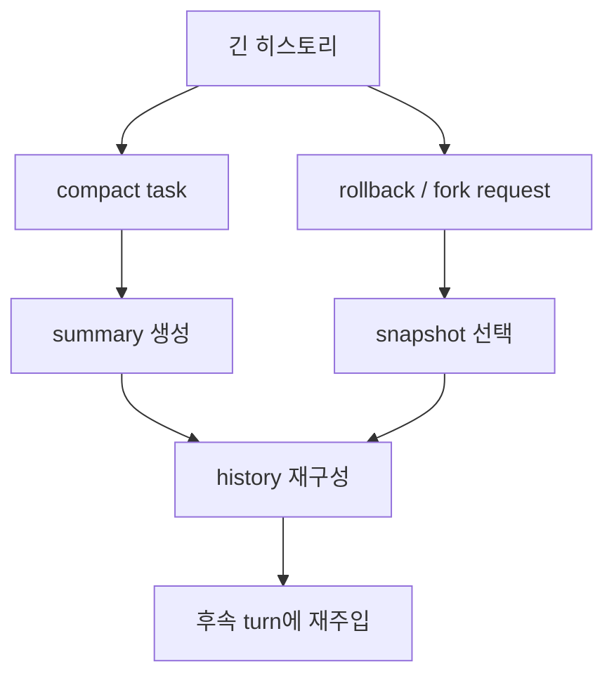

# 12장: Compaction과 Rollback — 긴 대화는 어떻게 접고 되돌리는가

> **이 장의 질문**: Codex는 대화가 길어질 때 히스토리를 어떻게 요약하고, 어떤 방식으로 되돌리고, 다시 주입하는가?

## 왜 중요한가

긴 대화를 다루는 시스템에서 compaction과 rollback은 부가 기능이 아닙니다. 이것은 "대화의 연속성"을 유지하기 위한 복구 문법입니다. Codex는 compaction을 별도 task로 취급하고, rollback과 fork도 단순 복사가 아니라 어떤 시점까지 히스토리를 재구성할지 명시적으로 모델링합니다.

## System Map



## Code Anchor

| 파일 | 역할 |
| --- | --- |
| `codex-rs/core/src/compact.rs` | compaction task와 요약 prompt |
| `codex-rs/core/src/thread_manager.rs` | fork snapshot과 rollback 관련 경계 |
| `codex-rs/app-server/README.md` | compact/rollback이 외부 API에서 어떻게 노출되는지 설명 |

## Runtime Proof

- compaction은 별도 task이며 summary prefix와 요약 prompt를 사용한다 -> `codex-rs/core/src/compact.rs` -> `SUMMARIZATION_PROMPT`, `SUMMARY_PREFIX`, `run_compact_task(...)`가 존재한다
- manual/pre-turn compaction과 mid-turn compaction은 initial context 주입 방식이 다르다 -> `codex-rs/core/src/compact.rs` -> `InitialContextInjection::{DoNotInject, BeforeLastUserMessage}`가 차이를 명시한다
- compaction 중 context window 초과가 나면 오래된 항목부터 제거하며 재시도한다 -> `codex-rs/core/src/compact.rs` -> `ContextWindowExceeded` 분기에서 `remove_first_item()`을 호출한다
- fork는 단순 복사가 아니라 truncate-before-user-message와 interrupted snapshot 두 모드를 가진다 -> `codex-rs/core/src/thread_manager.rs` -> `ForkSnapshot` enum이 두 방식을 정의한다
- 외부 API에서도 compact와 rollback은 thread-level 연산으로 노출된다 -> `codex-rs/app-server/README.md` -> `thread/compact/start`, `thread/rollback` API가 존재한다

## 소스 발췌

`codex-rs/core/src/compact.rs`는 manual/pre-turn compaction과 mid-turn compaction의 initial context 주입 차이를 enum으로 표현합니다.

```rust
/// Controls whether compaction replacement history must include initial context.
///
/// Pre-turn/manual compaction variants use `DoNotInject`: they replace history with a summary and
/// clear `reference_context_item`, so the next regular turn will fully reinject initial context
/// after compaction.
///
/// Mid-turn compaction must use `BeforeLastUserMessage` because the model is trained to see the
/// compaction summary as the last item in history after mid-turn compaction; we therefore inject
/// initial context into the replacement history just above the last real user message.
#[derive(Clone, Copy, Debug, Eq, PartialEq)]
pub(crate) enum InitialContextInjection {
    BeforeLastUserMessage,
    DoNotInject,
}
```

compaction 결과는 새 history를 만들고 세션 history를 교체합니다.

```rust
let mut new_history = build_compacted_history(Vec::new(), &user_messages, &summary_text);

if matches!(
    initial_context_injection,
    InitialContextInjection::BeforeLastUserMessage
) {
    let initial_context = sess.build_initial_context(turn_context.as_ref()).await;
    new_history =
        insert_initial_context_before_last_real_user_or_summary(new_history, initial_context);
}
let ghost_snapshots: Vec<ResponseItem> = history_items
    .iter()
    .filter(|item| matches!(item, ResponseItem::GhostSnapshot { .. }))
    .cloned()
    .collect();
new_history.extend(ghost_snapshots);
let reference_context_item = match initial_context_injection {
    InitialContextInjection::DoNotInject => None,
    InitialContextInjection::BeforeLastUserMessage => Some(turn_context.to_turn_context_item()),
};
let compacted_item = CompactedItem {
    message: summary_text.clone(),
    replacement_history: Some(new_history.clone()),
};
sess.replace_compacted_history(new_history, reference_context_item, compacted_item)
    .await;
```

최종 교체는 `codex-rs/core/src/session/mod.rs`에서 history와 rollout persistence를 같이 갱신합니다.

```rust
pub(crate) async fn replace_compacted_history(
    &self,
    items: Vec<ResponseItem>,
    reference_context_item: Option<TurnContextItem>,
    compacted_item: CompactedItem,
) {
    self.replace_history(items, reference_context_item.clone())
        .await;

    self.persist_rollout_items(&[RolloutItem::Compacted(compacted_item)])
        .await;
    if let Some(turn_context_item) = reference_context_item {
        self.persist_rollout_items(&[RolloutItem::TurnContext(turn_context_item)])
            .await;
    }
    self.services.model_client.advance_window_generation();
}
```

## 해석

Codex는 긴 대화를 "잘라 버리는" 대신 "재구성하는" 쪽에 가깝습니다. 요약은 다음 턴이 이해할 수 있는 새로운 입력이 되고, rollback/fork는 어떤 스냅샷을 기준으로 다시 출발할지 고르는 행위가 됩니다.

## 더 깊게 읽기: compaction은 새 history를 만든다

`run_compact_task_inner_impl()`을 따라가면 compaction이 단순히 "요약 텍스트 하나 생성"이 아님을 알 수 있습니다. 먼저 현재 history를 clone하고, 사용자가 요청한 compact prompt를 history에 기록합니다. 그 history를 prompt용 입력으로 변환해 모델에 보내고, context window 초과가 나면 가장 오래된 항목부터 제거하며 재시도합니다. 성공하면 마지막 assistant message를 summary suffix로 삼아 `SUMMARY_PREFIX`와 결합하고, user messages와 summary로 replacement history를 새로 만듭니다.

- compaction도 turn item lifecycle을 가진다 -> `codex-rs/core/src/compact.rs` -> `ContextCompactionItem::new()`를 started/completed로 emit한다
- compaction prompt는 history에 기록된 뒤 모델 입력이 된다 -> `codex-rs/core/src/compact.rs` -> `initial_input_for_turn`을 `history.record_items(...)`로 넣는다
- context window 초과 시 오래된 history item을 제거하고 재시도한다 -> `codex-rs/core/src/compact.rs` -> `ContextWindowExceeded` 분기에서 `history.remove_first_item()`을 호출한다
- summary는 prefix와 마지막 assistant message를 결합해 만든다 -> `codex-rs/core/src/compact.rs` -> `format!("{SUMMARY_PREFIX}\n{summary_suffix}")`가 replacement summary가 된다
- replacement history는 session state에 들어간다 -> `codex-rs/core/src/compact.rs` -> `replace_compacted_history(new_history, reference_context_item, compacted_item)`을 호출한다

이 흐름 때문에 compaction 결과는 "별도 노트"가 아니라 이후 모델 요청의 history 자체를 바꾸는 구조적 이벤트입니다.

## rollback과 fork를 같이 보는 이유

rollback도 같은 문제를 다룹니다. "어디까지 기억할 것인가"입니다. `ContextManager::drop_last_n_user_turns()`는 마지막 N개의 instruction turn을 자르되, 첫 user message 이전 항목은 보존할 수 있게 설계되어 있습니다. `ForkSnapshot`은 committed prefix를 자르는 모드와, 현재 mid-turn snapshot을 interrupt marker와 함께 가져가는 모드를 나눕니다.

- rollback은 user turn boundary 기준으로 history를 자른다 -> `codex-rs/core/src/context_manager/history.rs` -> `drop_last_n_user_turns()`가 user message positions를 기준으로 cut index를 계산한다
- fork snapshot은 두 가지 semantics를 가진다 -> `codex-rs/core/src/thread_manager.rs` -> `ForkSnapshot::TruncateBeforeNthUserMessage`와 `ForkSnapshot::Interrupted`가 별도 variant다
- interrupt marker는 실제 interrupt와 fork snapshot이 공유한다 -> `codex-rs/core/src/tasks/mod.rs` -> `interrupted_turn_history_marker()`가 공용 model-visible marker를 만든다

따라서 compaction, rollback, fork는 서로 다른 기능이지만 같은 질문에 답합니다. "후속 턴이 어떤 history에서 다시 시작해야 하는가?"

## Builder Takeaway

compaction을 단순 summarize 기능으로 구현하면 곧 실패합니다. 중요한 것은 summary 텍스트보다 "어느 지점까지 잘랐는가", "무엇을 다시 주입했는가", "후속 턴이 어떤 문맥에서 재시작하는가"입니다. Codex는 이 세 질문을 별도 타입과 task 경계로 모델링합니다.

이제 기억과 복구 문법을 봤으니, 다음 장부터는 이 시스템이 어떤 보호 계층과 확장 경계 위에 서는지 봅니다.
