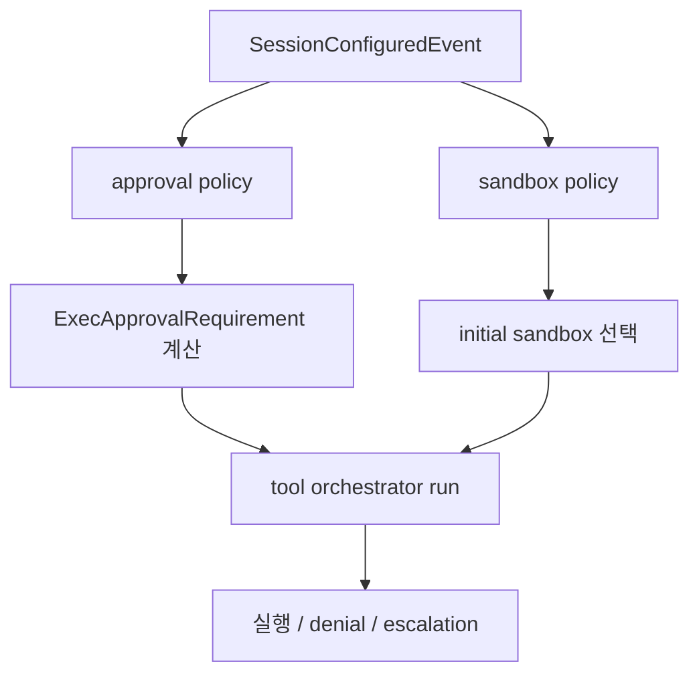

# 13장: 샌드박스와 승인 정책 — 안전성은 어떤 계층으로 서는가

> **이 장의 질문**: Codex의 안전성은 어떤 단일 스위치가 아니라 어떤 다층 정책 구조로 계산되는가?

## 왜 중요한가

에이전트 안전성은 "승인 받기" 같은 UI 한 장면으로 설명되지 않습니다. 세션 설정, approval policy, sandbox policy, 실행 전 requirement 계산, 실패 후 escalation 판단이 모두 연결되어야 실제 경계가 생깁니다. Codex는 이 연결을 `session configured policy -> orchestrator decision -> execution path`의 구조로 만듭니다.

## System Map



## Code Anchor

| 파일 | 역할 |
| --- | --- |
| `codex-rs/core/src/tools/orchestrator.rs` | 실행 전 policy calculation의 중심 |
| `codex-rs/core/src/session/session.rs` | 세션 수준 정책을 외부로 노출 |
| `codex-rs/app-server/README.md` | 외부 클라이언트가 override할 수 있는 정책 표면 |

## Runtime Proof

- 세션 구성 이벤트는 approval policy와 sandbox policy를 외부에 노출한다 -> `codex-rs/core/src/session/session.rs` -> `SessionConfiguredEvent`에 두 정책이 포함된다
- 실행 전 approval requirement를 계산하고 skip/forbidden/needs-approval로 나눈다 -> `codex-rs/core/src/tools/orchestrator.rs` -> `ExecApprovalRequirement` 분기가 존재한다
- 첫 시도 샌드박스는 파일시스템/네트워크/플랫폼 정책을 모두 반영한다 -> `codex-rs/core/src/tools/orchestrator.rs` -> `select_initial(...)` 인자에 관련 정책이 모인다
- sandbox denial 후에도 항상 escalation하는 것은 아니다 -> `codex-rs/core/src/tools/orchestrator.rs` -> denial 분기에서 capability와 approval policy를 다시 본다
- 외부 클라이언트도 `turn/start` 시 sandbox/approval override를 전달할 수 있다 -> `codex-rs/app-server/README.md` -> override 가능한 필드를 설명한다

## 소스 발췌

정책 값 자체는 `codex-rs/protocol/src/protocol.rs`의 wire-visible enum으로 정의됩니다.

```rust
#[serde(rename_all = "kebab-case")]
#[strum(serialize_all = "kebab-case")]
pub enum AskForApproval {
    /// Under this policy, only "known safe" commands—as determined by
    /// `is_safe_command()`—that **only read files** are auto‑approved.
    /// Everything else will ask the user to approve.
    #[serde(rename = "untrusted")]
    #[strum(serialize = "untrusted")]
    UnlessTrusted,

    /// DEPRECATED: *All* commands are auto‑approved, but they are expected to
    /// run inside a sandbox where network access is disabled and writes are
    /// confined to a specific set of paths. If the command fails, it will be
    /// escalated to the user to approve execution without a sandbox.
    /// Prefer `OnRequest` for interactive runs or `Never` for non-interactive
    /// runs.
    OnFailure,

    /// The model decides when to ask the user for approval.
    #[default]
    OnRequest,

    /// Fine-grained controls for individual approval flows.
    ///
    /// When a field is `true`, commands in that category are allowed. When it
    /// is `false`, those requests are automatically rejected instead of shown
    /// to the user.
    #[strum(serialize = "granular")]
    Granular(GranularApprovalConfig),

    /// Never ask the user to approve commands. Failures are immediately returned
    /// to the model, and never escalated to the user for approval.
    Never,
}
```

실제 실행 판단은 `codex-rs/core/src/exec_policy.rs`에서 command, sandbox, approval policy를 함께 보고 결정합니다.

```rust
if command_might_be_dangerous(command) || environment_lacks_sandbox_protections {
    return match approval_policy {
        AskForApproval::Never => {
            let sandbox_is_explicitly_disabled = matches!(
                sandbox_policy,
                SandboxPolicy::DangerFullAccess | SandboxPolicy::ExternalSandbox { .. }
            );
            if sandbox_is_explicitly_disabled {
                // If the sandbox is explicitly disabled, we should allow the command to run
                Decision::Allow
            } else {
                Decision::Forbidden
            }
        }
        AskForApproval::OnFailure
        | AskForApproval::OnRequest
        | AskForApproval::UnlessTrusted
        | AskForApproval::Granular(_) => Decision::Prompt,
    };
}
```

## 해석

Codex의 안전성은 단일 가드가 아니라 계층형 결정 체계입니다. 세션 수준 정책은 경계를 선언하고, 오케스트레이터는 호출 수준에서 그 경계를 구체적 requirement로 바꿉니다. 이 두 층이 함께 있어야 "왜 이 호출이 막혔는가"를 설명할 수 있습니다.

## 더 깊게 읽기: 정책 선언과 호출 결정을 연결한다

`SessionConfiguredEvent`는 세션이 어떤 정책으로 시작했는지를 외부에 알립니다. 여기에는 approval policy, approvals reviewer, sandbox policy, cwd가 포함됩니다. 하지만 이 이벤트 자체가 실행을 허용하거나 막지는 않습니다. 실제 tool call 시점에는 `ToolOrchestrator::run()`이 현재 turn context와 tool runtime의 요구를 합쳐 `ExecApprovalRequirement`를 계산합니다.

이 분리가 중요한 이유는 세션 정책이 "기본 경계"이고, 호출 결정은 "그 경계를 현재 명령에 적용한 결과"이기 때문입니다. 같은 sandbox policy라도 어떤 tool인지, network approval context가 있는지, guardian reviewer를 쓰는지에 따라 경로가 달라집니다.

- 세션 정책은 첫 이벤트에 노출된다 -> `codex-rs/core/src/session/session.rs` -> `SessionConfiguredEvent`가 approval policy, approvals reviewer, sandbox policy, cwd를 포함한다
- 호출별 approval requirement는 orchestrator에서 계산된다 -> `codex-rs/core/src/tools/orchestrator.rs` -> `tool.exec_approval_requirement(...)` 또는 `default_exec_approval_requirement(...)`를 사용한다
- guardian reviewer 사용 여부도 호출 경로에 반영된다 -> `codex-rs/core/src/tools/orchestrator.rs` -> `routes_approval_to_guardian(turn_ctx)`와 `guardian_review_id`가 approval request 경로에 들어간다
- network denial은 별도 approval context로 바뀔 수 있다 -> `codex-rs/core/src/tools/orchestrator.rs` -> `network_approval_context_from_payload(...)` 결과에 따라 retry approval 문구가 달라진다

즉 "승인을 받는다"는 UI 한 장면 뒤에는 세션 정책, turn context, tool policy, guardian routing, network policy decision이 함께 작동합니다.

## app-server에서 보는 안전 표면

외부 클라이언트도 이 정책 체계를 일부 조정할 수 있습니다. `app-server` 문서는 `turn/start`에서 model, cwd, sandbox policy, approval policy 등을 override할 수 있다고 설명합니다. 또 approval flow는 `item/commandExecution/requestApproval` 같은 server-initiated JSON-RPC request로 나타납니다.

- turn 시작 요청은 정책 override를 받을 수 있다 -> `codex-rs/app-server/README.md` -> `turn/start` optional fields가 sandbox policy와 approval policy override를 설명한다
- command approval은 item lifecycle에 묶인다 -> `codex-rs/app-server/README.md` -> command execution approval request와 client response flow를 설명한다
- granular request permissions도 별도 item request로 노출된다 -> `codex-rs/app-server-protocol/src/protocol/common.rs` -> `item/permissions/requestApproval` method mapping이 존재한다

이렇게 보면 안전성은 core 내부 구현만의 문제가 아니라, 외부 표면과 UX가 반드시 함께 지켜야 하는 계약입니다.

## Builder Takeaway

안전성은 반드시 `정책 선언`과 `실행 시점 계산`의 두 층으로 나눠야 합니다. 정책을 너무 추상적으로만 두면 실행 경로에서 이유를 설명할 수 없고, 반대로 호출 시점에만 즉흥적으로 판단하면 제품 전체의 일관성을 잃습니다.

이제 보호 계층의 첫 층을 봤으니, 다음 장에서는 사용자가 런타임에 직접 개입할 수 있는 `Hooks` 시스템을 봅니다.
