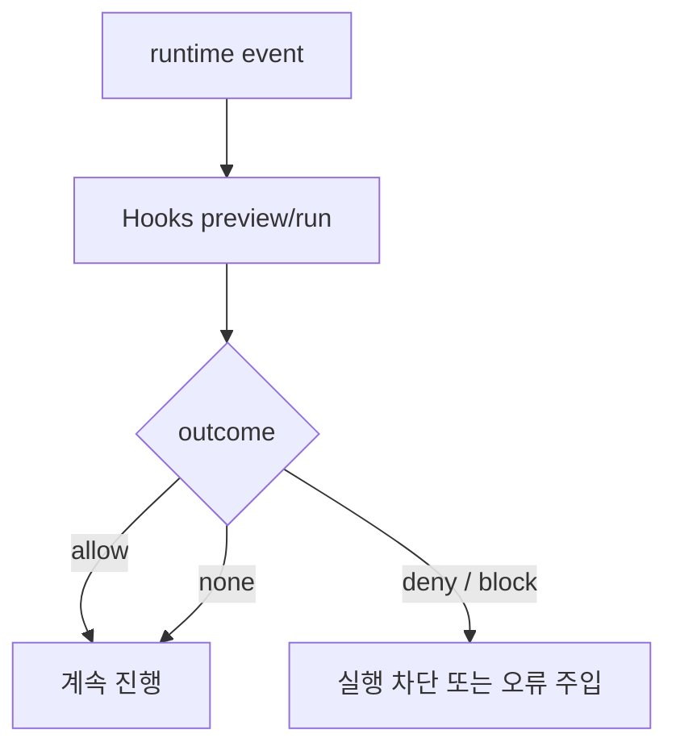

# 14장: Hooks 시스템 — 사용자는 어디서 런타임에 개입할 수 있는가

> **이 장의 질문**: Codex의 hooks는 어떤 이벤트 지점에서 런타임을 가로채며, 그 결과는 어떻게 다시 정책 흐름에 반영되는가?

## 왜 중요한가

hooks는 "작업 끝나면 알림 보내기" 같은 부가 기능이 아닙니다. session start, pre-tool-use, permission request, post-tool-use, stop, user prompt submit 등 여러 지점에서 런타임을 가로채고, 그 결과가 실제 실행 허용 여부와 후속 메시지 흐름을 바꿉니다. 즉 hooks는 제어 평면의 외부 개입 포인트입니다.

## System Map



## Code Anchor

| 파일 | 역할 |
| --- | --- |
| `codex-rs/hooks/src/lib.rs` | hook 이벤트 타입과 공개 surface |
| `codex-rs/hooks/src/registry.rs` | preview와 run 조합 |
| `codex-rs/hooks/src/events/permission_request.rs` | permission request hook 해석 |
| `codex-rs/hooks/src/events/pre_tool_use.rs` | pre-tool-use block/JSON outcome 해석 |

## Runtime Proof

- hooks crate는 여러 이벤트별 outcome/request 타입을 공개한다 -> `codex-rs/hooks/src/lib.rs` -> session_start, pre_tool_use, permission_request, stop 등을 re-export한다
- `Hooks`는 preview와 run을 모두 제공한다 -> `codex-rs/hooks/src/registry.rs` -> `preview_*`와 `run_*` 메서드가 짝으로 존재한다
- permission-request hook은 allow/deny/none을 반환하며 deny가 보수적으로 우선한다 -> `codex-rs/hooks/src/events/permission_request.rs` -> 관련 resolver가 deny 우선 규칙을 구현한다
- pre-tool-use hook은 JSON 출력 또는 exit code 2로 실행 차단을 만들 수 있다 -> `codex-rs/hooks/src/events/pre_tool_use.rs` -> parser와 exit code 처리 분기가 존재한다

## 소스 발췌

`codex-rs/hooks/src/registry.rs`의 registry는 preview와 run을 분리해서 노출합니다.

```rust
pub fn preview_pre_tool_use(
    &self,
    request: &PreToolUseRequest,
) -> Vec<codex_protocol::protocol::HookRunSummary> {
    self.engine.preview_pre_tool_use(request)
}

pub async fn run_pre_tool_use(&self, request: PreToolUseRequest) -> PreToolUseOutcome {
    self.engine.run_pre_tool_use(request).await
}

pub fn preview_permission_request(
    &self,
    request: &PermissionRequestRequest,
) -> Vec<codex_protocol::protocol::HookRunSummary> {
    self.engine.preview_permission_request(request)
}

pub async fn run_permission_request(
    &self,
    request: PermissionRequestRequest,
) -> PermissionRequestOutcome {
    self.engine.run_permission_request(request).await
}
```

permission request hook은 deny를 보수적으로 우선합니다. 이 발췌는 `codex-rs/hooks/src/events/permission_request.rs`입니다.

```rust
fn resolve_permission_request_decision<'a>(
    decisions: impl IntoIterator<Item = &'a PermissionRequestDecision>,
) -> Option<PermissionRequestDecision> {
    let mut resolved_allow = None;
    for decision in decisions {
        match decision {
            PermissionRequestDecision::Allow => {
                resolved_allow = Some(PermissionRequestDecision::Allow);
            }
            PermissionRequestDecision::Deny { message } => {
                return Some(PermissionRequestDecision::Deny {
                    message: message.clone(),
                });
            }
        }
    }
    resolved_allow
}
```

pre-tool-use hook은 block 여부와 block reason을 outcome으로 돌려줍니다.

```rust
#[derive(Debug)]
pub struct PreToolUseOutcome {
    pub hook_events: Vec<HookCompletedEvent>,
    pub should_block: bool,
    pub block_reason: Option<String>,
}
```

## 해석

Codex의 hooks는 "콜백"보다는 "정책 인터셉터"에 가깝습니다. preview와 run이 분리되어 있다는 점도 중요합니다. 시스템은 사용자가 개입할 수 있는 지점을 미리 보여 줄 수 있고, 실제 실행 시에는 그 결정을 다시 런타임 흐름에 반영할 수 있습니다.

## 더 깊게 읽기: preview와 run은 다른 계약이다

`Hooks` registry는 거의 모든 주요 hook 이벤트에 대해 preview와 run을 나란히 제공합니다. preview는 UI가 "어떤 hook이 돌 예정인지"를 표시할 수 있게 `HookRunSummary`를 만들고, run은 실제 command를 실행해 outcome을 만듭니다. 이 둘을 나누면 사용자는 런타임이 멈추기 전에 곧 실행될 개입점을 볼 수 있고, 런타임은 실행 후 결과를 정책 결정에 반영할 수 있습니다.

- hooks public surface는 이벤트별 request/outcome을 노출한다 -> `codex-rs/hooks/src/lib.rs` -> permission request, pre tool use, post tool use, session start, stop, user prompt submit 타입을 re-export한다
- registry는 preview와 run을 모두 가진다 -> `codex-rs/hooks/src/registry.rs` -> `preview_pre_tool_use`, `run_pre_tool_use`, `preview_permission_request`, `run_permission_request`가 나란히 있다
- legacy after-agent hook도 같은 registry에 들어온다 -> `codex-rs/hooks/src/registry.rs` -> `legacy_notify_argv`가 있으면 `notify_hook`으로 after agent hook을 구성한다

hooks를 단순 callback으로 보면 preview surface가 왜 필요한지 이해하기 어렵습니다. 그러나 hooks를 "사용자 개입이 가능한 정책 지점"으로 보면 preview는 UX 계약이고, run은 실행 계약입니다.

## deny semantics를 코드로 읽기

permission request hook과 pre-tool-use hook은 비슷해 보이지만 의미가 다릅니다. permission request hook은 approval path에서 allow/deny/none 결정을 돌려줄 수 있고, deny가 보수적으로 우선합니다. pre-tool-use hook은 실행 전 command를 막을 수 있으며, JSON output 또는 exit code 2로 block reason을 전달할 수 있습니다.

- permission request deny는 allow보다 우선한다 -> `codex-rs/hooks/src/events/permission_request.rs` -> `resolve_permission_request_decision(...)`이 deny를 만나면 즉시 반환한다
- permission request hook은 결정하지 않을 수도 있다 -> `codex-rs/hooks/src/events/permission_request.rs` -> `PermissionRequestOutcome.decision: Option<...>` 구조가 normal approval flow를 계속할 수 있게 한다
- pre-tool-use hook은 block 여부와 reason을 반환한다 -> `codex-rs/hooks/src/events/pre_tool_use.rs` -> `PreToolUseOutcome { should_block, block_reason }`이 있다
- exit code 2는 block으로 해석된다 -> `codex-rs/hooks/src/events/pre_tool_use.rs` -> `Some(2)` 분기가 stderr reason을 feedback으로 넣고 `should_block = true`로 만든다

이 차이를 정확히 알아야 hooks가 approval을 대체하는지, 실행을 차단하는지, 또는 단순 관찰인지 구분할 수 있습니다.

## Builder Takeaway

사용자 확장 지점을 설계할 때는 이벤트 이름만 열어 주는 것으로 충분하지 않습니다. outcome type, preview surface, deny semantics까지 같이 정의해야 예측 가능한 생태계를 만들 수 있습니다. Codex hooks는 그 최소 조건을 잘 보여 줍니다.

이제 사용자가 어디서 개입할 수 있는지 봤으니, 다음 장에서는 외부 앱과 도구가 붙는 더 큰 확장 버스인 MCP 연결 관리자를 봅니다.
