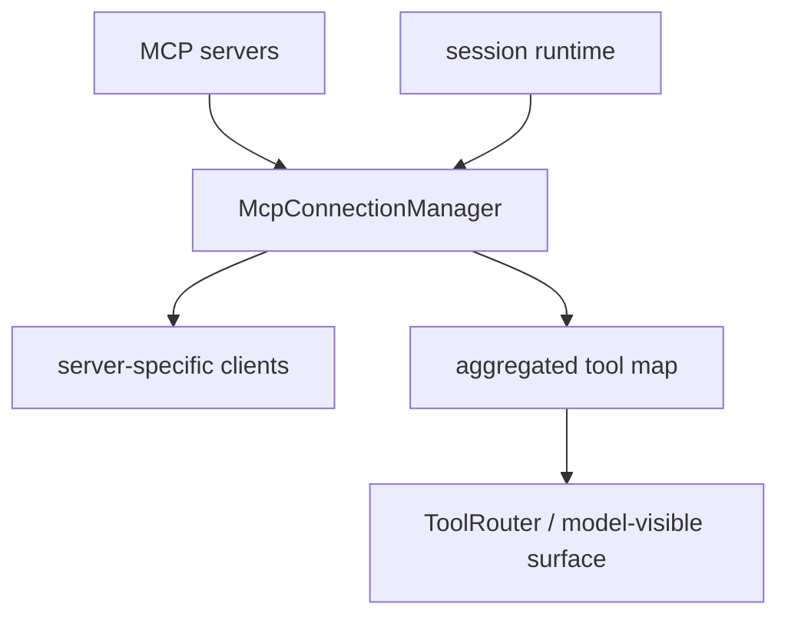

# 15장: MCP 연결 관리자 — 외부 앱과 도구는 어떻게 붙는가

> **이 장의 질문**: Codex는 MCP를 단순 외부 도구 추가가 아니라 어떤 연결 버스로 다루며, 연결 관리자는 무엇을 책임지는가?

## 왜 중요한가

MCP는 많은 데모에서 "서버 하나 붙이면 도구가 더 생긴다" 정도로 설명됩니다. 그러나 Codex에서 MCP는 훨씬 더 큰 의미를 가집니다. 외부 시스템을 현재 thread에 연결하고, server별 client를 관리하고, model-visible tool map을 집계하고, 일부 앱 도구는 캐시까지 둡니다. 즉 이것은 개별 툴러닝이 아니라 확장 버스입니다.

## System Map



## Code Anchor

| 파일 | 역할 |
| --- | --- |
| `codex-rs/codex-mcp/src/mcp_connection_manager.rs` | MCP 연결, client 보관, tool aggregation의 중심 |
| `codex-rs/core/src/session/session.rs` | 세션 시작 이후 MCP manager를 실제 초기화 |

## Runtime Proof

- MCP connection manager는 서버 이름별 RMCP client를 관리하고, 집계된 tool map을 제공한다 -> `codex-rs/codex-mcp/src/mcp_connection_manager.rs` -> 모듈 주석과 관련 구조체가 역할을 직접 설명한다
- model-visible tool name과 raw MCP tool definition은 분리되어 있다 -> `codex-rs/codex-mcp/src/mcp_connection_manager.rs` -> `ToolInfo`가 namespace와 raw tool을 함께 가진다
- Codex apps 도구 목록은 사용자별 cache key로 디스크 캐시된다 -> `codex-rs/codex-mcp/src/mcp_connection_manager.rs` -> cache key, path 계산, schema version 경로가 존재한다
- 세션은 `SessionConfigured` 이후에 MCP manager를 초기화한다 -> `codex-rs/core/src/session/session.rs` -> watcher 시작 뒤 manager를 생성한다

## 소스 발췌

`codex-rs/codex-mcp/src/mcp_connection_manager.rs`는 파일 상단에서 connection manager의 역할을 직접 설명합니다.

```rust
//! Connection manager for Model Context Protocol (MCP) servers.
//!
//! The [`McpConnectionManager`] owns one [`codex_rmcp_client::RmcpClient`] per
//! configured server (keyed by the *server name*). It offers convenience
//! helpers to query the available tools across *all* servers and returns them
//! in a single aggregated map using the model-visible fully-qualified tool name
//! as the key.
```

`ToolInfo`는 model-visible 이름과 raw MCP tool definition을 함께 보존합니다.

```rust
#[derive(Debug, Clone, Serialize, Deserialize)]
pub struct ToolInfo {
    /// Raw MCP server name used for routing the tool call.
    pub server_name: String,
    /// Model-visible tool name used in Responses API tool declarations.
    #[serde(rename = "tool_name", alias = "callable_name")]
    pub callable_name: String,
    /// Model-visible namespace used for deferred tool loading.
    #[serde(rename = "tool_namespace", alias = "callable_namespace")]
    pub callable_namespace: String,
    /// Instructions from the MCP server initialize result.
    #[serde(default)]
    pub server_instructions: Option<String>,
    /// Raw MCP tool definition; `tool.name` is sent back to the MCP server.
    pub tool: Tool,
    pub connector_id: Option<String>,
    pub connector_name: Option<String>,
    #[serde(default)]
    pub plugin_display_names: Vec<String>,
    pub connector_description: Option<String>,
}
```

모든 server client의 listed tools는 하나의 map으로 qualify됩니다.

```rust
#[instrument(level = "trace", skip_all)]
pub async fn list_all_tools(&self) -> HashMap<String, ToolInfo> {
    let mut tools = Vec::new();
    for managed_client in self.clients.values() {
        let Some(server_tools) = managed_client.listed_tools().await else {
            continue;
        };
        tools.extend(server_tools);
    }
    qualify_tools(tools)
}
```

## 해석

Codex는 MCP를 "외부 확장 하나"가 아니라 "연결된 확장 집합"으로 다룹니다. 그래서 connection manager는 단순 transport wrapper가 아니라, 툴 이름 집계와 namespace 관리까지 책임집니다.

## 더 깊게 읽기: connection manager는 tool map의 소유자다

`mcp_connection_manager.rs`의 모듈 주석은 이 파일의 역할을 직접 말합니다. server name별 `RmcpClient`를 소유하고, 모든 서버의 available tools를 model-visible fully-qualified tool name을 key로 하는 aggregate map으로 제공합니다. 이 말은 MCP server가 많아져도 tool surface는 connection manager를 통과해 한곳에서 정규화된다는 뜻입니다.

`ToolInfo`도 이 구조를 잘 보여 줍니다. raw MCP server name, model-visible tool name, model-visible namespace, server instructions, raw MCP tool definition, connector/plugin metadata가 한 구조체에 들어 있습니다. 모델이 보는 이름과 실제 MCP 서버로 돌려보낼 raw tool name을 동시에 보존하는 것입니다.

- connection manager는 server별 client와 aggregate tool map을 책임진다 -> `codex-rs/codex-mcp/src/mcp_connection_manager.rs` -> 모듈 주석이 one client per server와 aggregated map을 설명한다
- `ToolInfo`는 model-visible 이름과 raw MCP tool을 함께 보존한다 -> `codex-rs/codex-mcp/src/mcp_connection_manager.rs` -> `server_name`, `callable_name`, `callable_namespace`, `tool` 필드가 함께 있다
- canonical name은 namespace와 callable name으로 만들어진다 -> `codex-rs/codex-mcp/src/mcp_connection_manager.rs` -> `ToolInfo::canonical_tool_name()`이 `ToolName::namespaced(...)`를 반환한다
- file path parameter schema는 모델 가시 형태로 masking될 수 있다 -> `codex-rs/codex-mcp/src/mcp_connection_manager.rs` -> `tool_with_model_visible_input_schema(...)`가 file param schema를 string/array string으로 정리한다

이 때문에 MCP 도구는 "그 서버가 준 tool 그대로" 모델에게 노출되는 것이 아니라, Codex가 안전하고 이해 가능한 model-visible surface로 다시 다듬어 내보냅니다.

## elicitation과 cache까지 포함한 확장 버스

connection manager는 tool listing만 하지 않습니다. Codex apps tools는 사용자 key 기반 cache path에 저장될 수 있고, MCP elicitation은 approval policy와 sandbox policy에 따라 auto accept, decline, user-visible request로 나뉩니다.

- Codex apps tool cache는 사용자 key hash로 파일을 나눈다 -> `codex-rs/codex-mcp/src/mcp_connection_manager.rs` -> `CodexAppsToolsCacheContext::cache_path()`가 `user_key_hash.json` 경로를 만든다
- approval policy `Never`는 elicitation을 거절한다 -> `codex-rs/codex-mcp/src/mcp_connection_manager.rs` -> `elicitation_is_rejected_by_policy(...)`가 `AskForApproval::Never`에서 true를 반환한다
- auto-accept 가능한 elicitation도 따로 판별한다 -> `codex-rs/codex-mcp/src/mcp_connection_manager.rs` -> schema 요구가 없는 form elicitation만 `can_auto_accept_elicitation(...)`에서 true가 될 수 있다
- user-visible elicitation은 이벤트로 올라간다 -> `codex-rs/codex-mcp/src/mcp_connection_manager.rs` -> `EventMsg::ElicitationRequest`를 `tx_event`로 보낸다

따라서 MCP는 transport 연결 이상의 subsystem입니다. 도구 표면, 사용자 승인, 앱 캐시, 외부 요청 lifecycle이 모두 묶인 확장 버스입니다.

## Builder Takeaway

외부 도구 프로토콜을 붙일 때는 transport client와 model-visible tool map을 한 계층으로 묶어 관리하는 편이 낫습니다. 그래야 서버 수가 늘어나도 모델 표면과 실제 연결 상태를 한곳에서 추적할 수 있습니다.

이제 제약과 확장 경계를 봤으니, 다음 장부터는 리뷰 서브에이전트, 모델 카탈로그, 인터페이스 표면 같은 더 큰 하위 시스템으로 올라갑니다.
