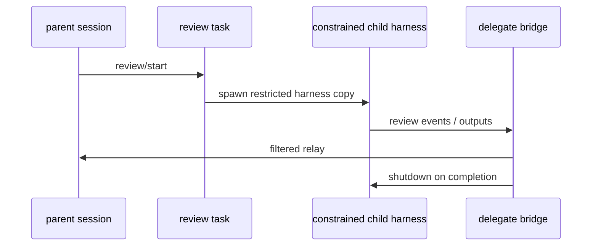

# 16장: 리뷰 서브에이전트 — Codex는 어떻게 축소된 하니스 복제본을 만들어 검토를 외주화하는가

> **이 장의 질문**: Codex의 리뷰 기능은 왜 단순 프롬프트 변형이 아니라, 제한된 하니스 복제본과 delegation bridge를 필요로 하는가?

## 왜 중요한가

멀티에이전트 설계에서 가장 중요한 것은 "정말 별도 런타임 단위인가, 아니면 같은 턴에서 프롬프트만 바꿨는가"입니다. Codex의 리뷰 기능은 전자입니다. review task는 일반 태스크와 별개 workflow이고, child는 독립 thread를 가지지만 부모가 허용한 도구, 정책, 노출 표면만 가진 채 실행됩니다. 즉 review delegate는 "작은 모델 하나 더"가 아니라 `축소된 하니스 복제본`입니다.

## System Map



## Code Anchor

| 파일 | 역할 |
| --- | --- |
| `codex-rs/core/src/tasks/review.rs` | review task와 리뷰용 sub-agent 설정 |
| `codex-rs/core/src/codex_delegate.rs` | child thread lifecycle과 부모 중계 |

## Runtime Proof

- review task는 일반 태스크와 별개 workflow다 -> `codex-rs/core/src/tasks/review.rs` -> `TaskKind::Review`를 반환한다
- 리뷰용 서브에이전트는 web search와 collab을 막고 approval policy를 `Never`로 제한한다 -> `codex-rs/core/src/tasks/review.rs` -> feature disable과 `approval_policy = Never` 설정이 있다
- 리뷰용 base instructions는 별도 rubric으로 바뀐다 -> `codex-rs/core/src/tasks/review.rs` -> `sub_agent_config.base_instructions = Some(REVIEW_PROMPT)`가 명시된다
- delegation one-shot wrapper는 child cancel token을 만들고 완료/중단 이벤트를 보면 자동 shutdown을 건다 -> `codex-rs/core/src/codex_delegate.rs` -> `run_codex_thread_one_shot()`이 bridge task를 통해 종료를 유도한다
- 부모 세션은 서브에이전트 approval을 그대로 노출하지 않고 자신이 중계/결정한다 -> `codex-rs/core/src/codex_delegate.rs` -> approval filtering과 routing 관련 설명이 있다

## 소스 발췌

`codex-rs/core/src/tasks/review.rs`의 `ReviewTask`는 별도 task kind를 가집니다.

```rust
#[derive(Clone, Copy)]
pub(crate) struct ReviewTask;

impl SessionTask for ReviewTask {
    fn kind(&self) -> TaskKind {
        TaskKind::Review
    }

    fn span_name(&self) -> &'static str {
        "session_task.review"
    }
```

review child는 feature와 approval policy가 축소된 config로 시작합니다.

```rust
let config = ctx.config.clone();
let mut sub_agent_config = config.as_ref().clone();
// Carry over review-only feature restrictions so the delegate cannot
// re-enable blocked tools (web search, collab tools, view image).
if let Err(err) = sub_agent_config
    .web_search_mode
    .set(WebSearchMode::Disabled)
{
    panic!("by construction Constrained<WebSearchMode> must always support Disabled: {err}");
}
let _ = sub_agent_config.features.disable(Feature::SpawnCsv);
let _ = sub_agent_config.features.disable(Feature::Collab);

// Set explicit review rubric for the sub-agent
sub_agent_config.base_instructions = Some(crate::REVIEW_PROMPT.to_string());
sub_agent_config.permissions.approval_policy = Constrained::allow_only(AskForApproval::Never);
```

one-shot delegate는 child 완료/중단 이벤트를 보면 shutdown op를 보냅니다. 이 발췌는 `codex-rs/core/src/codex_delegate.rs`입니다.

```rust
let should_shutdown = matches!(
    event.msg,
    EventMsg::TurnComplete(_) | EventMsg::TurnAborted(_)
);
let _ = tx_bridge.send(event).await;
if should_shutdown {
    let _ = ops_tx
        .send(Submission {
            id: "shutdown".to_string(),
            op: Op::Shutdown {},
            trace: None,
        })
        .await;
    child_cancel.cancel();
    break;
}
```

## 해석

Codex의 review delegate는 "독립성"과 "통제"를 동시에 노립니다. child는 별도 thread이므로 별도 실행 흐름을 가질 수 있지만, 권한과 노출 표면은 parent가 재조정합니다. 이 장은 책 전체에서 처음으로 `하니스는 필요할 때 복제되지만, 항상 더 작은 권한과 더 좁은 표면으로 축소된다`는 사실을 명확히 보여 줍니다.

## 더 깊게 읽기: review는 parent turn 안의 child harness다

review 경로는 두 층으로 나뉩니다. `session/review.rs`는 parent session에서 review turn context를 만들고 `ReviewTask`를 spawn합니다. `tasks/review.rs`는 그 task 안에서 sub-agent용 config를 다시 만들고, `run_codex_thread_one_shot(...)`으로 child Codex thread를 띄웁니다. 즉 review는 단순 prompt가 아니라 parent turn이 child session을 잠깐 생성해 결과를 중계하는 workflow입니다.

- parent는 review 전용 turn context를 만든다 -> `codex-rs/core/src/session/review.rs` -> `spawn_review_thread(...)`가 review model, tools config, review prompt를 준비한다
- review prompt는 synthesized user input으로 child task에 들어간다 -> `codex-rs/core/src/session/review.rs` -> `UserInput::Text { text: review_prompt, ... }`를 만들어 `ReviewTask::new()`에 넘긴다
- review task는 별도 `TaskKind::Review`다 -> `codex-rs/core/src/tasks/review.rs` -> `ReviewTask::kind()`가 `TaskKind::Review`를 반환한다
- child Codex는 one-shot thread로 시작된다 -> `codex-rs/core/src/tasks/review.rs` -> `start_review_conversation(...)`이 `run_codex_thread_one_shot(...)`을 호출한다

이 구조 덕분에 parent는 review 모드 진입/이탈 이벤트를 emit하고, child는 독립적으로 모델 요청과 도구 표면을 가질 수 있습니다.

## 축소된 권한은 어디서 생기나

review child가 위험한 이유는 부모보다 더 자유로워질 수 있기 때문입니다. Codex는 이 위험을 줄이기 위해 review용 config를 명시적으로 좁힙니다. web search를 disable하고, collab/spawn 계열 기능을 끄고, base instructions를 review rubric으로 바꾸며, approval policy를 `Never`로 제한합니다. parent-child bridge도 approval request를 그대로 소비자에게 노출하지 않고 parent session 경로로 돌립니다.

- review child는 web search와 collab을 제한한다 -> `codex-rs/core/src/tasks/review.rs` -> `web_search_mode.set(Disabled)`, `Feature::SpawnCsv`, `Feature::Collab` disable 경로가 있다
- review child의 base instructions는 review prompt로 교체된다 -> `codex-rs/core/src/tasks/review.rs` -> `sub_agent_config.base_instructions = Some(crate::REVIEW_PROMPT.to_string())`
- approval policy는 `Never`로 제한된다 -> `codex-rs/core/src/tasks/review.rs` -> `sub_agent_config.permissions.approval_policy = Constrained::allow_only(AskForApproval::Never)`
- delegation bridge는 approval 이벤트를 parent로 라우팅한다 -> `codex-rs/core/src/codex_delegate.rs` -> `forward_events(...)`가 exec/apply patch/request permissions/request user input 이벤트를 별도 handler로 넘긴다
- one-shot child는 완료나 중단 이벤트 후 shutdown된다 -> `codex-rs/core/src/codex_delegate.rs` -> `TurnComplete` 또는 `TurnAborted`를 보면 `Op::Shutdown`을 보내고 child cancel token을 cancel한다

이것이 "축소된 하니스 복제본"이라는 표현의 실제 근거입니다.

## Builder Takeaway

서브에이전트를 붙일 때는 새 스레드만 띄우면 끝이 아닙니다. 무엇을 child에게 허용할지, 무엇을 parent가 다시 통제할지, 종료 시점을 누가 결정할지를 설계해야 합니다. Codex의 review delegate는 그 세 축을 모두 보여 주며, sub-agent를 `constrained harness copy`로 설계하라는 강한 힌트를 남깁니다.

이제 시스템이 자신을 분기해 검토하는 방식을 봤으니, 다음 장에서는 이 하니스가 어떤 모델 자원을 사용할 수 있는지 자체적으로 관리하고 새로고침하는 모델 카탈로그 서브시스템을 봅니다.
