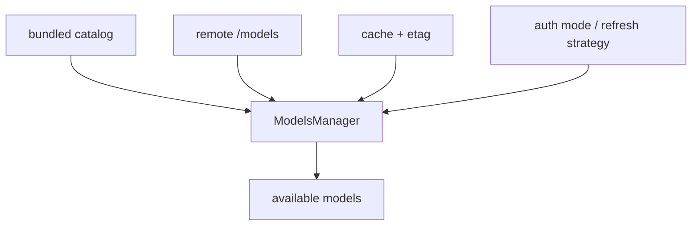

# 17장: 모델 카탈로그와 새로고침 — 모델 선택은 왜 별도 서브시스템인가

> **이 장의 질문**: Codex는 왜 모델 목록을 정적 상수로 두지 않고, 인증 상태와 refresh strategy를 가진 별도 모델 관리 서브시스템으로 다루는가?

## 왜 중요한가

모델 선택은 단순 드롭다운 문제가 아닙니다. 어떤 인증 모드인지, 캐시가 있는지, 원격 새로고침이 허용되는지, 커스텀 카탈로그를 강제했는지에 따라 가능한 모델 목록 자체가 달라집니다. Codex는 이 복잡성을 `ModelsManager`로 격리합니다.

## System Map



## Code Anchor

| 파일 | 역할 |
| --- | --- |
| `codex-rs/models-manager/src/manager.rs` | 카탈로그, cache, remote refresh, provider 관리의 중심 |

## Runtime Proof

- models manager는 remote models, etag, cache manager, provider를 함께 관리한다 -> `codex-rs/models-manager/src/manager.rs` -> `ModelsManager` struct가 관련 필드를 가진다
- custom model catalog가 주어지면 원격 refresh를 하지 않는다 -> `codex-rs/models-manager/src/manager.rs` -> `CatalogMode::Custom`일 때 새로고침이 조기 반환된다
- refresh strategy는 offline, online-if-uncached, online 세 가지다 -> `codex-rs/models-manager/src/manager.rs` -> `refresh_available_models()` 분기가 전략별 동작을 나눈다
- 인증 모드가 맞지 않으면 네트워크 fetch를 건너뛰고 cache만 본다 -> `codex-rs/models-manager/src/manager.rs` -> auth mode 검사 후 fetch 여부를 결정한다
- 원격 fetch 성공 시 etag와 cache를 함께 갱신한다 -> `codex-rs/models-manager/src/manager.rs` -> remote 결과 적용 후 cache persist 경로가 이어진다

## 소스 발췌

`codex-rs/models-manager/src/manager.rs`는 refresh 전략을 enum으로 분리합니다.

```rust
/// Strategy for refreshing available models.
#[derive(Debug, Clone, Copy, PartialEq, Eq)]
pub enum RefreshStrategy {
    /// Always fetch from the network, ignoring cache.
    Online,
    /// Only use cached data, never fetch from the network.
    Offline,
    /// Use cache if available and fresh, otherwise fetch from the network.
    OnlineIfUncached,
}
```

manager 자체는 remote catalog, catalog mode, cache manager, provider를 함께 소유합니다.

```rust
/// Coordinates remote model discovery plus cached metadata on disk.
#[derive(Debug)]
pub struct ModelsManager {
    remote_models: RwLock<Vec<ModelInfo>>,
    catalog_mode: CatalogMode,
    collaboration_modes_config: CollaborationModesConfig,
    etag: RwLock<Option<String>>,
    cache_manager: ModelsCacheManager,
    provider: SharedModelProvider,
}
```

모델 목록 호출은 refresh 후 active catalog snapshot을 picker용 preset으로 바꿉니다.

```rust
pub async fn list_models(&self, refresh_strategy: RefreshStrategy) -> Vec<ModelPreset> {
    if let Err(err) = self.refresh_available_models(refresh_strategy).await {
        error!("failed to refresh available models: {err}");
    }
    let remote_models = self.get_remote_models().await;
    self.build_available_models(remote_models)
}
```

picker용 preset은 인증 모드에 따라 필터링됩니다.

```rust
fn build_available_models(&self, mut remote_models: Vec<ModelInfo>) -> Vec<ModelPreset> {
    remote_models.sort_by(|a, b| a.priority.cmp(&b.priority));

    let mut presets: Vec<ModelPreset> = remote_models.into_iter().map(Into::into).collect();
    let auth_mode = self
        .provider
        .auth_manager()
        .and_then(|auth_manager| auth_manager.auth_mode());
    let chatgpt_mode = matches!(auth_mode, Some(AuthMode::Chatgpt));
    presets = ModelPreset::filter_by_auth(presets, chatgpt_mode);

    ModelPreset::mark_default_by_picker_visibility(&mut presets);

    presets
}
```

## 해석

Codex가 모델 관리를 별도 서브시스템으로 둔 이유는 "선택 가능한 모델"이 런타임 환경에 따라 달라지기 때문입니다. 모델은 프롬프트 한 줄로 끝나는 것이 아니라, 인증, 캐시, 갱신 정책, 원격 공급원과 얽힌 운영 대상입니다.

## 더 깊게 읽기: 모델 목록은 환경 의존 값이다

`ModelsManager`는 remote model list만 들고 있지 않습니다. catalog mode, collaboration mode config, etag, disk cache manager, provider를 함께 가집니다. 즉 모델 목록은 compile-time constant가 아니라 "현재 인증 상태와 캐시 상태, provider 설정으로 계산한 결과"입니다.

- manager는 catalog, etag, cache, provider를 함께 소유한다 -> `codex-rs/models-manager/src/manager.rs` -> `ModelsManager` 필드가 `remote_models`, `catalog_mode`, `etag`, `cache_manager`, `provider`를 가진다
- custom catalog는 authoritative하다 -> `codex-rs/models-manager/src/manager.rs` -> `CatalogMode::Custom`이면 `refresh_available_models(...)`가 즉시 반환한다
- default catalog는 bundled models에서 시작한다 -> `codex-rs/models-manager/src/manager.rs` -> `new_with_provider(...)`가 custom catalog가 없으면 `load_remote_models_from_file()`을 사용한다
- model list는 refresh strategy에 따라 달라진다 -> `codex-rs/models-manager/src/manager.rs` -> `RefreshStrategy::{Online, Offline, OnlineIfUncached}`가 각각 fetch/cache 정책을 설명한다

여기서 "모델을 고른다"는 말은 단순히 문자열 하나를 선택한다는 뜻이 아닙니다. 먼저 가능한 model preset 집합을 만들고, 그중 default 또는 사용자 지정 모델을 고르는 것입니다.

## auth와 cache를 같이 읽기

refresh 경로에서 인증은 핵심 게이트입니다. auth mode가 ChatGPT가 아니고 provider가 command auth를 갖지 않으면, online fetch 대신 cache만 시도하고 종료합니다. `OnlineIfUncached`에서는 cache를 먼저 보고, 없을 때만 원격 `/models`를 fetch합니다. fetch 성공 시에는 remote models를 적용하고 etag와 cache를 갱신합니다.

- 인증 조건이 맞지 않으면 네트워크 fetch를 피한다 -> `codex-rs/models-manager/src/manager.rs` -> `auth_mode != Some(AuthMode::Chatgpt)`와 `!has_command_auth()` 분기에서 cache만 시도한다
- offline strategy는 cache만 읽는다 -> `codex-rs/models-manager/src/manager.rs` -> `RefreshStrategy::Offline` 분기가 `try_load_cache()`만 호출한다
- online-if-uncached는 cache hit이면 fetch하지 않는다 -> `codex-rs/models-manager/src/manager.rs` -> `try_load_cache()` 성공 시 바로 반환한다
- fetch 성공 시 etag와 disk cache를 갱신한다 -> `codex-rs/models-manager/src/manager.rs` -> `fetch_and_update_models()`가 `etag`를 쓰고 `persist_cache(...)`를 호출한다

이 설계는 모델 목록을 사용자 경험의 편의 기능이 아니라 운영 자원으로 취급합니다. 특히 sub-agent에서는 `spawn_internal()`이 refresh strategy를 `Offline`으로 바꾸기 때문에, child harness가 불필요한 모델 카탈로그 refresh를 일으키지 않습니다.

- sub-agent는 offline refresh strategy를 사용한다 -> `codex-rs/core/src/session/mod.rs` -> `SessionSource::SubAgent(_)`이면 `RefreshStrategy::Offline`을 선택한다

## Builder Takeaway

모델 목록을 하드코딩해 두는 단계는 오래가지 못합니다. 인증 모드, 원격 공급원, 캐시 무효화, 사용자 override가 들어오는 순간 곧 별도 카탈로그 관리 계층이 필요해집니다. Codex는 그 미래 문제를 일찍 분리해 둔 사례입니다.

이제 어떤 모델을 쓸 수 있는지 관리하는 계층을 봤으니, 다음 장에서는 같은 코어가 app-server, TUI, CLI라는 서로 다른 표면으로 어떻게 드러나는지 봅니다.
