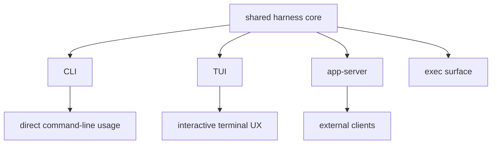

# 18장: app-server, TUI, CLI — 같은 하니스가 어떻게 다른 표면으로 드러나는가

> **이 장의 질문**: Codex는 왜 여러 인터페이스 표면을 가지며, 그 표면들은 같은 하니스의 어떤 부분을 공유하고 어떤 부분만 다르게 포장하는가?

## 왜 중요한가

좋은 에이전트 시스템은 인터페이스가 늘어나도 의미론이 갈라지지 않아야 합니다. Codex는 app-server, TUI, CLI, exec 같은 여러 표면을 제공하지만, 중요한 점은 이 표면들이 서로 다른 제품이 아니라 같은 하니스를 다른 UX와 프로토콜로 포장한 것이라는 점입니다. Part 5 전체를 sub-agent와 함께 읽으면, Codex는 "하니스를 어떻게 복제할 것인가"뿐 아니라 "하니스를 어떻게 노출할 것인가"도 별도 설계 대상으로 본다는 사실이 드러납니다.

## System Map



## Code Anchor

| 파일 | 역할 |
| --- | --- |
| `codex-rs/app-server/README.md` | 외부 클라이언트용 protocol surface |
| `codex-rs/README.md` | 워크스페이스 내 실행 표면의 역할 설명 |
| `codex-rs/tui/src/cli.rs` | TUI가 노출하는 사용자 경험 옵션 |

## Runtime Proof

- app-server는 VS Code 같은 rich interface를 위한 공식 인터페이스다 -> `codex-rs/app-server/README.md` -> 문서 첫 부분이 그 목적을 직접 설명한다
- 워크스페이스의 핵심 실행 표면은 `core`, `exec`, `tui`, `cli`로 구분된다 -> `codex-rs/README.md` -> code organization 섹션이 각 crate 역할을 정리한다
- TUI는 approval policy, web search, alt-screen 여부 같은 UX 옵션을 노출한다 -> `codex-rs/tui/src/cli.rs` -> 관련 CLI 필드가 존재한다
- app-server API는 thread/start, turn/start, review/start, rollback, compact 같은 상위 동작을 thread/turn 프리미티브 위에서 노출한다 -> `codex-rs/app-server/README.md` -> API overview가 관련 surface를 열거한다

## 소스 발췌

`codex-rs/tui/src/cli.rs`는 사용자 경험 옵션을 CLI 필드로 노출합니다.

```rust
#[derive(Parser, Debug)]
#[command(version)]
pub struct Cli {
    /// Optional user prompt to start the session.
    #[arg(value_name = "PROMPT", value_hint = clap::ValueHint::Other)]
    pub prompt: Option<String>,

    // Internal controls set by the top-level `codex resume` subcommand.
    // These are not exposed as user flags on the base `codex` command.
    #[clap(skip)]
    pub resume_picker: bool,

    #[clap(skip)]
    pub resume_last: bool,

    /// Internal: resume a specific recorded session by id (UUID). Set by the
    /// top-level `codex resume <SESSION_ID>` wrapper; not exposed as a public flag.
    #[clap(skip)]
    pub resume_session_id: Option<String>,

    /// Internal: show all sessions (disables cwd filtering and shows CWD column).
    #[clap(skip)]
    pub resume_show_all: bool,

    /// Internal: include non-interactive sessions in resume listings.
    #[clap(skip)]
    pub resume_include_non_interactive: bool,

    // Internal controls set by the top-level `codex fork` subcommand.
    // These are not exposed as user flags on the base `codex` command.
    #[clap(skip)]
    pub fork_picker: bool,

    #[clap(skip)]
    pub fork_last: bool,

    /// Internal: fork a specific recorded session by id (UUID). Set by the
    /// top-level `codex fork <SESSION_ID>` wrapper; not exposed as a public flag.
    #[clap(skip)]
    pub fork_session_id: Option<String>,

    /// Internal: show all sessions (disables cwd filtering and shows CWD column).
    #[clap(skip)]
    pub fork_show_all: bool,

    #[clap(flatten)]
    pub shared: TuiSharedCliOptions,

    /// Configure when the model requires human approval before executing a command.
    #[arg(long = "ask-for-approval", short = 'a')]
    pub approval_policy: Option<ApprovalModeCliArg>,

    /// Enable live web search. When enabled, the native Responses `web_search` tool is available to the model (no per‑call approval).
    #[arg(long = "search", default_value_t = false)]
    pub web_search: bool,

    /// Disable alternate screen mode
    ///
    /// Runs the TUI in inline mode, preserving terminal scrollback history. This is useful
    /// in terminal multiplexers like Zellij that follow the xterm spec strictly and disable
    /// scrollback in alternate screen buffers.
    #[arg(long = "no-alt-screen", default_value_t = false)]
    pub no_alt_screen: bool,

    #[clap(skip)]
    pub config_overrides: CliConfigOverrides,
}
```

반면 app-server v2는 `codex-rs/app-server-protocol/src/protocol/v2.rs`에서 thread/turn 요청 payload를 타입으로 고정합니다. 아래 두 블록은 각 struct의 앞부분 연속 발췌입니다.

```rust
pub struct ThreadStartParams {
    #[ts(optional = nullable)]
    pub model: Option<String>,
    #[ts(optional = nullable)]
    pub model_provider: Option<String>,
    #[ts(optional = nullable)]
    pub cwd: Option<String>,
    #[experimental(nested)]
    #[ts(optional = nullable)]
    pub approval_policy: Option<AskForApproval>,
    /// Override where approval requests are routed for review on this thread
    /// and subsequent turns.
    #[ts(optional = nullable)]
    pub approvals_reviewer: Option<ApprovalsReviewer>,
    #[ts(optional = nullable)]
    pub sandbox: Option<SandboxMode>,
    #[ts(optional = nullable)]
    pub config: Option<HashMap<String, JsonValue>>,
    #[ts(optional = nullable)]
    pub service_name: Option<String>,
```

```rust
pub struct TurnStartParams {
    pub thread_id: String,
    pub input: Vec<UserInput>,
    /// Optional turn-scoped Responses API client metadata.
    #[experimental("turn/start.responsesapiClientMetadata")]
    #[ts(optional = nullable)]
    pub responsesapi_client_metadata: Option<HashMap<String, String>>,
    /// Override the working directory for this turn and subsequent turns.
    #[ts(optional = nullable)]
    pub cwd: Option<PathBuf>,
    /// Override the approval policy for this turn and subsequent turns.
    #[experimental(nested)]
    #[ts(optional = nullable)]
    pub approval_policy: Option<AskForApproval>,
    /// Override the sandbox policy for this turn and subsequent turns.
    #[ts(optional = nullable)]
    pub sandbox_policy: Option<SandboxPolicy>,
    /// Override the model for this turn and subsequent turns.
    #[ts(optional = nullable)]
    pub model: Option<String>,
    /// Override the service tier for this turn and subsequent turns.
    #[serde(
        default,
        deserialize_with = "super::serde_helpers::deserialize_double_option",
        serialize_with = "super::serde_helpers::serialize_double_option",
        skip_serializing_if = "Option::is_none"
    )]
    #[ts(optional = nullable)]
    pub service_tier: Option<Option<ServiceTier>>,
```

## 해석

Codex의 표면 분리는 "표면마다 로직이 다르다"가 아니라 "하니스는 같고, 인터페이스 계약과 UX가 다르다"에 가깝습니다. app-server는 외부 계약을, TUI와 CLI는 사용자 경험과 옵션 조합을, exec는 실행 표면 특화를 담당합니다. 즉 Part 16의 sub-agent가 `분기된 하니스`였다면, 이 장의 app-server/TUI/CLI는 `포장된 하니스`입니다.

## 더 깊게 읽기: 같은 core, 다른 entry contract

app-server, TUI, CLI는 같은 코어를 쓰지만 사용자와 맺는 계약은 다릅니다. TUI는 interactive terminal에서 approval policy, web search, alt-screen 같은 UX 옵션을 다룹니다. app-server는 JSON-RPC method/notification으로 외부 rich client가 thread와 turn을 제어하게 합니다. CLI/exec는 command-line entrypoint와 non-interactive 실행에 더 가깝습니다.

- TUI 표면은 사용자 옵션을 clap 구조체로 노출한다 -> `codex-rs/tui/src/cli.rs` -> `Cli`가 prompt, approval policy, web search, alt screen 옵션을 가진다
- app-server는 rich interface용 protocol surface다 -> `codex-rs/app-server/README.md` -> VS Code extension 같은 rich interface를 위한 interface라고 설명한다
- app-server protocol은 method 이름을 code에서 고정한다 -> `codex-rs/app-server-protocol/src/protocol/common.rs` -> `thread/start`, `turn/start`, `review/start`, `thread/rollback`, `thread/compact/start` mapping이 있다
- v2 payload는 TypeScript export 대상이다 -> `codex-rs/app-server-protocol/src/protocol/v2.rs` -> API 타입들이 `#[ts(export_to = "v2/")]`를 사용한다

이 차이를 놓치면 "왜 같은 기능이 TUI와 app-server에 중복돼 보이는가"라는 오해가 생깁니다. 실제 중복은 코어 의미론이 아니라 표면별 계약입니다.

## 표면별로 달라지는 것과 같아야 하는 것

달라져도 되는 것은 입력 방식, 표시 방식, transport, lifecycle notification의 포장입니다. 같아야 하는 것은 thread/turn의 기본 의미, approval/sandbox policy의 효과, tool execution result의 의미, history/compaction/rollback semantics입니다.

app-server의 `review/start`는 inline과 detached delivery를 설명합니다. TUI의 `/review`는 사용자 경험으로 드러납니다. 하지만 core에서 review는 `ReviewTask`, constrained sub-agent, `ExitedReviewMode`로 수렴합니다. 표면은 다르지만 하니스 의미론은 하나여야 합니다.

- review는 app-server에서도 상위 API로 노출된다 -> `codex-rs/app-server/README.md` -> `review/start`가 inline/detached delivery와 review item stream을 설명한다
- core review는 같은 ReviewTask 경로로 들어간다 -> `codex-rs/core/src/session/review.rs` -> `spawn_review_thread(...)`가 `ReviewTask::new()`를 spawn한다
- review 결과는 structured event로 parent에 돌아온다 -> `codex-rs/core/src/tasks/review.rs` -> `exit_review_mode(...)`가 `EventMsg::ExitedReviewMode`를 보낸다

이런 대응이 있을 때만 새 표면을 추가해도 제품 의미론이 갈라지지 않습니다.

## Builder Takeaway

표면이 늘어날수록 더 중요한 것은 공용 하니스와 표면별 adapter를 분리하는 것입니다. UI나 API를 추가할 때마다 코어를 복제하기 시작하면 곧 의미론이 갈라집니다. Codex는 하니스를 한곳에 두고 표면별 노출만 다르게 하는 편을 택했습니다.

이제 분기된 하니스와 포장된 하니스까지 봤으니, 마지막 장에서는 이 저장소 전반에서 반복적으로 드러나는 하니스 엔지니어링 원칙을 압축합니다.
