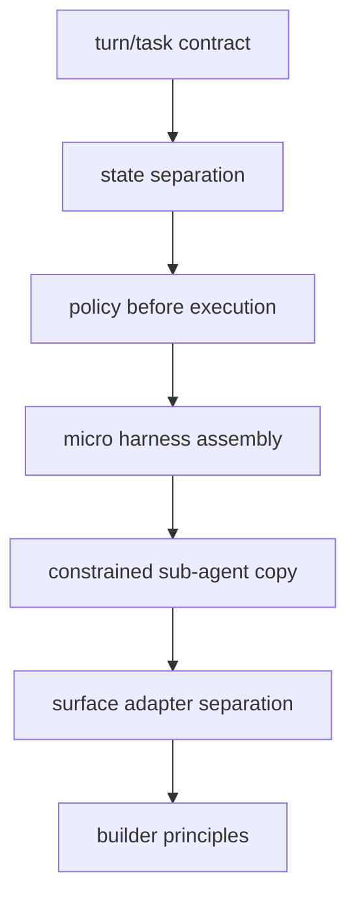

# 19장: Codex가 보여 주는 하니스 엔지니어링 원칙 — 무엇을 가져가고 무엇을 버릴까

> **이 장의 질문**: 이 책 전체를 통틀어 Codex가 반복해서 보여 준 하니스 엔지니어링 원칙은 무엇이며, 어떤 것은 그대로 가져가고 어떤 것은 Codex 특화로 남겨야 하는가?

## 왜 중요한가

책을 끝까지 읽고도 장별 기능만 기억에 남는다면 절반만 읽은 셈입니다. 중요한 것은 개별 기능이 아니라, 왜 이런 분리와 계약이 반복적으로 등장하는가를 보는 것입니다. Codex는 "모델이 똑똑하면 된다"는 식의 낙관론보다, 모델을 다루는 하니스를 먼저 세우고 그 하니스를 상태, 정책, 서브에이전트, 표면으로 분해하는 설계를 더 강하게 보여 줍니다.

## System Map



## 반복해서 보이는 원칙

| 원칙 | 대표 anchor |
| --- | --- |
| 하니스 코어를 턴/태스크 계약 위에 세우기 | `thread_manager.rs`, `tasks/mod.rs`, `tasks/regular.rs` |
| 상태를 세션과 턴으로 나누기 | `state/session.rs`, `state/turn.rs` |
| 도구를 실행하기 전에 정책을 계산하기 | `tools/orchestrator.rs` |
| 모델 제어층을 micro harness로 조립하기 | `agents_md.rs`, `core-skills/**`, `session/mod.rs` |
| 서브에이전트를 축소된 하니스 복제본으로 만들기 | `tasks/review.rs`, `codex_delegate.rs` |
| 표면을 늘려도 하니스를 복제하지 않기 | app-server, TUI, CLI, exec |

## Runtime Proof

- 하니스 코어는 계약에서 시작한다 -> `codex-rs/core/src/thread_manager.rs`, `codex-rs/core/src/tasks/mod.rs` -> 첫 이벤트 검증과 task trait이 공통 실행 계약을 만든다
- 상태 분리 우선 -> `codex-rs/core/src/state/session.rs`, `codex-rs/core/src/state/turn.rs` -> 장수명 상태와 턴 중간 상태가 분리된다
- 정책 우선 실행 -> `codex-rs/core/src/tools/orchestrator.rs` -> approval/sandbox calculation이 실제 attempt보다 먼저 온다
- micro harness assembly -> `codex-rs/core/src/agents_md.rs`, `codex-rs/core-skills/**`, `codex-rs/core/src/session/mod.rs` -> 여러 출처를 section 단위로 조립한다
- 축소된 권한의 서브에이전트 -> `codex-rs/core/src/tasks/review.rs`, `codex-rs/core/src/codex_delegate.rs` -> review delegate가 제한된 feature와 approval policy를 가진 child harness를 띄운다
- 하니스와 표면 분리 -> `codex-rs/app-server/README.md`, `codex-rs/tui/src/cli.rs` -> 같은 하니스가 서로 다른 표면 계약으로 노출된다

## 소스 발췌

이 장은 원칙 정리 장이므로, 앞 장에서 반복된 핵심 소스 모양을 한곳에 다시 묶어 봅니다.

첫째, workflow는 task kind로 분리됩니다. 이 발췌는 `codex-rs/core/src/state/turn.rs`입니다.

```rust
#[derive(Clone, Copy, Debug, Eq, PartialEq)]
pub(crate) enum TaskKind {
    Regular,
    Review,
    Compact,
}
```

둘째, 세션과 턴 상태는 다른 수명을 가집니다.

```rust
/// Persistent, session-scoped state previously stored directly on `Session`.
pub(crate) struct SessionState {
    pub(crate) session_configuration: SessionConfiguration,
    pub(crate) history: ContextManager,
    pub(crate) latest_rate_limits: Option<RateLimitSnapshot>,
    pub(crate) server_reasoning_included: bool,
    pub(crate) dependency_env: HashMap<String, String>,
    pub(crate) mcp_dependency_prompted: HashSet<String>,
    /// Settings used by the latest regular user turn, used for turn-to-turn
    /// model/realtime handling on subsequent regular turns (including full-context
    /// reinjection after resume or `/compact`).
    previous_turn_settings: Option<PreviousTurnSettings>,
    /// Startup prewarmed session prepared during session initialization.
    pub(crate) startup_prewarm: Option<SessionStartupPrewarmHandle>,
    pub(crate) active_connector_selection: HashSet<String>,
    pub(crate) pending_session_start_source: Option<codex_hooks::SessionStartSource>,
    granted_permissions: Option<PermissionProfile>,
    next_turn_is_first: bool,
}
```

```rust
/// Mutable state for a single turn.
#[derive(Default)]
pub(crate) struct TurnState {
    pending_approvals: HashMap<String, oneshot::Sender<ReviewDecision>>,
    pending_request_permissions: HashMap<String, PendingRequestPermissions>,
    pending_user_input: HashMap<String, oneshot::Sender<RequestUserInputResponse>>,
    pending_elicitations: HashMap<(String, RequestId), oneshot::Sender<ElicitationResponse>>,
    pending_dynamic_tools: HashMap<String, oneshot::Sender<DynamicToolResponse>>,
    pending_input: Vec<ResponseInputItem>,
    mailbox_delivery_phase: MailboxDeliveryPhase,
    granted_permissions: Option<PermissionProfile>,
    pub(crate) tool_calls: u64,
    pub(crate) has_memory_citation: bool,
    pub(crate) token_usage_at_turn_start: TokenUsage,
}
```

셋째, 외부 표면은 core vocabulary를 app-server method로 다시 포장합니다. 이 발췌는 `codex-rs/app-server-protocol/src/protocol/common.rs`입니다.

```rust
ThreadStart => "thread/start" {
    params: v2::ThreadStartParams,
    inspect_params: true,
    response: v2::ThreadStartResponse,
},
```

```rust
TurnStart => "turn/start" {
    params: v2::TurnStartParams,
    inspect_params: true,
    response: v2::TurnStartResponse,
},
```

이 네 조각만으로도 책의 핵심 원칙이 단순 조언이 아니라 코드 구조에서 반복되는 패턴임을 확인할 수 있습니다.

## 무엇을 그대로 가져갈까

### 그대로 가져갈 만한 것

- 명시적 turn/task 계약
- 세션/턴 상태 분리
- 중앙 도구 오케스트레이터
- section 기반 micro harness 조립
- constrained sub-agent copy 패턴
- 외부 확장을 위한 connection manager 계층
- 하니스와 표면 adapter의 분리

### 그대로 가져가면 안 되는 것

- Codex의 모든 모듈 경계를 그대로 복제하는 것
- 실제 필요도 없이 review delegate 같은 고급 서브시스템을 먼저 넣는 것
- 자신에게 없는 운영 요구를 위해 모델 카탈로그와 프로토콜 계층을 과도하게 복잡하게 만드는 것

## Anti-Pattern Table

| Anti-Pattern | 왜 문제인가 | Codex가 택한 반대 방향 |
| --- | --- | --- |
| 거대한 system prompt 하나 | 출처별 책임과 trim 설명이 불가능 | section 기반 micro harness 조립 |
| 도구마다 개별 권한 검사 | 일관성 상실 | 중앙 orchestrator |
| 모든 상태를 한 구조체에 저장 | resume/approval/rollback 복잡도 폭증 | SessionState / TurnState 분리 |
| 서브에이전트를 그냥 프롬프트 변형으로 처리 | parent-child 정책 경계가 사라짐 | constrained harness copy + relay bridge |
| 인터페이스마다 코어 복제 | 의미론 드리프트 | 공용 harness + 표면 adapter |

## Grounded Principle Notes

이 책의 원칙은 멋진 이름을 붙인 패턴이 아니라, 여러 파일에서 반복해서 관찰되는 구조입니다. 다음 표는 앞 장들의 주장을 다시 더 구체적인 검증 단위로 묶습니다.

| 원칙 | Claim -> file path -> observable event/check |
| --- | --- |
| 세션 시작은 첫 이벤트 계약으로 고정한다 | 첫 이벤트는 `SessionConfigured`여야 한다 -> `codex-rs/core/src/thread_manager.rs`, `codex-rs/core/src/session/session.rs` -> thread spawn 검증과 `SessionConfiguredEvent` 송신 경로가 있다 |
| 턴은 task와 turn state의 결합이다 | regular/review/compact는 `SessionTask`로 실행된다 -> `codex-rs/core/src/tasks/mod.rs`, `codex-rs/core/src/tasks/regular.rs`, `codex-rs/core/src/tasks/review.rs`, `codex-rs/core/src/tasks/compact.rs` -> 각 task가 `TaskKind`와 `run`을 구현한다 |
| 실행은 정책 계산 뒤에만 간다 | approval requirement와 sandbox selection이 attempt보다 앞선다 -> `codex-rs/core/src/tools/orchestrator.rs` -> `requirement` match와 `select_initial(...)` 후 `run_attempt(...)`가 호출된다 |
| 지식층은 discovery와 injection을 분리한다 | skill catalog와 skill body injection이 다르다 -> `codex-rs/core-skills/src/loader.rs`, `codex-rs/core-skills/src/injection.rs` -> root discovery/dedupe 후 mentioned skill만 본문을 읽는다 |
| 긴 대화는 기록이 아니라 재구성 문제다 | compaction은 replacement history를 만든다 -> `codex-rs/core/src/compact.rs` -> summary text, user messages, ghost snapshots를 조합해 `replace_compacted_history(...)`를 호출한다 |
| 확장은 연결과 model-visible surface를 함께 관리한다 | MCP는 server client와 tool map을 한곳에 둔다 -> `codex-rs/codex-mcp/src/mcp_connection_manager.rs` -> server별 client, `ToolInfo`, cache, elicitation 경로가 같은 manager에 있다 |
| 서브에이전트는 권한 축소가 기본이다 | review child는 web search/collab/approval을 제한한다 -> `codex-rs/core/src/tasks/review.rs`, `codex-rs/core/src/codex_delegate.rs` -> feature disable, `approval_policy = Never`, parent-routed approval bridge가 있다 |

이 표가 중요한 이유는 각 원칙을 "좋은 말"에서 "검증 가능한 코드 구조"로 낮추기 때문입니다. 책을 수정하거나 확장할 때도 이 형식을 유지하면 근거 없는 해석이 줄어듭니다.

## 내 시스템에 옮길 때의 순서

Codex의 모든 기능을 한 번에 가져오려 하면 실패하기 쉽습니다. 옮길 때는 기능 단위보다 위험 단위로 가져가는 편이 안전합니다.

1. 먼저 thread/session/turn/task의 최소 계약을 만든다.
2. 그 다음 history와 turn state를 분리한다.
3. 도구가 늘어나기 전에 tool router와 orchestrator를 분리한다.
4. AGENTS.md나 skills 같은 지식층은 discovery/injection/budget을 나눈 뒤 붙인다.
5. compaction, rollback, fork는 history 불변식이 안정된 뒤 붙인다.
6. sub-agent는 parent-child approval/termination bridge까지 설계할 수 있을 때만 붙인다.
7. app-server 같은 외부 표면은 core event vocabulary와 protocol vocabulary를 분리한 뒤 붙인다.

이 순서가 절대 규칙은 아니지만, 복잡도가 폭발하는 지점을 늦춰 줍니다. 특히 3번과 6번을 건너뛰면 나중에 안전성 문제가 기능 곳곳에 흩어질 가능성이 큽니다.

## Builder Takeaway

Codex에서 진짜로 배울 것은 "OpenAI의 비밀"이 아니라, 프로덕션급 하니스가 어디에서 복잡해지는지에 대한 감각입니다. 계약을 먼저 세우고, 상태를 분리하고, 정책을 중앙화하고, micro harness를 조립하고, 필요할 때는 축소된 child harness로 분기하고, 마지막에는 surface adapter로 포장하는 것. 이 여섯 가지는 그대로 가져갈 가치가 있습니다.

여기까지 왔다면 이제 Codex를 기능 목록이 아니라 하나의 하니스 구조와 원칙의 묶음으로 설명할 수 있어야 합니다. 그것이 이 책의 목표였습니다.
