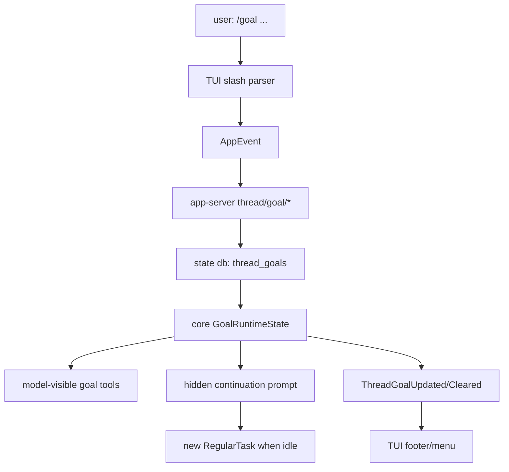

# 20장: /goal 강좌 로드맵 — 장시간 목표 루프를 어떻게 읽을 것인가

> **이 장의 질문**: `/goal`을 하나의 slash command가 아니라 장시간 목표를 지속 상태, 제어 API, 모델 도구, 자동 continuation으로 바꾸는 하니스 루프로 읽으려면 어떤 순서로 봐야 하는가?

## 학습 목표

이 Part의 목표는 `/goal` 기능을 "사용법" 수준에서 끝내지 않고, 코드 레벨에서 전체 루프를 재구성하는 것입니다. 강좌를 끝까지 따라가면 다음 질문에 답할 수 있어야 합니다.

- 사용자가 `/goal`을 입력했을 때 TUI는 어떤 이벤트를 만든다?
- app-server의 `thread/goal/*` API는 어떤 payload와 notification을 보장한다?
- 목표는 왜 rollout 텍스트가 아니라 sqlite `thread_goals` row로 저장되는가?
- core는 token/time 사용량을 어느 이벤트에서 회계하는가?
- idle 상태의 active goal은 어떻게 새 `RegularTask`를 만든다?
- 모델은 왜 `pause`, `resume`, `budget_limited`를 직접 설정할 수 없는가?
- 내 하니스에 비슷한 기능을 넣을 때 어떤 경계부터 만들어야 하는가?

## 전체 지도

이 지도에서 핵심은 방향입니다. `/goal`은 사용자 메시지를 길게 저장해 두었다가 반복 주입하는 기능이 아닙니다. 사용자의 목표 입력은 control plane mutation으로 들어가고, core runtime이 그 상태를 읽어 다음 턴의 원인을 만듭니다.

## 강좌 구성

| 장 | 주제 | 코드 질문 |
| --- | --- | --- |
| 21장 | TUI 표면 | `/goal`, `/goal pause`, `/goal resume`, `/goal clear`는 어디서 갈라지는가? |
| 22장 | app-server와 저장 모델 | `thread/goal/set|get|clear`는 어떤 상태 row를 읽고 쓰는가? |
| 23장 | core goal runtime | turn/tool/resume/interrupt 이벤트가 목표 회계와 continuation에 어떻게 연결되는가? |
| 24장 | 모델 도구와 안전장치 | 모델은 goal을 어디까지 조작할 수 있고, 무엇은 못 하게 막히는가? |
| 25장 | 내 하니스에 옮기기 | 장시간 목표 루프를 구현할 때 어떤 순서와 gate가 필요한가? |

## 먼저 기억할 네 가지 어휘

| 어휘 | 의미 |
| --- | --- |
| objective | 사용자가 달성하라고 지정한 목표 문장 |
| status | `active`, `paused`, `budget_limited`, `complete` 중 하나 |
| token budget | 목표에 쓸 수 있는 선택적 token 예산 |
| continuation | active goal이 idle 상태에서 다음 regular turn을 자동으로 여는 동작 |

## Code Anchor

| 층 | 파일 |
| --- | --- |
| feature flag | `codex-rs/features/src/lib.rs` |
| slash command | `codex-rs/tui/src/slash_command.rs` |
| slash dispatch | `codex-rs/tui/src/chatwidget/slash_dispatch.rs` |
| TUI goal actions | `codex-rs/tui/src/app/thread_goal_actions.rs` |
| app-server protocol | `codex-rs/app-server-protocol/src/protocol/common.rs`, `codex-rs/app-server-protocol/src/protocol/v2/thread.rs` |
| app-server processor | `codex-rs/app-server/src/request_processors/thread_goal_processor.rs` |
| state schema/runtime | `codex-rs/state/migrations/0029_thread_goals.sql`, `codex-rs/state/src/runtime/goals.rs` |
| core runtime | `codex-rs/core/src/goals.rs`, `codex-rs/core/src/tasks/mod.rs` |
| model tools | `codex-rs/core/src/tools/handlers/goal_spec.rs`, `codex-rs/core/src/tools/handlers/goal/` |
| TUI rendering | `codex-rs/tui/src/chatwidget/goal_menu.rs`, `codex-rs/tui/src/chatwidget/goal_status.rs` |

## Runtime Proof

- `/goal`은 experimental feature다 -> `codex-rs/features/src/lib.rs` -> `Feature::Goals`가 "persisted thread goals and automatic goal continuation"으로 정의된다
- `/goal`은 inline args를 지원한다 -> `codex-rs/tui/src/slash_command.rs` -> `SlashCommand::Goal`이 `supports_inline_args()`에 포함된다
- 사용자 제어는 app event로 간다 -> `codex-rs/tui/src/chatwidget/slash_dispatch.rs` -> control command가 `SetThreadGoalStatus` 또는 `ClearThreadGoal`로 바뀐다
- 외부 API는 thread resource 아래에 있다 -> `codex-rs/app-server-protocol/src/protocol/common.rs` -> `thread/goal/set`, `thread/goal/get`, `thread/goal/clear`가 정의된다
- persistent state는 sqlite row다 -> `codex-rs/state/migrations/0029_thread_goals.sql` -> `thread_id` primary key의 `thread_goals` 테이블이 있다
- 자동 continuation은 core runtime이 만든다 -> `codex-rs/core/src/goals.rs` -> active goal candidate가 developer message를 pending input에 넣고 `RegularTask`를 시작한다

## 강좌 읽는 법

각 장은 같은 형식을 따릅니다.

1. 먼저 사용자 관점의 동작을 한 문장으로 정리합니다.
2. 그 동작이 지나가는 파일을 좁은 순서로 읽습니다.
3. 중요한 코드 조각을 작은 단위로 봅니다.
4. 마지막에 `Claim -> file path -> observable event/check` 표로 근거를 고정합니다.
5. "강좌 체크포인트"에서 직접 설명해 볼 질문을 남깁니다.

이 방식은 `/goal`을 외운 기능 목록이 아니라, 실제 하니스 루프로 이해하기 위한 장치입니다. 다음 장부터는 TUI 표면에서 시작합니다.
