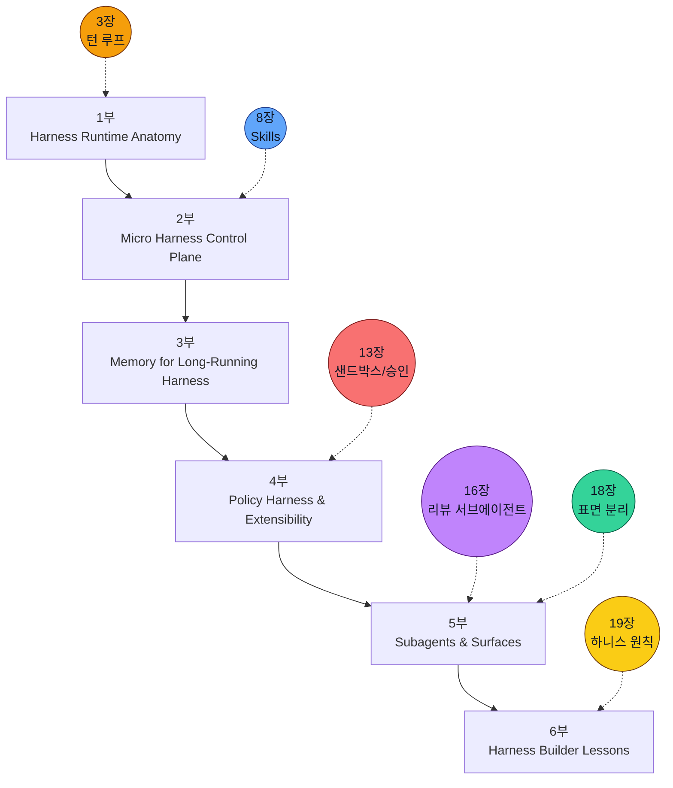

# 서문

이 책은 `openai/codex` 공개 저장소를 "똑똑한 CLI"가 아니라 `하니스 엔지니어링(harness engineering)` 사례로 읽기 위해 다시 쓴 한국어 해설서입니다. 여기서 런타임 구조는 목적이 아니라 수단입니다. 진짜로 보고 싶은 것은 Codex가 어떤 턴 루프를 코어로 삼고, 어떤 지침 층으로 모델을 조종하고, 어떤 상태와 예산으로 기억을 유지하며, 어떤 정책 경계 위에서 안전하게 서브에이전트로 분기하는지입니다.

참조본 `book-ko`에서 가져온 것은 제목이 아니라 책을 조직하는 방식입니다. 각 장은 질문으로 열고, 구조도를 먼저 보여 주고, 실제 코드 anchor를 짚고, 관찰 가능한 런타임 증거를 붙인 뒤, 마지막에 `Builder Takeaway`로 닫힙니다. 이 리듬이 유지될 때만 독자는 기능 목록이 아니라 하나의 하니스를 머릿속에 세울 수 있습니다.

## 이 책의 약속

이 책은 다음 세 가지를 약속합니다.

1. Codex를 `CLI + 모델`이 아니라 `스레드/세션/턴/도구/정책/서브에이전트`로 조직된 하니스로 설명합니다.
2. 가능한 한 공개 저장소의 실제 근거를 사용하고, 핵심 문장은 `Claim -> file path -> observable event/check` 형태로 고정합니다.
3. 각 장 끝에서 "이 구조를 내 하니스에 어떻게 옮길 것인가"를 분명히 남깁니다.

즉 이 책은 반쯤은 해설서이고, 반쯤은 구축자용 하니스 패턴 카탈로그입니다.

## 이번 판에서 더 강화한 것

이 판은 각 장을 요약 노트보다 한 단계 더 코드 독해에 가깝게 보강했습니다. 특히 `소스 발췌`, `더 깊게 읽기`, `직접 확인 체크포인트`, `Grounded Principle Notes` 같은 섹션은 독자가 책 안에서 먼저 실제 코드를 보고, 필요하면 저장소를 열어 더 확인할 수 있도록 구성했습니다.

강화 방향은 세 가지입니다.

1. 추상 설명 뒤에 바로 파일 경로와 관찰 지점을 붙입니다.
2. 각 장에 실제 Rust 소스의 짧은 연속 발췌를 붙여, 파일을 바로 열 수 없는 독자도 핵심 구조를 눈으로 확인할 수 있게 합니다.
3. 장별 기능을 "왜 필요한가"에서 끝내지 않고 "어떤 타입/함수/이벤트가 그 책임을 소유하는가"로 내립니다.
4. builder takeaway가 단순 조언이 되지 않도록, 앞선 코드 근거에서 어떤 설계 원칙이 나왔는지 다시 회수합니다.

예를 들어 "도구 실행은 중앙 정책 계층을 거친다"는 문장은 이제 `codex-rs/core/src/tools/orchestrator.rs`에서 approval requirement 계산, sandbox selection, retry/escalation 분기가 실제 attempt보다 앞선다는 관찰과 함께 읽어야 합니다. "skills는 지식층이다"라는 문장도 `core-skills/src/loader.rs`의 discovery/dedupe와 `core-skills/src/injection.rs`의 mentioned-skill body injection을 같이 봐야 합니다.

## 누구를 위한 책인가

### 1. 구조를 깊게 이해하고 싶은 독자

Codex가 실제로 어떻게 굴러가는지 알고 싶지만, 저장소 전체를 직접 파고들 시간은 없는 독자입니다. 이 경우에는 장마다 제시되는 질문, 구조도, 코드 anchor만 따라가도 하니스의 전체 뼈대를 잡을 수 있게 했습니다.

### 2. 에이전트 빌더

로컬 코딩 에이전트, 멀티에이전트 런타임, 승인 정책, 컨텍스트 주입, app-server 같은 구조를 자신의 제품에 옮기고 싶은 독자입니다. 이 경우 각 장의 `Builder Takeaway`, 특히 `8장`, `16장`, `18장`, `19장`을 집중해서 읽으면 됩니다.

## 읽기 전 준비

필수 선수 지식은 많지 않습니다. 다만 아래 정도는 알고 있으면 읽기가 훨씬 편합니다.

- Rust 모듈 구조와 비동기 코드에 대한 기초 감각
- 터미널 도구, 서브프로세스, 환경 변수, stdin/stdout
- LLM API의 system/user/assistant 역할, tool call, streaming 개념

전문가일 필요는 없습니다. 파일 경로, 상태 기계, Mermaid 구조도를 읽을 수 있으면 충분합니다.

## 추천 독서 경로

### 경로 A: Harness Builder

처음 읽는다면 아래 순서를 추천합니다.

`1장 -> 3장 -> 7장 -> 8장 -> 9장 -> 13장 -> 16장 -> 18장 -> 19장`

이 경로는 하니스의 코어, micro harness 제어층, 정책 경계, 서브에이전트, 표면 패키징의 순서로 mental model을 세웁니다.

### 경로 B: Sub-agent 중심

Codex가 어떻게 안전하게 일을 외주화하는지가 궁금하다면 아래 순서가 더 효율적입니다.

`3장 -> 8장 -> 13장 -> 16장 -> 17장 -> 18장 -> 19장`

이 경로는 턴 루프, 재사용 가능한 micro harness, 정책 경계, constrained sub-agent copy, 자원 관리, surface adapter를 빠르게 훑습니다.

### 경로 C: Runtime Proof 중심

`1장 -> 2장 -> 3장 -> 10장 -> 12장 -> 16장 -> 18장`

이 경로는 기능 설명보다 계약, 상태, 복구, delegation 경로를 실제 코드와 증거 중심으로 읽습니다.

## 이 책의 지식 지도

이 지도에서 3장은 책의 닻(anchor)입니다. 하지만 책의 클라이맥스는 16장과 18장입니다. 앞선 장들이 왜 필요한지는 결국 "무엇을 복제하고 무엇을 제한한 채 하니스를 분기할 수 있는가"라는 질문으로 회수됩니다.

## 표기 규칙

이 책은 아래 표기 규칙을 사용합니다.

### 파일 경로

- Rust 구현: `codex-rs/...`
- 문서/설정: `docs/...`, `book.toml`, `Cargo.toml`
- 부록에서 자주 참조하는 경로는 반복적으로 재등장합니다.

### 근거 수준

| Level | 의미 | 예시 |
| --- | --- | --- |
| Confirmed | 코드나 설정으로 직접 확인 | 타입 정의, 함수 본문, 설정 파일 |
| Observed | 런타임/산출물로 관찰 | 이벤트 이름, CLI 출력, JSON schema |
| Inferred | 앞선 근거를 바탕으로 한 해석 | "이 계층이 하니스 제어층 역할을 한다" 같은 설명 |

핵심 주장은 가능하면 아래 형식을 따릅니다.

- `Claim -> file path -> observable event/check`

예:

- 첫 세션 이벤트가 계약 역할을 한다 -> `codex-rs/core/src/thread_manager.rs` -> 첫 이벤트가 아니면 오류로 처리하는 검증 로직이 있다

이 형식은 문장 장식이 아니라 독서 규칙입니다. 독자가 직접 확인할 수 없는 주장은 이 책에서 핵심 결론이 되면 안 됩니다. 내부 구현의 의도를 해석할 수는 있지만, 그 해석은 먼저 타입, 함수, 이벤트, 문서 중 하나에 닿아 있어야 합니다.

## 실제 코드 읽기 루틴

각 장을 읽을 때는 다음 순서를 권합니다.

1. 먼저 `System Map`으로 계층과 흐름을 잡습니다.
2. `Code Anchor`의 파일을 열고 타입/함수 이름을 찾습니다.
3. `Runtime Proof`의 `Claim -> file path -> observable event/check`를 하나씩 확인합니다.
4. `더 깊게 읽기` 섹션에서 그 코드가 왜 설계상 중요한지 다시 해석합니다.
5. 마지막으로 `Builder Takeaway`를 자신의 시스템에 옮길 때 어떤 전제 조건이 필요한지 적어 봅니다.

이 루틴을 따르면 책을 읽는 행위가 저장소를 검증하는 행위와 분리되지 않습니다.

## 시각 규칙

이 책은 모든 장에서 동일한 시각 문법을 유지합니다.

1. `이 장의 질문`
2. `System Map`
3. `Code Anchor`
4. `Runtime Proof`
5. `Builder Takeaway`

또한 모든 장은 최소 하나의 Mermaid 다이어그램을 포함합니다. 여기서 다이어그램은 장식이 아니라 하니스의 층, 전환, 제약, parent-child 경계를 보여 주는 용도입니다.

## 이 책의 한계

- 이 책은 공개 저장소 기준입니다. 서버 내부 정책, 비공개 운영 콘솔, 조직 내부 배포 로직까지 증명하지는 못합니다.
- 참조본처럼 30장 이상으로 늘리지 않고, 현재 19장 뼈대를 유지합니다. 대신 각 장의 약속과 회수 지점을 하니스 중심으로 다시 배치합니다.
- 일부 해석은 코드를 바탕으로 한 구조적 추론입니다. 그런 경우 `Inferred`로 분리합니다.

## 마지막 안내

이 책을 가장 잘 읽는 방법은 개별 기능을 외우는 것이 아닙니다. 대신 계속 같은 질문을 던지면 됩니다.

- 무엇이 하니스를 시작하는가
- 무엇이 모델 행동을 조종하는가
- 무엇이 기억과 비용을 관리하는가
- 무엇이 안전한 외주화를 허용하는가
- 무엇이 서브에이전트와 표면 분리를 성립시키는가

그 다섯 질문이 Codex 전체를 읽는 프레임이 됩니다.
